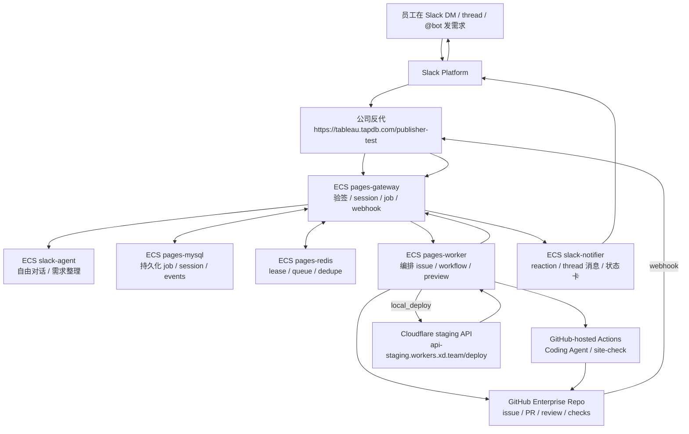
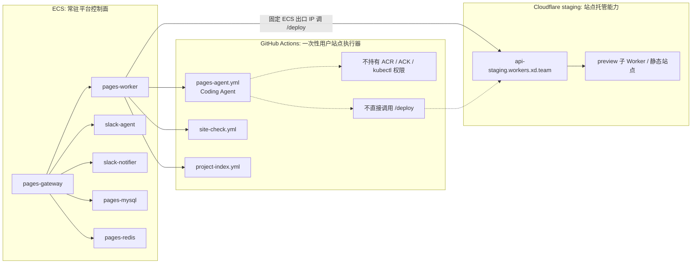

# pages-manager 当前状态

更新时间：2026-06-15

当前分支：`feat/slack-preview-gateway`

当前 HEAD：以 `git log -1 --oneline` 为准。

当前工作区状态：ECS compose 运行配置、当前状态文档、Slack/Coding Agent 模型参数兼容修复、Slack 验签安全诊断已整理为本地 commit；`.env.ecs` 和 `.ack-preview.env` 都不能提交。

## 0. 当前结论

`pages-manager` 的 Slack 到个人网站 preview 的主链路已经完成了主要代码搭建：

- Slack HTTP 入口、Slack Agent、Gateway、Worker、Slack Notifier 已经形成长期架构。
- GitHub Actions 中的 Coding Agent、site-check 已接入链路；`pages-preview.yml` 保留 actions mode，当前 preview deploy 由 ECS `pages-worker` 走 `local_deploy`。
- Gateway 已开始从文件态切到 MySQL + Redis 运行态。
- K8s/ACK 部署结构已经按 `gateway / worker / slack-agent / slack-notifier` 四个 Deployment 组织。
- 平台 workflow 和用户站点 workflow 的权限边界已经拆开，相关 PR 已合入 `master`。
- 本地代码验证已通过，当前主要问题不在单元测试，而在真实 Slack 完整闭环、生产级数据库隔离、GitHub App 身份迁移，以及后续 ACK/ACR lane 的网络稳定性。

当前最新环境状态：

- ACK 暂时不作为主验证环境。
- 已改为在 ECS 上运行完整 pages-manager runtime。
- 公司反代 `https://tableau.tapdb.com/publisher-test/*` 已能转发到 ECS:80。
- ECS 上通过 Docker Compose 运行 `caddy / pages-gateway / pages-worker / slack-agent / slack-notifier / pages-mysql / pages-redis`。
- ECS 的 `/health` 和 `/ready` 已通过公网验证。
- GitHub webhook 已切到 `https://tableau.tapdb.com/publisher-test/integrations/github/webhook`，GitHub ping delivery 返回 200。
- Slack Events endpoint 已用签名模拟 `url_verification` 验证通过；公司反代白名单修复后，应继续保持 Slack 签名 header 透传。
- Slack Agent 已在 ECS 内调用公司模型网关成功，模型名使用 `gpt-5.5`。
- 本地代码已补充 Slack 发起人 profile 快照和中文 issue/comment 模板；部署后新 issue 会展示 Slack 昵称、邮箱（取决于 Slack App 是否具备 `users:read.email`）和机器可读自动化元数据。
- 本地代码已把 Slack 来源的 `employeeSlug` 改为 gateway 根据 Slack 身份派生，Slack Agent 只能影响 `siteSlug` 和需求摘要，不能靠用户文本写入别人的目录。
- ECS 公网 IP `123.56.251.50` 已加入 GitHub `staging` environment 的 `IP_ALLOWLIST`，并触发 `Deploy Staging` 让 Cloudflare staging Worker 生效。
- 当前 preview deploy 使用 `PAGES_PREVIEW_MODE=local_deploy`，由 ECS `pages-worker` 调用 `https://api-staging.workers.xd.team/deploy`，不是 GitHub-hosted runner 直接调用。
- 2026-06-15 签名模拟 Slack event 已在 ECS 上跑通到真实 preview：issue `#53`、PR `#54`、preview `https://pm-pr-54-smoke-profile-staging.workers.xd.team`。

当前不能宣称“完整生产化跑通”的原因是：

- 还需要用真实 Slack 用户消息跑完一次完整用户闭环；当前签名模拟事件已覆盖后台链路，但模拟 channel 不能验证真实 Slack thread 回写。
- GitHub Actions 变量已切到 ECS callback URL 和 `gpt-5.5` 模型名。
- 当前 ECS MySQL / Redis 是 compose 内临时运行态，不是最终生产数据库。
- GitHub-hosted runner 到阿里云 ACR 公网 registry 出现过超时；这影响 ACK/ACR lane，不影响当前 ECS 离线镜像部署。
- 当前 ECS 上的 `SLACK_BOT_TOKEN` 实测 scope 仍缺少 `app_mentions:read`、`im:history`、`reactions:write` 等能力；如果 Slack 后台已经申请权限，需要确认是否已 reinstall / approve 并把新 token 更新到 ECS。

## 1. 目标实现状态

当前主要功能目标已经在代码层面实现：`pages-manager` 已经从原本的站点发布工具，扩展成由 Slack 驱动的个人网页发布平台雏形。

已经实现或接入的用户链路：

```text
用户在 Slack 发需求
  -> Slack Agent 持续对话并理解需求
  -> Gateway 创建 PublishingJob 和 GitHub issue
  -> GitHub Actions 运行 Coding Agent
  -> Coding Agent 只写入允许的网站目录
  -> GitHub Actions 创建或更新 PR
  -> site-check 和 GitHub Review Agent 结果被平台监听
  -> 通过检查后发布 preview
  -> Slack thread 收到状态更新和 preview URL
```

当前真实运行链路图：



当前运行边界图：



产品要求不是“一个员工一个网站”，而是：

```text
sites/<employeeSlug>/<siteSlug>/
```

一个员工可以有多个网站。每个网站需要在目录、任务、PR、preview、权限上隔离。

因此，当前状态不是“目标还没实现”，而是“代码主链路已实现，ECS 真实运行态和关键分段验证已通过，但还没有完成真实 Slack 多轮消息触发的一次完整无人值守闭环”。后续阻塞点主要集中在真实 Slack E2E、生产级 DB/Redis 隔离、GitHub App 身份模型，以及后续 ACK/ACR lane。

## 2. 当前架构方向

当前验证架构：

```text
Slack / GitHub Webhooks / Browser
  -> 公司反代 tableau.tapdb.com/publisher-test
  -> ECS pages-gateway
  -> ECS pages-worker / slack-agent / slack-notifier
  -> GitHub Actions 一次性执行器
  -> ECS pages-worker 调 Cloudflare staging /deploy
  -> Slack thread 回传状态和 preview URL
```

长期架构方向：

```text
Slack / GitHub Webhooks / Browser
  -> pages-gateway
  -> pages-worker
  -> slack-agent
  -> slack-notifier
  -> GitHub Actions 一次性执行器
  -> 平台 worker/deployer 调 Cloudflare / preview 发布
```

当前 ECS compose 已按长期 K8s 形态拆成相同的四个长期服务；后续迁移到 ACK/K8s 时，运行态仍按四个长期运行的 Deployment 拆分：

- `pages-gateway`
  - 对外 HTTP 入口。
  - 接收 Slack Events、Slack Interactivity、GitHub webhook、executor callback。
  - 负责 health、readiness、任务状态流转、Slack session 关联、webhook 验签、callback 处理。
  - 除 MySQL 和 Redis 外，应保持无状态。

- `pages-worker`
  - 内部 worker 服务。
  - 接收 gateway 派发的发布任务。
  - 创建或复用 GitHub issue。
  - 触发 GitHub Actions workflow。
  - 当前 ECS 路径下负责 `local_deploy`，即由 worker 用固定 ECS 出口 IP 调用 Cloudflare staging `/deploy`。
  - 当前设计里不直接运行 Coding Agent。

- `slack-agent`
  - 常驻对话 Agent 服务。
  - 使用公司 OpenAI-compatible 模型网关。
  - 负责自由式 Slack 对话、澄清、需求总结、续接已有任务。
  - 不写代码、不创建 PR、不直接部署。

- `slack-notifier`
  - 内部 Slack 发送服务。
  - 负责 thread 回复、状态卡、更新已有 Slack 卡片、添加 working reaction。
  - 让 Slack token 不进入 gateway 日志和 GitHub workflow 日志。

一次性执行器目前仍放在 GitHub Actions：

- `project-index.yml`
- `pages-agent.yml`
- `site-check.yml`
- `pages-preview.yml`，保留 actions mode；当前 ECS 验证路径不使用它直接调用 `/deploy`

后续可以把这些一次性执行器迁移到 K8s Job，但当前阶段不强制迁移。

关键边界：

- GitHub-hosted runner 负责 Coding Agent / site-check / PR，不直接调用 Cloudflare `/deploy`。
- Preview deploy 当前由 ECS `pages-worker` 发起，避免 GitHub-hosted runner 动态出口 IP 进入 Cloudflare staging 白名单。
- 后续迁到 ACK 时，应保持同样原则：由平台自有 worker/deployer 用固定出口访问 `/deploy`。

## 3. 仓库和 workflow 边界

当前仓库被拆成两条 lane。

### 平台本体 lane

平台本体 CI/CD 只处理 pages-manager 自己：

- app 代码
- gateway / worker / slack-agent / slack-notifier
- ACK/K8s manifests
- Cloudflare 平台 Worker
- 部署脚本

平台 workflow 包括：

- `ci.yml`
- `deploy-staging.yml`
- `deploy.yml`
- `deploy-ack-preview.yml`

平台 workflow 可以在合适场景使用 Cloudflare、ACK、ACR、kubeconfig 等部署权限。

### 用户站点发布 lane

用户站点 workflow 只处理自动生成的网站发布任务：

- issue 上下文
- `sites/<employeeSlug>/<siteSlug>/` 下的生成代码
- PR 创建或更新
- site-check
- preview 发布触发和状态回调；当前实际 `/deploy` 由 ECS `pages-worker` 执行

用户站点 workflow 不能拥有：

- Aliyun AK
- ACR 权限
- `KUBE_CONFIG_B64`
- `kubectl`
- ACK namespace 权限
- production 部署凭据

自动生成的站点 PR 不能修改：

```text
.github/**
apps/**
packages/**
k8s/**
scripts/**
Dockerfile*
平台部署相关文档
```

这部分边界已经通过 PR `#44` 合入 `master`。

PR 标题：

```text
ci: 隔离平台 CI 与用户站点发布检查
```

PR `#44` 还修复了一个关键问题：`pages-agent` 会 dispatch `ci.yml`，但之前 `workflow_dispatch` 触发的 CI 不知道 generated site diff 的范围，所以 site-only PR 仍会跑平台 lint/test。现在 `ci.yml` 支持 `baseSha`、`headSha`、`allowedPath` 输入，能识别只改了指定 `sites/<employee>/<site>/` 目录的分发式检查，并跳过平台检查。

## 4. Slack 运行态细节

当前推荐方案是 Slack HTTPS Events API + Interactivity。

Socket Mode 只适合早期本地测试，不作为长期生产路径。长期不应该依赖本地 `listen.mjs` 进程。

Slack 应该请求 gateway 的这些路径：

```text
https://tableau.tapdb.com/publisher-test/integrations/slack/events
https://tableau.tapdb.com/publisher-test/integrations/slack/interactions
```

Gateway 使用下面的配置验证 Slack 签名：

```text
SLACK_SIGNING_SECRET
```

Slack notifier 使用下面的配置发消息：

```text
SLACK_BOT_TOKEN
```

Slack App 需要的能力包括：

- 接收 `app_mention`
- 接收 DM 消息
- 发送消息
- 添加 reaction
- 更新消息和状态卡
- 处理 Block Kit interaction

当前产品行为：

- 支持 DM。
- 支持 `@bot`。
- Slack 回复时应在合适位置 `@` 对应用户。
- 收到消息后会加 working reaction，告诉用户 Agent 已经开始处理。
- 会话按 `team / user / channel / thread` 隔离。
- DM 没有显式 thread 信息时，会使用 DM session 和 active session 续接。
- 用户可以在同一个 thread 继续修改 preview。
- 用户不能通过猜 job id 或 session id 接管别人的任务。

当前 Slack 限制：

- ACK 公网入口还不能稳定直接承接 Slack；当前不走 ACK。
- ECS 入口已通过 `tableau.tapdb.com/publisher-test` 暴露。
- 反代必须保留原始 body 和 Slack 签名 header。
- 反代不能验证或重写 Slack payload，验签必须由 gateway 完成。
- gateway 不对真实 Slack event 放开验签；无签名 event 会返回 401，并只记录安全诊断字段。

## 5. Agent 细节

### Slack Agent

Slack Agent 是产品对话 Agent，职责是：

- 支持自由式闲聊，不要求用户必须输入 `/issue`。
- 信息不足时追问。
- 把需求总结成结构化发布任务。
- 理解对已有 preview 的修改请求。
- 保留 session 记忆，以及 active issue / PR / preview 关系。
- 不输出、不猜测 token、secret、cookie、API key 等敏感信息。
- 记录安全审计日志。

Slack Agent 使用公司 OpenAI-compatible 模型网关。

关键配置名：

```text
SLACK_AGENT_API_KEY
AGENT_GATEWAY_URL
AGENT_MODEL_NAME
```

真实 token 不能提交，不能写入本文档。

当前 ECS 验证结果：

- `AGENT_GATEWAY_URL` 指向公司 OpenAI-compatible 网关。
- `AGENT_MODEL_NAME=gpt-5.5` 可以成功返回结构化需求分析。
- `codex/gpt-5.5` 在当前网关返回 503，不应作为 Slack Agent 模型名。
- `gpt-5.5` 不接受显式 `temperature: 0/0.2`；Slack Agent 和 Coding Agent 已在本地改为默认不传 `temperature`，只有显式配置时才传。

### Coding Agent

Coding Agent 当前运行在 GitHub Actions 里，不运行在 gateway，也不是 K8s 常驻服务。

它使用：

```text
AGENT_CODE_API_KEY
```

Coding Agent 职责：

- 读取 GitHub issue 和 workflow input 上下文。
- 只在允许的网站目录下生成或更新文件。
- 创建或更新 PR。
- 在 fix mode 下根据 review comment 修改已有站点。

当前边界：

- Gateway 和 worker 负责编排。
- GitHub Actions 负责执行一次性 Coding Agent。
- GitHub Review Agent comment 通过 GitHub webhook 被 gateway 监听。
- site-check 是 preview 放行门禁。
- 本地已修复 Coding Agent 请求公司模型时默认携带 `temperature` 的问题；该修复必须提交并推送到 workflow 使用的分支后，GitHub Actions 才会生效。
- GitHub Actions 变量里的 `AGENT_MODEL_NAME` 必须使用 `gpt-5.5`，不能继续使用 `codex/gpt-5.5`。

## 6. 数据库和 Redis 运行态

目标运行态是 MySQL + Redis。

K8s/ACK 约定已经改成参考 xdclaw 的 split MySQL 配置：

```text
MYSQL_ADDR=<host>:3306
MYSQL_USER=<user>
MYSQL_PASSWORD=<secret>
MYSQL_DATABASE=pages_manager_preview
REDIS_URL=redis://:<secret>@<host>:6379/11
```

`DATABASE_URL` 在部分代码路径里仍然兼容，但不再作为 K8s 主约定。

Gateway 运行态不应该依赖：

- JSON 文件 store
- 进程内内存
- 单 pod PVC
- SQLite

需要持久化的状态包括：

- PublishingJob
- SlackSession
- SessionMemory
- IssueLink
- AgentRun / JobEvent
- GitHub webhook delivery dedupe
- Review Agent comment record
- DeployRecord
- AuditLog
- RuntimeLogPointer
- ExternalApiCallLog

Redis 用于：

- lease
- queue / worker 协调
- dedupe cache
- rate limit
- 短期 session 协调
- notifier event

## 7. ACK / K8s 细节

当前 preview namespace：

```text
pages-manager-preview
```

不要使用或修改 `xdclaw-preview` 资源。之前容易误解的 `xdclaw/preview` 命名已经改掉。

已讨论过的 ACK/ACR 信息：

```text
Region: cn-shanghai
ACR instance id: cri-jxbbw6ph46qxfsvh
ACR public registry: xdclaw-hub-registry.cn-shanghai.cr.aliyuncs.com/public
ACR VPC registry: xdclaw-hub-registry-vpc.cn-shanghai.cr.aliyuncs.com/public
ACK namespace: pages-manager-preview
imagePullSecret: acr-credential-secret-aggregation
```

本地私有配置文件：

```text
.ack-preview.env
```

该文件已被 `.gitignore` 忽略，不能提交。

K8s Secret 结构：

- `slack-platform-secret`
  - Slack bot token
  - Slack signing secret
  - Slack notifier shared secret

- `github-platform-secret`
  - GitHub token 或 GitHub App installation token
  - webhook secret

- `callback-secrets`
  - internal callback token
  - pages worker shared secret

- `model-provider-secret`
  - Slack Agent model API key
  - model gateway URL
  - model name

- `database-secret`
  - `mysql-addr`
  - `mysql-user`
  - `mysql-password`
  - `mysql-database`

- `redis-secret`
  - `redis-url`

Deployment 应该从 `pages-manager-preview` namespace 内自己的 Secret 读取配置，不能直接引用 xdclaw 的 Secret。

## 8. 临时 DB / Redis 决策

ACK 早期 smoke 可以临时复用 xdclaw preview 已有的 RDS MySQL 和 Redis/Tair 基础设施，但只能是基础设施复用。

不能复用 xdclaw 的业务 database，也不能直接使用 xdclaw 的 K8s Secret。

必须隔离：

```text
MySQL database: pages_manager_preview
Redis DB: /11
K8s namespace: pages-manager-preview
K8s Secret: pages-manager-preview/database-secret 和 redis-secret
```

不能为了绕过权限问题设置：

```text
MYSQL_DATABASE=xdclaw
```

如果共享 MySQL 用户不能访问 `pages_manager_preview`，不能把 pages-manager 的表建到 xdclaw database 里。

可选方案：

1. 找运维创建只授权 `pages_manager_preview.*` 的专用 MySQL 用户。
2. 为 pages-manager 创建独立 RDS / Redis 实例。
3. 短期 smoke 阶段在 `pages-manager-preview` namespace 内运行临时 MySQL / Redis。

namespace-local MySQL/Redis 是一次性 smoke 方案，可以接受数据丢失，但不是生产设计。

## 9. Cloudflare / Preview 发布

个人网站 preview 发布当前仍依赖 pages-manager 现有 Cloudflare 发布模型。

关键要求：

- Cloudflare 资源不是每个员工单独申请。
- 平台统一持有 Cloudflare account / KV / Worker 资源池。
- 员工获得的是隔离的网站路径和 owner marker，不是独立 Cloudflare 账号。

preview access token / owner marker 应按 preview、站点、用户上下文生成，不能是所有人共用的全局凭据。

当前实际调用路径：

```text
ECS pages-worker
  -> https://api-staging.workers.xd.team/deploy
  -> Cloudflare staging Worker
  -> preview 子站点 / 子 Worker
```

当前不是：

```text
GitHub-hosted runner -> /deploy
```

这么拆的原因：

- Cloudflare staging Worker 有 `IP_ALLOWLIST`。
- GitHub-hosted runner 出口 IP 动态，不适合作为白名单来源。
- ECS 出口 IP 相对固定，已经加入 `staging` environment 的 `IP_ALLOWLIST`。
- GitHub Actions 不直接持有 preview 发布权限，降低用户站点 workflow 的权限面。

已完成的 staging 配置动作：

```text
GitHub Environment: staging
Variable: IP_ALLOWLIST
追加: 123.56.251.50
Deploy Staging run: 27520058875
结果: success
```

验证结果：

```text
ECS pages-worker -> GET https://api-staging.workers.xd.team/list
返回: 200 {"sites":[],"filtered":true}
```

## 10. GitHub Webhook 细节

Gateway 应该通过 GitHub webhook 接收事件，而不是依赖本地 `gh` 查询或轮询。

重要事件：

- issue created / edited / commented
- pull request opened / synchronized
- pull request review / review comment
- Review Agent 的 issue comment
- check_run / site-check 结果

当前 ECS webhook URL：

```text
https://tableau.tapdb.com/publisher-test/integrations/github/webhook
```

当前验证结果：

- GitHub repo webhook 已更新到上面的 ECS URL。
- webhook events 保持 `check_run`、`issues`、`issue_comment`、`pull_request_review`、`pull_request_review_comment`。
- GitHub ping delivery 返回 200 OK。
- webhook 已配置 secret，不能依赖未鉴权 callback。
- GitHub Actions callback 变量已同步为 `https://tableau.tapdb.com/publisher-test/internal/executor-callback`，allowed origins 已调整为 `https://tableau.tapdb.com`。

## 11. 当前验证状态

ECS 运行态验证：

```text
https://tableau.tapdb.com/publisher-test/health -> 200
https://tableau.tapdb.com/publisher-test/ready  -> 200
```

ECS Docker Compose 当前 healthy 服务：

```text
caddy
pages-gateway
pages-worker
slack-agent
slack-notifier
pages-mysql
pages-redis
```

公网 endpoint 验证：

```text
/integrations/slack/events        -> 缺少签名时 401，签名模拟 url_verification 时 200
/integrations/slack/interactions  -> 缺少签名时 401
/integrations/github/webhook      -> 缺少签名时 401，GitHub ping delivery 200
/internal/executor-callback       -> 缺少 callback token 时 401
```

ECS 外部依赖验证：

- Slack Bot token 可用，`auth.test` 返回 ok。
- 当前 Slack bot 身份：`tapdbbot`；实测 token scope 只有 `chat:write.customize`、`chat:write`、`incoming-webhook`，`users.list` / `conversations.list` / `conversations.open` 均返回 `missing_scope`。
- GitHub token 可访问 `xindong/pages-manager`，repo permissions 包含 admin/push。
- 公司模型网关可达，`gpt-5.5` 可完成 Slack Agent 结构化分析。
- Cloudflare staging `/deploy` 可由 ECS `pages-worker` 调用，ECS 请求 `https://api-staging.workers.xd.team/list` 返回 200。

2026-06-15 全链路签名模拟测试：

```text
Slack signed event -> ECS gateway -> Slack Agent -> issue #53
  -> Pages Agent run 27521022782 -> PR #54
  -> CI / Site Check success
  -> Codex Review comment
  -> GitHub webhook -> gateway review gate
  -> ECS pages-worker local_deploy
  -> preview_deployed
```

测试结果：

```text
Job: job_2116bca0cd50460a8703f39f
Issue: https://github.com/xindong/pages-manager/issues/53
PR: https://github.com/xindong/pages-manager/pull/54
Preview: https://pm-pr-54-smoke-profile-staging.workers.xd.team
Marker: ecs-full-e2e-1781491710154
```

这次测试确认后台链路已经走到真实 Cloudflare preview。限制是：Slack 入口使用签名模拟事件，channel 是 `D_ECS_SIM_FULL`，因此 Slack reaction / thread 回写不能作为真实 Slack 成功依据；日志里符合预期地出现了 `missing_scope` / `channel_not_found`。

2026-06-15 真实 Slack 私聊全链路测试：

```text
Slack DM -> ECS gateway -> Slack Agent -> issue #55
  -> Pages Agent run 27522977934 -> PR #56
  -> CI / Site Check success
  -> Codex Review comment
  -> GitHub webhook -> gateway review gate
  -> ECS pages-worker local_deploy
  -> preview_deployed
  -> Slack thread 回传 Preview URL
```

测试结果：

```text
Job: job_b9781a6d11c84e5a9a6a543c
Issue: https://github.com/xindong/pages-manager/issues/55
PR: https://github.com/xindong/pages-manager/pull/56
Preview: https://pm-pr-56-smoke-profile-staging.workers.xd.team
Marker: real-slack-e2e-001
```

这次测试确认真实 Slack 私聊入口、Slack Agent、GitHub Actions Coding Agent、Review Agent webhook、site-check、ECS `local_deploy` 和 Slack 回传全部跑通。

新发现的体验和实现问题：

- Slack 体验应该收敛为同一个 thread 里的同一条状态卡片渐进式更新，而不是每个阶段都追加新的普通消息。当前虽然有状态卡片 `chat.update`，但 issue / PR / preview 仍会额外创建多条消息，信息噪音偏大。
- Slack 通知顺序存在竞态：job 事件顺序是 `previewing -> preview_deployed`，但 Slack thread 里出现了先发 Preview URL、后发“Review gate 已通过，开始生成 staging Preview”的情况。应该避免 `preview_deployed` 后再用较旧阶段覆盖状态卡，或者在 `local_deploy` 快速完成时跳过迟到的 `previewing` 通知。
- `working reaction` 偶发失败，Slack 返回 `message_not_found`。主流程不受影响，但“收到消息后给用户一个表情反馈”的体验还不稳定。
- 日志出现 `Data too long for column 'slack_user_id'`，疑似 Slack assistant / 特殊事件 payload 的 user 字段不是普通 Slack user id。需要在入库前归一化或对 unsupported event 做安全裁剪。

本次新增聚焦测试：

```text
node --test tests/apps/slack-agent/index.test.js tests/scripts/pages-agent-coding.test.js
```

结果：

```text
14 tests passed
```

最近一次 rebase 和 push 后，本地验证通过：

```text
git diff --check
corepack pnpm lint
corepack pnpm test
```

结果：

```text
351 tests passed
```

聚焦测试也通过：

```text
node --test scripts/k8s-overlays.test.js scripts/workflows.test.js tests/workflows/pages-agent.test.js
```

结果：

```text
17 tests passed
```

远端 workflow 状态：

- PR `#44` 已合入 `master`。
- 合并后的 master CI 通过。
- CodeQL 通过。
- PR `#44` 的 staging sync / deploy workflow 通过。

当前已知 open generated site PR：

- `#29`：generated site PR，checks passing。
- `#34`：generated site PR，checks passing。
- `#42`：generated site PR，目前 `pages-generated-site-check` / `pages-user-flow` 失败，需要继续调查。

## 12. 已知阻塞点

### 阻塞 1：真实 Slack 消息验证

当前 ECS 公网入口已经可用：

```text
https://tableau.tapdb.com/publisher-test
```

Slack App 后台应配置为：

```text
https://tableau.tapdb.com/publisher-test/integrations/slack/events
https://tableau.tapdb.com/publisher-test/integrations/slack/interactions
```

需要解决：

- 给当前 bot 发 DM 或 `@bot`，确认消息进入 ECS gateway。
- 确认同一 Slack 会话能完成多轮对话，而不是只创建单条任务。
- 当前 ECS token scope 仍不完整，缺少 `app_mentions:read`、`im:history`、`reactions:write` 等。Slack App 如果刚申请完权限，需要重新 install / approve，并确认 ECS `.env.ecs` 使用的是重新安装后的 bot token。

### 阻塞 2：GitHub Actions 变量需要保持与 ECS 对齐

全流程依赖 GitHub Actions 回调 ECS gateway，并使用公司模型网关。

当前配置：

- `PAGES_GATEWAY_CALLBACK_URL=https://tableau.tapdb.com/publisher-test/internal/executor-callback`
- `PAGES_CALLBACK_ALLOWED_ORIGINS=https://tableau.tapdb.com`
- `AGENT_MODEL_NAME=gpt-5.5`
- `AGENT_CODE_API_KEY` 仍放 GitHub secret，不能进入代码或文档。

如果后续入口域名变化，这三项需要一起更新，否则 GitHub Actions callback 或 Coding Agent 模型调用会失败。

### 阻塞 3：GitHub-hosted runner 到 ACR 公网 registry 超时

观察到的错误：

```text
Head "https://xdclaw-hub-registry.cn-shanghai.cr.aliyuncs.com/v2/public/pages-manager/...": dial tcp ...:443: i/o timeout
```

这不像 kubeconfig 问题，更像 GitHub-hosted runner 到阿里云 ACR 公网 registry 的网络可达性或稳定性问题。

当前 ECS 路线绕开了这个问题，因为 ECS 使用本地构建、离线镜像包、`scp`、`docker load`，不依赖 ACR。

可选解决方向：

- 在阿里云或同区域内使用 self-hosted runner。
- 使用 GitHub 可稳定访问的中间 registry/cache。
- 去掉 registry cache 后加重试，但不能保证根治。
- 向运维确认 ACR 公网地址对 GitHub runner 是否存在已知网络问题。

### 阻塞 4：最终 MySQL / Redis 权限和隔离

当前 ECS 已经临时运行 compose 内置 MySQL / Redis，可以支持 smoke 验证。

测试阶段如果不关心历史数据，可以直接 reset ECS compose 内 MySQL database 或 volume；仓库里仍然保留 Drizzle migration，保证本地、ECS、ACK 新环境能从空库稳定建到当前 schema。

最终生产化仍需要确认 MySQL 用户能否访问：

```text
pages_manager_preview
```

如果不能访问，不能把 `MYSQL_DATABASE` 改成 `xdclaw` 绕过。

需要解决：

- 给 pages-manager 创建专用 database 和授权。
- 或者短期使用 namespace-local MySQL 做 smoke。

### 阻塞 5：完整 Slack 到 Preview E2E 尚未用真实 Slack 消息跑完

代码链路已具备，ECS 运行态已启动，但还缺一次真实用户路径验证：

- 用户在 Slack 发消息。
- Gateway 收到 Slack event。
- Slack Agent 多轮对话整理需求。
- Worker 创建 GitHub issue。
- GitHub Actions Coding Agent 生成站点代码。
- PR 创建。
- Review/site-check 结果经 GitHub webhook 回到 gateway。
- preview 发布。
- Slack 回传 preview URL。

这些跑完前，只能说 ECS 运行态和关键分段验证通过，不能说完整用户闭环已完成。

### 阻塞 6：GitHub 身份模型应迁移到 GitHub App

当前测试和配置里使用过 token。长期应使用 GitHub App installation token。

原因：

- 审计更清楚。
- 权限更精确。
- webhook 归属更清晰。
- 避免使用个人 PAT 作为平台身份。

## 13. 产品决策

### Slack session 模型

一个 Slack 用户可以同时拥有多个 session。

当前决策：

- Slack thread 是最强 session 边界。
- 频道里的不同 thread 分别是不同 session。
- DM 里每个 top-level message 可以形成一个 `dm-thread` session。
- 同一个 DM thread 的回复继续同一个 session。
- 用户可以用 `session: sess_xxx` 显式切换到某个自己的 session。
- 如果同一个用户存在多个 active / recent session，平台不猜测目标，而是要求用户明确选择。
- 用户不能引用或继续别人的 session / job。

### Active session 留存时间

当前决策：

- active context 默认保留 2 小时。
- 等待澄清的上下文默认保留 1 天。
- recent session 选择窗口默认 14 天。
- session 归档窗口默认 90 天。
- 用户可以通过 `close` / `关闭会话` / Slack 卡片关闭按钮结束 session。
- 关闭后清空 active job / issue / PR / preview 关联；同一个 thread 后续重新发起任务时可以重新激活。

这个策略的目标是避免 DM 中很久以前的任务被误续接，同时保留同一天内自然连续对话的体验。

### Preview 确认流程

当前决策：

- 当前阶段 preview 是最终交付物，不自动发布 production。
- 用户说“这个版本可以”“保留这个 preview”时，平台记录为 `confirm_preview` 语义。
- `confirm_preview` 不触发新的 Coding Agent fix round。
- `confirm_preview` 不自动合并到 `master`，也不自动触发生产发布。
- 用户继续说“这个 preview 不满意，把标题改成中文”时，才进入 fix round。
- 用户说“关闭会话 / 到这里就好 / 这个 preview 不用了”时，关闭当前 session。

也就是说，确认 preview 的产品语义是“接受当前 preview 状态并停止继续修改”，不是“上线生产”。

### Review Agent 和 site-check 门禁

当前决策：

- site-check 失败时，不发布 preview。
- Review Agent blocking comment 时，不发布 preview。
- Review Agent suggestion / nonblocking summary 可以继续发布 preview，但需要在 Slack thread 中提示用户有建议。
- Review Agent approval 或非阻塞总结，加上 site-check 通过后，才允许进入 preview。
- 如果 blocking comment 后用户继续修改，进入同一 PR / 同一任务的 fix round，不新开无关任务。

### Admin UI 优先级

当前决策：

- admin UI 不是当前阶段主线。
- 当前主线是 Slack -> Agent 对话 -> issue -> Coding Agent -> PR -> review/site-check -> preview -> Slack 回传。
- admin UI 可以后置，只用于排障和运营查看。
- admin UI 第一版不做复杂用户管理和 auth 体系；先只做内部受控入口下的 job、session、webhook、错误状态查看。

### 内部 API 范围

当前决策：

- API 需要保留，CLI 暂不做。
- 当前 API 优先服务内部系统和高级用户自动化。
- 当前阶段先以内部 token / shared secret / 平台网关鉴权为主，不做面向全员的开放式公网 API。
- 涉及发布、session、job 状态、webhook callback 的 API 都必须按用户和任务边界隔离。
- 后续如果要开放给更多用户，再补完整的身份、权限、审计和 rate limit。

## 14. 当前待确认事项

这些不是长期 backlog，而是影响“当前是否能稳定完成真实 Slack 到 preview 闭环”的直接问题：

- generated PR `#42` 的失败原因。
  - 当前现象：`pages-generated-site-check` / `pages-user-flow` 失败。
  - 需要确认：失败来自 site-check 逻辑、workflow 输入、preview deploy callback、生成内容，还是 ACK 环境。

- ECS gateway 的公网入口稳定性。
  - 当前现象：已经通过公司反代 `https://tableau.tapdb.com/publisher-test` 暴露到 ECS:80。
  - 需要确认：Slack Events、Slack Interactivity、GitHub webhook、executor callback 在长时间运行下都能稳定转发；反代必须保留原始 body、`X-Slack-Signature`、`X-Slack-Request-Timestamp`、GitHub webhook 签名 header。

- `pages_manager_preview` 数据库权限。
  - 当前现象：允许临时复用 xdclaw preview 的 RDS 实例，但不能复用 xdclaw database。
  - 需要确认：是否已有用户能访问 `pages_manager_preview`，或者是否需要新建专用 MySQL 用户。

- Redis 隔离。
  - 当前设计：使用独立 Redis DB，例如 `/11`。
  - 需要确认：ACK 环境中的 `redis-secret/redis-url` 是否确实指向独立 DB，不和 xdclaw 共享 DB。

- ACR 构建推送路径。
  - 当前现象：GitHub-hosted runner 到阿里云 ACR 公网 registry 出现过 i/o timeout。
  - 需要确认：继续用 GitHub-hosted runner、改 self-hosted runner，还是短期只做本地 build/push smoke。

- GitHub 平台身份。
  - 当前状态：测试和配置中使用过 token。
  - 需要确认：后续是否切到 GitHub App installation token，以及最小权限集合。

- ECS 上完整多轮 Slack E2E。
  - 当前状态：代码链路、ECS 运行态、签名模拟、GitHub webhook ping、模型调用、staging IP allowlist 分段验证通过。
  - 需要确认：同一个 Slack thread 内连续创建、修改、preview 回传是否能不依赖本地手工操作完成。
