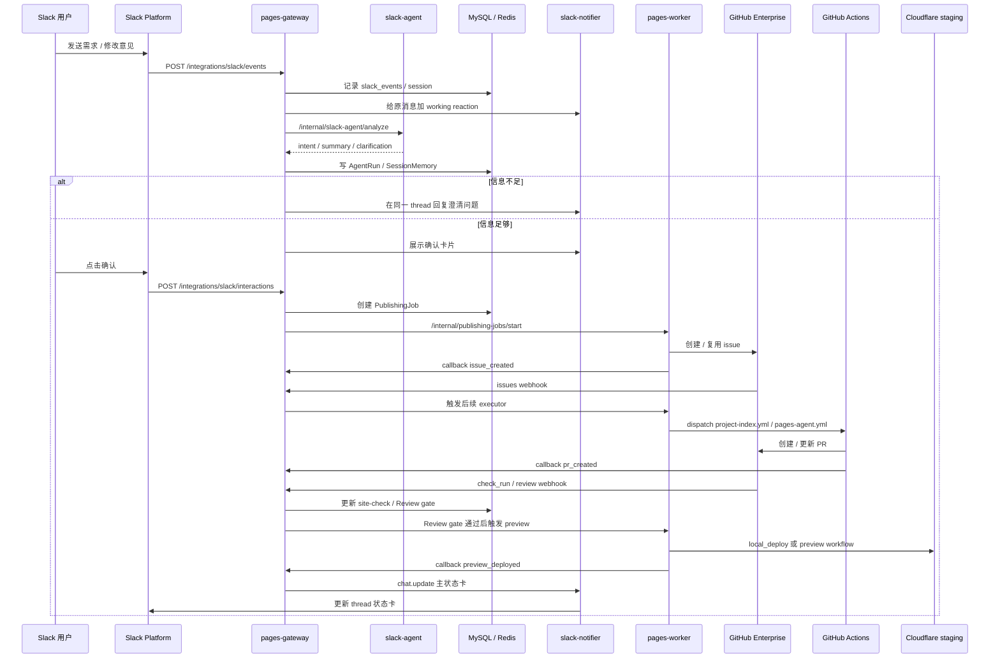

# End To End Flow

## 当前主线

当前产品主线是 Slack 到个人网站 preview 的闭环：

```text
Slack 对话
  -> 需求整理和确认
  -> GitHub issue
  -> Coding Agent
  -> PR
  -> site-check / Review Agent gate
  -> Preview
  -> Slack thread 回写
```

Internal API 也保留，但必须进入同一套 gateway、DB、worker、GitHub、Review gate 和 Slack / webhook 通知流程，不能绕过状态机。

## 时序



## 关键阶段

| 阶段         | 执行者                                | 结果                                              |
| ------------ | ------------------------------------- | ------------------------------------------------- |
| Slack 接收   | `apps/gateway`                        | 验签、幂等、写 `slack_events`                     |
| 需求理解     | `apps/slack-agent`                    | `AgentRun`、`SessionMemory`、intent / summary     |
| 用户确认     | `apps/gateway` + `slack-notifier`     | 只有确认按钮触发后才创建 issue                    |
| issue 创建   | `apps/worker` + `packages/git-client` | GitHub issue，回调 `issue_created`                |
| Coding Agent | `pages-agent.yml`                     | 生成 / 修改目标 `sites/<employee>/<site>/`        |
| PR           | `pages-agent.yml`                     | 受控 branch / PR，回调 `pr_created`               |
| site-check   | `site-check.yml`                      | deterministic required check                      |
| Review gate  | `apps/gateway/src/github/*`           | 归一化 Review Agent comment，决定 blocking / pass |
| Preview      | `apps/worker` 或 `pages-preview.yml`  | Cloudflare staging preview URL                    |
| Slack 回写   | `apps/slack-notifier`                 | 同一 thread 主卡片更新                            |

## 多轮修改

用户拿到 preview 后继续在同一 Slack thread 里回复：

```text
这个 preview 不满意，把标题换成中文，再突出联系方式
```

处理规则：

- gateway 用 `SlackSession` 和 `IssueLink` 定位当前 job / issue / PR。
- Slack Agent 只总结修改意图，不直接改代码。
- worker 追加 GitHub issue comment。
- job 进入 `changes_requested` / `fixing`。
- `pages-agent.yml(mode=fix)` 修改同一个 PR branch。
- site-check / Review gate 重新跑。
- preview 更新后同一张 Slack 状态卡继续更新。

如果 job 已在 `fixing`，新的 Slack 修改进入 pending 队列，避免多个 Coding Agent 并发改同一个 PR。

## 用户和站点隔离

Slack session 隔离键：

```text
team_id + primary_slack_user_id + session_key
```

站点目录隔离：

```text
sites/<employeeSlug>/<siteSlug>/
```

`employeeSlug` 由 gateway 根据 Slack 身份 / 员工身份派生，Slack Agent 只能给 hint，不能靠用户文本写入别人的目录。

## Preview 先行

当前 preview 是默认交付物，不自动发布 production。

用户说“这个版本可以 / 到这里就好”时，产品语义是接受当前 preview 并停止继续修改；不自动合并、不自动 production deploy。后续 production 需要单独的受控流程。

## 状态来源

必须进入 MySQL / webhook / callback 的状态才算平台事实：

- `publishing_jobs`
- `job_events`
- `slack_events`
- `slack_sessions`
- `issue_links`
- `agent_runs`
- `github_webhook_deliveries`
- `review_agent_comments`
- `site_check_runs`
- `slack_job_status_messages`

本机 `gh` 查询、终端日志、手动 watch 只能用于排障，不能推进状态机。
