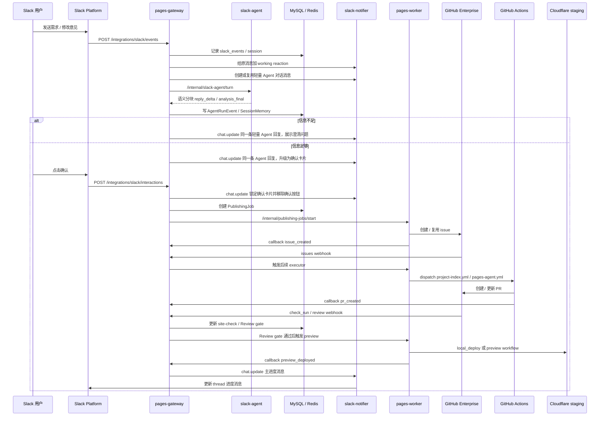
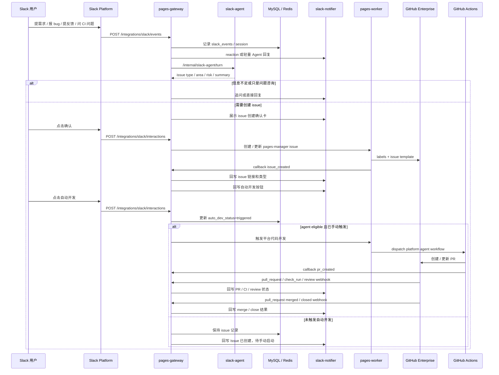

# End To End Flow

## 当前主线

当前运行边界：

- Site Publishing Lane：已退休。新任务、Slack 续接、GitHub Review/site-check、callback、worker start 和 preview workflow 都不会再推进；历史数据保留。
- Platform Dev Lane：Slack 到 `pages-manager` 自身 issue / PR / merge 通知的闭环，使用独立 PlatformDevItem 状态机、手动“自动开发”触发和 `platform-agent.yml`。

Site Publishing Lane 历史链路（dormant）：

```text
Slack 对话
  -> 需求整理和确认
  -> GitHub issue
  -> Coding Agent
  -> PR
  -> site-check / Review Agent gate
  -> Preview
  -> Slack thread 回写
```

Platform Dev Lane：

```text
Slack 需求 / 反馈 / 问题
  -> 需求整理和分类
  -> pages-manager issue
  -> 等待手动“自动开发”触发
  -> Coding Agent PR
  -> CI / review / merge
  -> Slack thread 回写
```

PublishingJob 历史读取 API 保留；创建 API 返回 `410 PUBLISHING_LANE_RETIRED`。pages-worker 只继续接受 `workItemKind=platform_dev`，不能绕过 Gateway 重新启动 Site Publishing。

当前冻结行为：

| 入口                                                                   | Site Publishing 行为                                                   |
| ---------------------------------------------------------------------- | ---------------------------------------------------------------------- |
| `POST /api/publishing-jobs`                                            | `410 PUBLISHING_LANE_RETIRED`，不解析或创建 job                        |
| Slack 新建 / 确认 / follow-up / retry / reopen / 诊断写入 / 转人工写入 | 返回退休提示，不创建、不恢复、不写 GitHub、不启动 worker；历史查询只读 |
| GitHub Issue/PR、Review、site-check webhook                            | 保留 delivery/comment/run 记录，返回 `200` ignored，不推进 job         |
| executor callback / review reconcile                                   | 返回 `200` ignored，不更新状态，不启动 worker                          |
| pages-worker Site Publishing start                                     | `410 PUBLISHING_LANE_RETIRED`                                          |
| `project-index.yml` / `pages-agent.yml` / `pages-preview.yml`          | workflow body 保留，job 由静态 `if: false` 跳过                        |
| PublishingJob list/detail/events                                       | 继续只读，供历史查询和审计                                             |

## Site Publishing Lane 历史时序（已冻结）

下图只解释已有 PublishingJob、Issue/PR、Review 和 preview 数据之间的历史关系，不表示当前仍可执行。当前入口统一在创建或推进前返回退休响应，GitHub webhook/callback 则记录后返回 `200` ignored。



## Site Publishing 历史关键阶段

| 阶段         | 执行者                                       | 结果                                              |
| ------------ | -------------------------------------------- | ------------------------------------------------- |
| Slack 接收   | `apps/gateway`                               | 验签、幂等、写 `slack_events`                     |
| 需求理解     | `apps/slack-agent`                           | `AgentRun`、`SessionMemory`、intent / summary     |
| 用户确认     | `apps/gateway` + `slack-notifier`            | 只有确认按钮触发后才创建 issue                    |
| issue 创建   | `apps/worker` + `packages/git-client`        | GitHub issue，回调 `issue_created`                |
| Coding Agent | `pages-agent.yml`（冻结）                    | 历史上生成 / 修改目标 `sites/<employee>/<site>/`  |
| PR           | `pages-agent.yml`（冻结）                    | 历史上创建受控 branch / PR，回调 `pr_created`     |
| site-check   | `pr-site.yml`（被动校验）                    | 已有或人工站点 PR 的 deterministic check          |
| Review gate  | `apps/gateway/src/github/*`                  | 归一化 Review Agent comment，决定 blocking / pass |
| Preview      | `apps/worker` 或 `pages-preview.yml`（冻结） | 历史 Cloudflare staging preview URL               |
| Slack 回写   | `apps/slack-notifier`                        | 同一 thread 主卡片更新                            |

## Platform Dev Lane 时序

这是 Slack 到 `pages-manager` 自身 issue / PR 的当前闭环。它使用独立 `PlatformDevItem` 状态机、平台确认卡、手动“自动开发”触发、`work_item_links`、`platform-agent.yml` 和 GitHub webhook 回写，不复用 `PublishingJob` 或站点 preview 语义。



关键阶段：

| 阶段         | 执行者                                | 结果                                                                  |
| ------------ | ------------------------------------- | --------------------------------------------------------------------- |
| Slack 接收   | `apps/gateway`                        | 验签、幂等、写 `slack_events`                                         |
| 需求分类     | `apps/slack-agent`                    | issue type、area、risk、summary                                       |
| issue 创建   | `apps/worker` + `packages/git-client` | `lane:platform-dev` issue、label、Slack 元数据                        |
| 自动化分流   | `apps/gateway`                        | `autoDevStatus=pending/triggered`、`agent:eligible`、`waiting-triage` |
| Coding Agent | 专用 platform workflow                | 修改 `pages-manager` repo 全目录内的相关代码                          |
| PR           | 专用 platform workflow                | 受控 branch / PR，回调 `pr_created`                                   |
| CI / review  | GitHub Actions + reviewer             | 决定是否 blocked / mergeable                                          |
| Slack 回写   | `apps/slack-notifier`                 | issue、PR、CI、review、merge / close 状态回写                         |

Platform Dev Lane 详细产品和权限边界见 [platform-dev-lane.md](./platform-dev-lane.md)。

## Site Publishing 多轮修改（已冻结）

历史上用户拿到 preview 后可以在同一 Slack thread 里回复：

```text
这个 preview 不满意，把标题换成中文，再突出联系方式
```

当前行为：

- gateway 可以用 `SlackSession` 和 `WorkItemLink` 找到历史 work item，但 follow-up、retry 和 reopen 只返回统一退休提示。
- 不追加 Site Publishing 修复 comment，不把 job 恢复到 `changes_requested` / `fixing`，不启动 Coding Agent 或 preview。
- 历史 session、work item link、agent run 和 job event 保留，不做物理删除。

Slack-first 主链路的 HTTP 入口、session、语义分块准流式回复、notifier 和进度消息 / message binding 合同见 [slack-platform-runtime.md](./slack-platform-runtime.md)。GitHub webhook、Review Agent comment 监听和 preview gate 规则见 [github-automation.md](./github-automation.md)。

## 用户和站点隔离

Slack session 隔离键：

```text
team_id + primary_slack_user_id + session_key
```

站点目录隔离：

```text
sites/<employeeSlug>/<siteSlug>/
```

`employeeSlug` 由 gateway 根据 Slack 身份 / 员工身份派生，Slack Agent 只能给 hint，不能靠用户文本写入别人的目录。

## Site Publishing Preview（已冻结）

Site Publishing Lane 不再生成或更新 preview。`apps/worker/src/jobs/preview.js` 和 `pages-preview.yml` 仅作为 dormant historical code 保留，不迁移到 v2。

Platform Dev Lane 的默认交付物仍是 issue / PR / merge 通知，不触发站点 preview。

## 状态来源

必须进入 MySQL / webhook / callback 的状态才算平台事实。对 Site Publishing 来说，这些表现在主要是历史记录来源，不表示状态机会继续推进：

- `platform_dev_items`
- `platform_dev_events`
- `work_item_links`
- `work_item_followups`
- `publishing_jobs`
- `job_events`
- `slack_events`
- `slack_sessions`
- `issue_links`
- `agent_runs`
- `github_webhook_deliveries`
- `review_agent_comments`
- `site_check_runs`
- `slack_work_item_status_messages`

本机 `gh` 查询、终端日志、手动 watch 只能用于排障，不能推进状态机。
