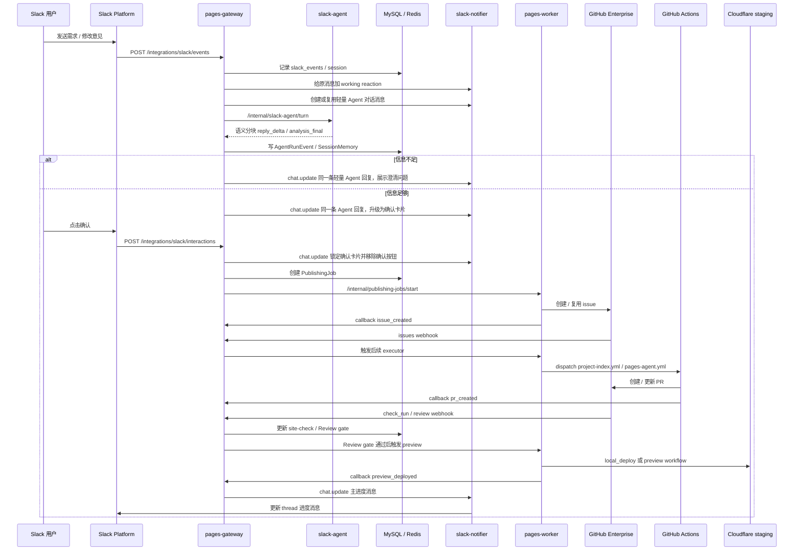
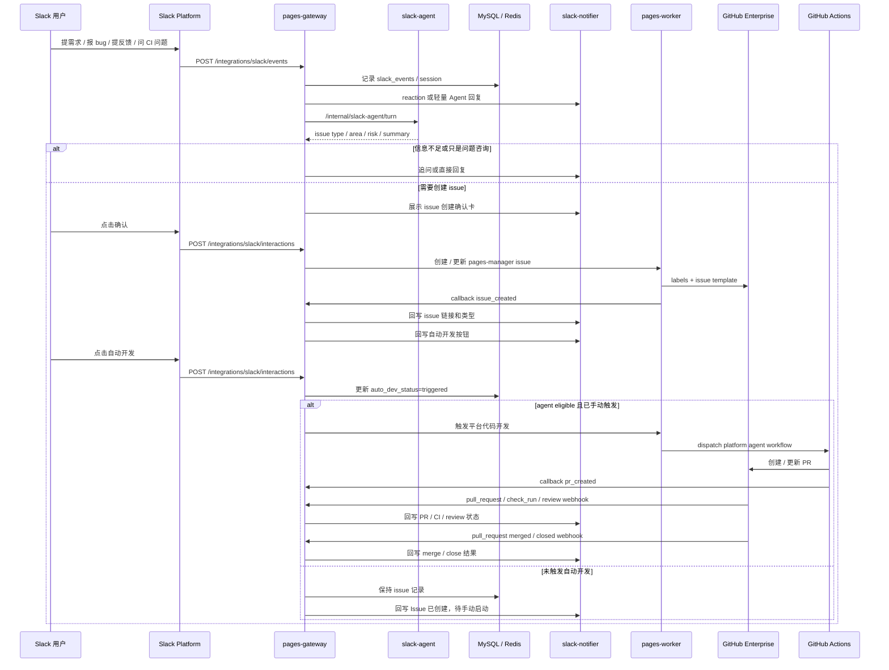

# End To End Flow

## 当前主线

产品目标有两条 Slack 主线：

- Site Publishing Lane：Slack 到个人网站 preview 的闭环，当前已有 `PublishingJob` / PR / preview 底座。
- Platform Dev Lane：Slack 到 `pages-manager` 自身 issue / PR / merge 通知的闭环，使用独立 PlatformDevItem 状态机、手动“自动开发”触发和 `platform-agent.yml`。

Site Publishing Lane：

```text
Slack 对话
  -> 需求整理和确认
  -> GitHub issue
  -> Coding Agent
  -> PR
  -> site-check / Review Agent gate
  -> Preview
  -> Slack thread 回写
```

Platform Dev Lane：

```text
Slack 需求 / 反馈 / 问题
  -> 需求整理和分类
  -> pages-manager issue
  -> 等待手动“自动开发”触发
  -> Coding Agent PR
  -> CI / review / merge
  -> Slack thread 回写
```

Internal API 也保留，但必须进入同一套 gateway、DB、worker、GitHub、Review gate 和 Slack / webhook 通知流程，不能绕过状态机。

## Site Publishing Lane 时序



## 关键阶段

| 阶段         | 执行者                                | 结果                                              |
| ------------ | ------------------------------------- | ------------------------------------------------- |
| Slack 接收   | `apps/gateway`                        | 验签、幂等、写 `slack_events`                     |
| 需求理解     | `apps/slack-agent`                    | `AgentRun`、`SessionMemory`、intent / summary     |
| 用户确认     | `apps/gateway` + `slack-notifier`     | 只有确认按钮触发后才创建 issue                    |
| issue 创建   | `apps/worker` + `packages/git-client` | GitHub issue，回调 `issue_created`                |
| Coding Agent | `pages-agent.yml`                     | 生成 / 修改目标 `sites/<employee>/<site>/`        |
| PR           | `pages-agent.yml`                     | 受控 branch / PR，回调 `pr_created`               |
| site-check   | `site-check.yml`                      | deterministic required check                      |
| Review gate  | `apps/gateway/src/github/*`           | 归一化 Review Agent comment，决定 blocking / pass |
| Preview      | `apps/worker` 或 `pages-preview.yml`  | Cloudflare staging preview URL                    |
| Slack 回写   | `apps/slack-notifier`                 | 同一 thread 主卡片更新                            |

## Platform Dev Lane 时序

这是 Slack 到 `pages-manager` 自身 issue / PR 的当前闭环。它使用独立 `PlatformDevItem` 状态机、平台确认卡、手动“自动开发”触发、`work_item_links`、`platform-agent.yml` 和 GitHub webhook 回写，不复用 `PublishingJob` 或站点 preview 语义。



关键阶段：

| 阶段 | 执行者 | 结果 |
| ---- | ------ | ---- |
| Slack 接收 | `apps/gateway` | 验签、幂等、写 `slack_events` |
| 需求分类 | `apps/slack-agent` | issue type、area、risk、summary |
| issue 创建 | `apps/worker` + `packages/git-client` | `lane:platform-dev` issue、label、Slack 元数据 |
| 自动化分流 | `apps/gateway` | `autoDevStatus=pending/triggered`、`agent:eligible`、`waiting-triage` |
| Coding Agent | 专用 platform workflow | 修改 `pages-manager` repo 全目录内的相关代码 |
| PR | 专用 platform workflow | 受控 branch / PR，回调 `pr_created` |
| CI / review | GitHub Actions + reviewer | 决定是否 blocked / mergeable |
| Slack 回写 | `apps/slack-notifier` | issue、PR、CI、review、merge / close 状态回写 |

Platform Dev Lane 详细产品和权限边界见 [platform-dev-lane.md](./platform-dev-lane.md)。

## 多轮修改

用户拿到 preview 后继续在同一 Slack thread 里回复：

```text
这个 preview 不满意，把标题换成中文，再突出联系方式
```

处理规则：

- gateway 用 `SlackSession` 和 `WorkItemLink` 定位当前 work item / issue / PR。
- Slack Agent 只总结修改意图，不直接改代码。
- 同一个 active session 优先复用同一条轻量 Agent 回复消息；确认前按语义片段更新正文，信息足够后才升级为确认卡；执行阶段只更新同一条进度消息，不刷多条重复消息。
- worker 追加 GitHub issue comment。
- Site Publishing job 进入 `changes_requested` / `fixing`。
- `pages-agent.yml(mode=fix)` 修改同一个 PR branch。
- site-check / Review gate 重新跑。
- preview 更新后同一条 Slack 进度消息继续更新。

如果 job 已在 `fixing`，新的 Slack 修改进入 pending 队列，避免多个 Coding Agent 并发改同一个 PR。

Slack-first 主链路的 HTTP 入口、session、语义分块准流式回复、notifier 和进度消息 / message binding 合同见 [slack-platform-runtime.md](./slack-platform-runtime.md)。GitHub webhook、Review Agent comment 监听和 preview gate 规则见 [github-automation.md](./github-automation.md)。

## 用户和站点隔离

Slack session 隔离键：

```text
team_id + primary_slack_user_id + session_key
```

站点目录隔离：

```text
sites/<employeeSlug>/<siteSlug>/
```

`employeeSlug` 由 gateway 根据 Slack 身份 / 员工身份派生，Slack Agent 只能给 hint，不能靠用户文本写入别人的目录。

## Site Publishing Preview 先行

Site Publishing Lane 的 preview 是默认交付物，不自动发布 production。Platform Dev Lane 的默认交付物是 issue / PR / merge 通知，不触发站点 preview。

用户说“这个版本可以 / 到这里就好”时，产品语义是接受当前 preview 并停止继续修改；不自动合并、不自动 production deploy。后续 production 需要单独的受控流程。

## 状态来源

必须进入 MySQL / webhook / callback 的状态才算平台事实：

- `platform_dev_items`
- `platform_dev_events`
- `work_item_links`
- `work_item_followups`
- `publishing_jobs`
- `job_events`
- `slack_events`
- `slack_sessions`
- `issue_links`
- `agent_runs`
- `github_webhook_deliveries`
- `review_agent_comments`
- `site_check_runs`
- `slack_work_item_status_messages`

本机 `gh` 查询、终端日志、手动 watch 只能用于排障，不能推进状态机。
