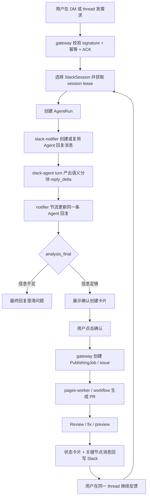

# Slack Platform Runtime

## 定位

本文是 `pages-manager` Slack 运行态的主文档。Slack 相关的运行拓扑、HTTP 入口、会话模型、Slack Agent、语义分块准流式回复、状态卡片、`slack-notifier`、DB / Redis、K8s 部署和 review checklist 都以本文为准。

产品形态一句话概括：

```text
员工在 Slack 里用自然语言描述个人站点需求
  -> Slack Agent 负责对话、澄清和需求整理
  -> 用户确认后创建 PublishingJob / issue
  -> Coding Agent / workflow 生成 PR 和 preview
  -> Slack thread 回写状态、链接和后续修改入口
```

Slack 体验分成两层：

| 层级       | 用户感知                 | 技术形态                                                                                                |
| ---------- | ------------------------ | ------------------------------------------------------------------------------------------------------- |
| 需求对话层 | 像 Agent 对话，有实时感  | Slack Agent 内部可 token streaming；Slack 外显按短句、语义片段或 500ms-1000ms 节流更新同一条 Agent 回复 |
| 任务执行层 | 像发布控制台，稳定可追踪 | PublishingJob 状态卡片 + issue / PR / preview 关键节点消息                                              |

目标不是把全链路都做成 token-by-token 输出。对话阶段追求接近实时的语义分块准流式：Agent 内部可以 token streaming，但 Slack 对外不能按裸 token 刷屏。执行阶段追求确定感，必须保持阶段化、可审计、可恢复。

项目当前还在测试阶段，不需要为旧 Slack 行为做破坏性兼容。实现上可以直接从一次性 `/internal/slack-agent/analyze` 收敛到 `/internal/slack-agent/turn`；旧 `analyze` 最多保留为本地测试 helper，不作为 K8s runtime 合同。

## 当前代码快照

当前 `feat/slack-preview-gateway` 已具备这些基础：

| 能力                     | 当前位置                                 | 说明                                                                                                    |
| ------------------------ | ---------------------------------------- | ------------------------------------------------------------------------------------------------------- |
| Slack HTTP Events        | `apps/gateway/src/index.js`              | `POST /integrations/slack/events`                                                                       |
| Slack Interactivity      | `apps/gateway/src/index.js`              | `POST /integrations/slack/interactions`                                                                 |
| Slack signature 校验     | `apps/gateway/src/slack/http.js`         | 基于 raw body、timestamp、signing secret 校验                                                           |
| URL verification         | `apps/gateway/src/control-plane/handlers.js` | 返回 Slack challenge                                                                               |
| DM / channel thread 会话 | `apps/gateway/src/slack/session.js`      | `SlackSession` 按 Slack user、thread 和 active context 隔离                                             |
| Slack intake 分类        | `apps/gateway/src/slack/intake.js`       | help、ping、status、自然语言需求、续接修改等前置分类                                                    |
| 基础状态卡片             | `packages/slack-notifier/src/index.js`   | Block Kit 展示 stage、job、issue、PR、preview                                                           |
| 原地更新卡片             | `packages/slack-notifier/src/index.js`   | 首次 `chat.postMessage`，后续 `chat.update`                                                             |
| 独立 notifier app        | `apps/slack-notifier/src/index.js`       | 内部 HTTP endpoint，正式 K8s 路径持有 bot token                                                         |
| gateway notifier adapter | `apps/gateway/src/slack/notifier.js`     | 调独立 notifier；本地无 URL 时走 fallback                                                               |
| 基础按钮                 | `apps/gateway/src/control-plane/handlers.js` | 确认创建、继续修改、查看链接、选择旧任务、关闭会话                                                 |
| Agent turn               | `apps/slack-agent/src/index.js`          | `/internal/slack-agent/turn` 已有基础合同；NDJSON 路径可流式输出事件；`analyze` 仅作为旧测试 / 兼容路径 |
| Gateway turn adapter     | `apps/gateway/src/control-plane/handlers.js` | 优先请求 NDJSON，能消费 `reply_delta` 并节流更新同一条 Agent 回复                                  |
| Provider 语义分块        | `apps/slack-agent/src/model-provider.js` | 公司 OpenAI-compatible streaming 响应中只抽取 `visibleReply`，聚合成短句 / 语义片段                     |

当前还不是正式版：

| 缺口                              | 影响                                                                                   |
| --------------------------------- | -------------------------------------------------------------------------------------- |
| Provider streaming 仍需真环境验证 | 代码已支持 OpenAI-compatible SSE streaming，但依赖模型按要求先输出 `visibleReply` 字段 |
| `turn` 协议仍需生产化             | 已有 `reply_delta` + `analysis_final` 基础消费，但还缺持久 offset 恢复和更完整失败补偿 |
| notifier 仍有同步 HTTP fallback   | 还不是 Redis Stream / Queue consumer，offset 恢复能力不足                              |
| store 必须收敛到 MySQL-backed     | 多副本下内存状态会丢幂等、lease、session 和 message binding                            |
| Slack API 调用没有完整持久重试    | `chat.postMessage` / `chat.update` 失败后补偿能力不足                                  |
| Interactivity 还不是完整命令面    | 缺取消、重新生成、选择站点、转人工确认等动作                                           |
| Preview 只有链接                  | 还没有截图、图片 block 或文件上传链路                                                  |

## 非目标

- 不做本地 IDE 远程控制。
- 不重新引入 Socket Mode 或本地 listener 作为运行时 fallback。
- 不让 Slash Command 成为多轮对话 runtime。
- 不把所有执行日志逐 token 或逐行刷到 Slack。
- 不让 Slack 消息是否发送成功决定 `PublishingJob` 是否成功。
- 不让 Slack Agent 直接写代码、创建 PR、部署 preview 或读取 GitHub / Cloudflare 写权限。
- 不把 Slack bot token 传给 GitHub Actions runner、coding-agent、builder、site-check 或 deployer。
- 不把模型内部推理、system prompt、provider 原始 response、debug trace、token、secret 回写到 Slack。

## 总体拓扑

Slack 分三层理解：

```text
Slack Platform
  外部 SaaS，负责消息、事件、slash command、interactive action

Slack App / Bot
  统一的平台机器人身份，安装在公司 Slack workspace

pages-manager Slack runtime
  跑在 pages-manager 自己的常驻平台服务中
```

推荐正式拓扑：

```text
Slack Events API / Interactivity / Commands
  ↓ HTTPS
Ingress
  ↓
pages-gateway
  - 校验 Slack signature / timestamp
  - 3 秒内 ACK
  - 写 SlackEvent / SlackMessageBatch / SlackInteractionEvent
  - 维护 SlackSession / SessionMemory / IssueLink
  - 创建 AgentRun / PublishingJob
  - 写 AgentRunEvent / JobEvent
  ↓
MySQL + Redis Stream / Queue
  ↓
apps/slack-agent
  - 加载 session / memory / issue link
  - 调公司 Agent Gateway
  - 输出语义分块 reply_delta + analysis_final
  ↓
pages-worker / executor
  - 创建 issue
  - dispatch coding workflow
  - 处理 review / fix / preview
  ↓
pages-gateway callback / GitHub webhook
  - 校验 attempt
  - 推进 PublishingJob 状态机
  - 写 JobEvent
  ↓
slack-notifier
  - 消费 AgentRunEvent / JobEvent
  - 限流、去重、retry、dead-letter
  - chat.postMessage / chat.update / reactions.add
  ↓
Slack thread
```

关键边界：

- `pages-gateway` 是 HTTP 入口和状态机入口；负责签名、幂等、权限、session 和状态推进。
- `apps/slack-agent` 是常驻会话理解服务；负责需求摘要、澄清、续接判断和结构化 intent。
- `apps/slack-notifier` 是 Slack Web API 输出服务；正式 K8s 路径只让它持有 `SLACK_BOT_TOKEN`。
- `pages-worker` 和 executor 推进 issue、PR、review、preview，但不直接发 Slack。
- executor 不直接写 MySQL / Redis 最终业务状态；它只能 callback gateway。
- MySQL 是最终状态真相源；Redis / queue 只做 lease、事件分发、短期协调和 rate limit。

## K8s 运行位置

Slack 相关常驻服务放在系统 namespace：

```text
namespace: pages-system
  ├─ pages-gateway
  ├─ slack-agent
  ├─ pages-worker
  ├─ slack-notifier
  ├─ redis / queue
  ├─ mysql
  └─ platform secrets
```

Slack runtime 不跑在 GitHub Actions，也不跑在一次性 job namespace。GitHub Actions 或后续 K8s Job 只适合跑 coding-agent、builder、site-check、controlled-committer、deployer 这类一次性 executor。

生产推荐：

```text
pages-gateway replicas=N
slack-agent replicas=N
slack-notifier replicas=1..N
mysql = shared truth source
redis / queue = lease + stream + rate limit
```

多副本必须满足：

- gateway 多副本不会重复处理同一个 Slack event。
- 同一 `slack_session_id` 同时只有一个 running `AgentRun`。
- notifier 多副本不会重复发送同一个 Slack message / update。
- 任意 Pod 重启后，可以从 DB 找回 session、job、message binding 和 last offset。

## Slack App 入口配置

当前运行方案只使用 HTTP Events / Interactivity，不使用 Socket Mode。

Slack App 需要配置：

```text
Event Request URL:
  <PAGES_GATEWAY_PUBLIC_URL>/integrations/slack/events

Interactivity Request URL:
  <PAGES_GATEWAY_PUBLIC_URL>/integrations/slack/interactions
```

Slash Command 可选，不是当前第一优先级。如果要加，建议只加一个：

```text
/pages
```

Command Request URL：

```text
<PAGES_GATEWAY_PUBLIC_URL>/integrations/slack/commands
```

推荐订阅事件：

```text
app_mention
message.im
message.channels
message.groups
```

处理规则：

- `app_mention`：频道里 @bot 触发，回复到对应 thread。
- `message.im`：DM 中触发，仍按 thread 组织会话。
- `message.channels` / `message.groups`：只处理已跟踪 thread 的后续普通回复；未跟踪 channel 普通消息继续忽略。
- `url_verification`：gateway 直接返回 challenge。
- bot/self/subtype 无关事件：gateway 记录 ignored reason，不进入 Agent。

Slack App 审批和安装后，如果修改了 scopes、Event Subscriptions 或 Interactivity URL，需要重新安装 / 重新审批才会生效。Request URL 只要 Slack 验证成功就能用于事件投递；应用分发到 workspace、权限 scope 和 bot 安装仍受公司 Slack 审批流程影响。

## HTTP 入口合同

### Events

```text
POST /integrations/slack/events
```

顺序：

1. 读取 raw body。
2. 校验 `X-Slack-Signature` 和 `X-Slack-Request-Timestamp`。
3. `url_verification` 直接返回 challenge。
4. 普通事件生成非空 `dedupe_key`，通常来自 `team_id:event_id`。
5. 写 `SlackEvent` / `SlackMessageBatch`。
6. 3 秒内 ACK。
7. 后台 enqueue `slack-agent.turn`，或推进确定性命令。

入口不得同步等待模型、GitHub Actions、preview deploy 或 Slack notifier 完成。

### Interactions

```text
POST /integrations/slack/interactions
```

顺序：

1. 读取 form encoded `payload` 的 raw body。
2. 校验 Slack signature。
3. 解析 `type`、`action_id`、`value`、`team.id`、`user.id`、`channel.id`、`message.ts`。
4. 写 `SlackInteractionEvent` 或等价 command event。
5. 立即 ACK，可用 ephemeral 文本提示“已收到”。
6. 后台交给 gateway / orchestrator 处理实际动作。

按钮点击不能依赖 message 文本反推业务状态，必须用 `action_id + value` 回查 `SlackSession`、`PublishingJob` 或 `SlackMessageBinding`。

interaction dedupe key 必须覆盖单次点击差异，例如：

```text
team_id + payload.type + action_id + action_ts + user.id
team_id + message.channel + message.ts + action_id + user.id + full_payload_hash
```

Slack retry 命中同一条 dedupe 记录时只能重复 ACK，不能重复创建 job、重复关闭会话或重复启动 fix round。

### Commands

```text
POST /integrations/slack/commands
```

Slash Command 只作为快捷入口：

```text
/pages 帮我做一个个人主页
  ↓
gateway 快速 ACK
  ↓
bot 在当前 channel / DM 创建普通 thread 回复
  ↓
后续多轮对话回到 message event + Interactivity
```

不要用 `/preview`、`/site`、`/issue` 等多个相近命令增加学习成本。Slash Command 不能绕过 Slack Agent、gateway 权限校验、session 选择和确认创建规则。

## Secret 和 Token 边界

Slack token 是平台级凭据，不属于员工，也不属于站点。

平台 secret 示例：

```text
secret ref: pages-slack-platform-secret
  SLACK_SIGNING_SECRET
  SLACK_BOT_TOKEN
  SLACK_APP_ID
  SLACK_NOTIFIER_SHARED_SECRET
```

组件边界：

| 组件                      | 需要的 Slack secret                                                                                  | 不应该拿到                                                  |
| ------------------------- | ---------------------------------------------------------------------------------------------------- | ----------------------------------------------------------- |
| `pages-gateway`           | `SLACK_SIGNING_SECRET`、`SLACK_NOTIFIER_SHARED_SECRET`；仅本地 fallback 可临时持有 `SLACK_BOT_TOKEN` | Git push token、Cloudflare deploy token、auto-merge token   |
| `slack-agent`             | 默认不需要 Slack bot token；如需拉 thread / channel 上下文，必须单独评审最小只读路径                 | Git push token、Cloudflare deploy token、auto-merge token   |
| `slack-notifier`          | `SLACK_BOT_TOKEN`                                                                                    | repo write token、Cloudflare deploy token、auto-merge token |
| GitHub Actions / executor | 不需要 Slack token                                                                                   | Slack bot token                                             |

`pages-gateway` 配置 `SLACK_NOTIFIER_URL` 后，正式路径只通过内部 shared secret 调 `slack-notifier`。本地 fallback 只能用于调试，不能带到生产 K8s 默认配置。

Slack Agent 的模型 API key 也是平台级 secret，只能注入给 `apps/slack-agent`：

```text
AGENT_MODEL_PROVIDER=company-agent
AGENT_MODEL_NAME=<company gateway model/router name, optional>
AGENT_GATEWAY_URL=<company OpenAI-compatible BaseURL>
AGENT_MODEL_STREAMING=true
SLACK_AGENT_MAX_CONTEXT_MESSAGES=50
SLACK_AGENT_MAX_OUTPUT_TOKENS=2048
SLACK_AGENT_SEMANTIC_CHUNK_MIN_CHARS=16
SLACK_AGENT_SEMANTIC_CHUNK_MAX_CHARS=72
```

规则：

- `deterministic` 只作为本地 / smoke 兜底。
- `company-agent` 只影响 Slack Agent 的需求理解层，不影响 Coding Agent 运行位置。
- prompt 中只能写规则、issue 规范、权限规则和工具合同，不能写 token 值。
- 用户在 Slack 发 API key 时，Slack Agent 不能回显、不能写 issue / PR / 页面，必须提示改用 secret manager 或管理员配置。

## 身份和权限

Slack 消息不能直接等同于公司员工身份。

```text
Slack team_id + slack_user_id
  ↓
ExternalIdentityBinding
  ↓
User / Employee / OwnerScope
```

规则：

- SSO 绑定跟随用户，不跟随 channel 或 thread。
- 登录绑定主键以 `(team_id, slack_user_id)` 定位。
- 每次创建任务前，gateway 都要确认绑定用户仍是有效员工，并重新计算部门、owner scope 和 admin 权限。
- Channel 只用于限制 bot 可用范围或 owner scope，不能成为登录主体。
- Thread 只用于上下文聚合和回写位置，不能成为共享会话主体。
- 用户只能续接自己名下的 `SlackSession` / `PublishingJob`。
- 如果用户把别人的 `session: sess_xxx`、`job_xxx`、PR link 贴到 Slack，gateway 必须拒绝，不能暴露对方 issue、PR、preview 或 session memory。
- 未绑定 SSO 的 Slack actor 只能收到登录 / 绑定提示，不能创建 `PublishingJob`。

如果消息来自另一个 Slack bot：

- 可以作为需求证据来源。
- 原始消息、channel、thread、bot user id 要写入 `SlackMessageBatch`。
- 不能直接成为 `requested_by`。
- 没有真人 actor 或 `TrustedSlackBotPolicy` 时，只能记录和总结，不能创建 `PublishingJob`。

可选模型：

```text
TrustedSlackBotPolicy
  team_id
  bot_user_id
  app_id
  mode: evidence_only | require_human_confirm | service_account
  service_account_id
  allowed_channel_ids_json
  allowed_owner_scope_ids_json
  status
```

## 用户和 Session 模型

Slack Agent 会话按用户隔离，但一个用户可以有多个 session：

```text
userScopeKey = team_id + primary_slack_user_id
sessionKey = explicit session id | channel thread | dm thread | dm task selector
conversationKey = userScopeKey + sessionKey
IssueLink = job / issue / PR / preview alias -> session
```

Slack channel、thread、DM channel 是消息 surface，不是权限主体：

```text
surfaceContext = channel_id + thread_ts + dm_channel_id + event_ts
```

规则：

- 同一个 Slack user 可以同时有多个 `SlackSession`，例如个人主页、活动页、旧 preview 修改和状态咨询。
- 同一个 Slack thread 里如果多人 @bot，每个人只进入自己名下的 `SlackSession`。
- Channel 不能共享 memory、active job 或 pending questions。
- 用户修改旧 preview 时，优先通过自己的 active `SlackSession` / `IssueLink` 找当前 job；找不到唯一候选时引导用户查看自己的 PR / 任务列表。
- Slack 回写在 channel / thread 里应带 `<@primarySlackUserId>` 前缀，避免多人 thread 串用户。
- Slack 用户资料，例如邮箱和真实姓名，只能作为展示和权限映射辅助；缺失时不能影响 session 隔离。

Session 选择：

- 明确带 `session_id`、`job_xxx`、issue number、PR link 或 preview URL：定位到该用户有权限访问的 session。
- 频道 / thread 消息：默认使用该用户在 `channel_id + thread_ts` 下的 session；没有则创建新的 thread-scoped session。
- DM thread 回复：优先回到原 root message 对应的 session；即使最早的 root message 是普通 DM，也要能通过 `thread_ts` 找回同一 session。
- DM 顶层普通消息：如果用户只有一个未过期 active session，默认续接；如果有多个 active session，必须反问选择。
- DM 顶层显式 `issue:` / `page:` / `site:` 测试命令：创建新的 message-scoped session，避免覆盖正在进行的任务。
- 用户明确说“新建会话”“重新做一个”“另开一个版本”：创建新的 session。
- 用户说“刚才那个”：只在该用户 active session 唯一且未过期时续接，否则提示用户查看自己的 PR / 任务列表再选择。
- 用户点击或发送“关闭会话”后，当前 session 进入 closed，active job / issue / PR 指针被清空，running AgentRun 被失败化；后续即使在同一个 Slack thread 继续发消息，也不能自动复活这个 closed session，只能创建新 session 或通过“我的任务 / 继续 issue #数字 / PR #数字”显式重新选择。

默认 TTL：

| 项                        | 默认值  | 行为                                                                       |
| ------------------------- | ------- | -------------------------------------------------------------------------- |
| active context TTL        | 2 小时  | 超过后不再默认续接；用户明确引用 job / issue / PR / preview 时可恢复       |
| waiting clarification TTL | 1 天    | Agent 问澄清问题后长期未答，状态改为 paused                                |
| recent selectable window  | 14 天   | 只作为“我的 PR / 我的任务”列表的数据窗口；不会在普通 DM 顶层消息里自动续接 |
| archive after inactive    | 90 天   | session 进入 archived 或压缩 memory；IssueLink 和审计保留                  |
| Slack Agent turn timeout  | 120 秒  | 单轮模型调用和工具规划超过后失败并回写可重试提示                           |
| Slack Agent session lease | 180 秒  | 同一 session 同时只允许一个 running AgentRun                               |
| Provider thread TTL       | 24 小时 | 供应商 thread 只做缓存；DB memory 才是真相源                               |
| Coding Agent run timeout  | 30 分钟 | 一次性 coding workflow 超时后写失败状态                                    |

关闭或过期只影响默认续接，不能删除 GitHub issue、PR、preview、DeployRecord 或 AgentRun。

## 数据模型

正式版至少需要这些持久对象：

| 对象                                                 | 用途                                                   |
| ---------------------------------------------------- | ------------------------------------------------------ |
| `SlackEvent`                                         | Slack HTTP event 幂等、审计和重放                      |
| `SlackInteractionEvent`                              | Interactivity / command 幂等和审计                     |
| `SlackMessageBatch`                                  | 同一 thread / turn 的用户消息聚合和上下文来源          |
| `SlackSession`                                       | `(team_id, slack_user_id, session_key)` 维度的会话状态 |
| `SessionMemory`                                      | 需求摘要、待澄清问题、偏好、最近 preview feedback      |
| `IssueLink`                                          | session 与 job / issue / PR / preview 的关联           |
| `PublishingJob`                                      | 发布任务状态机                                         |
| `AgentRun`                                           | Slack Agent 或 Coding Agent 的单轮运行                 |
| `AgentRunEvent`                                      | Agent 对用户可见的进度、摘要、澄清、错误               |
| `JobEvent`                                           | job 阶段变化、callback、review、preview、失败          |
| `SlackAgentReplyMessage`                             | 确认创建前的 Agent 对话回复 `channel + ts + offset`    |
| `slack_job_status_messages` 或 `SlackMessageBinding` | job/session 到 Slack card/message 的绑定               |
| `SlackNotificationAttempt`                           | Slack API 调用尝试、错误、重试、rate limit             |
| `ExternalApiCallLog`                                 | Slack/GitHub/Cloudflare/model provider 调用摘要        |

`SlackSession` 建议字段：

```text
session_id
team_id
session_key
session_title
channel_id
thread_ts
dm_channel_id
surface_context_json
primary_user_id
owner_scope_id
active_job_id
active_issue_number
active_pr_number
active_preview_url
active_context_expires_at
status
last_intent
last_active_at
closed_at
created_at
updated_at
```

`SessionMemory`：

```text
session_id
summary
requirements_json
pending_questions_json
preferences_json
last_preview_feedback
last_agent_response
updated_at
```

`IssueLink`：

```text
session_id
publishing_job_id
issue_number
pr_number
branch_name
preview_url
head_sha
relationship: primary | followup | superseded
created_at
updated_at
```

`SlackAgentReplyMessage`：

```text
id
team_id
slack_session_id
agent_run_id
publishing_job_id          # nullable，确认创建前为空
channel_id
thread_ts
message_ts
mode: update | native_stream
status: starting | streaming | completed | failed
text_snapshot
last_sent_offset
last_sequence
final_event_id
error_code
error_message
created_at
updated_at
```

建议索引：

```text
unique(team_id, slack_user_id, session_key)
unique(agent_run_id)
index(slack_session_id, updated_at)
index(channel_id, thread_ts, message_ts)
index(status, updated_at)
```

如果后续不想新增独立表，也可以把 `SlackAgentReplyMessage` 合并进统一的 `SlackMessageBinding(message_kind=agent_reply | status_card | milestone)`，但第一版推荐独立，避免对话 delta / offset 字段污染状态卡片模型。

## Slack 到发布任务流程



自然语言是主入口。`issue:`、`page:`、`site:` 这类前缀可以在测试阶段保留为开发便捷入口，但不是正式产品承诺。

| Slack 输入                            | 行为                                                                        |
| ------------------------------------- | --------------------------------------------------------------------------- |
| 任意自然语言需求                      | 进入 Slack Agent；信息足够时展示确认卡片                                    |
| 模糊闲聊 / 信息不足                   | 进入 Slack Agent；回复澄清问题，不创建 job                                  |
| 查询我的任务 / PR                     | Slack Agent 请求 `list_my_work_items`；gateway 只返回当前用户可见任务       |
| 查询历史 / 全部任务                   | `state=all`，返回当前用户 active + inactive 任务                            |
| 查询已关闭 issue / PR                 | `state=closed`，只返回当前用户已关闭、已取消或失败任务；可恢复项展示 reopen |
| 继续 issue #数字 / PR #数字           | Slack Agent 请求 `switch_work_item`；gateway 校验归属后切换当前 session     |
| 重新打开 issue #数字 / PR #数字       | Slack Agent 请求 `reopen_work_item`；gateway 只恢复当前用户可恢复的关闭任务 |
| `status: job_xxx`                     | 查询当前用户有权限访问的 job 状态                                           |
| `help`                                | 返回帮助                                                                    |
| `ping`                                | 连通性回复                                                                  |
| `cancel`                              | 返回取消提示或转人工确认                                                    |
| `关闭会话` / `结束对话`               | 关闭当前选中的 session                                                      |
| `这个任务不用了` / `归档这个 preview` | 关闭当前 active IssueLink 或转人工确认                                      |

只有 Slack Agent 明确返回创建类 intent / `confirm_create_issue`，且 `needsClarification=false`，并且用户点击确认后，gateway 才能创建 `PublishingJob`。

当前产品化消息形态：

- 确认前的需求整理阶段，优先复用同一条 Agent 回复消息；连续 DM 或同一 thread 补充需求时，用 `chat.update` 更新该消息，不为每轮都新发一张草稿卡。
- `thinking` / `drafting` 阶段的 Agent 回复保持轻量，只用普通 section 文本承载准流式内容；不显示 header、按钮或正式状态字段，避免用户刚发一句话就看到重卡片跳动。
- 信息足够时，Agent 回复消息变成“确认发布需求”卡片；卡片只代表确认前草稿，不创建 issue。
- 用户点击“继续补充需求”时，原卡片更新为“等待补充”，不会创建 issue，也不会关闭会话。
- 用户点击“确认创建发布任务”后，原确认卡片更新为“发布需求已确认”，确认按钮被移除，避免旧卡片被重复点击。
- 确认后进入执行阶段，由单独的 `PublishingJob` 状态卡接管 issue / PR / Review / Preview 进度；用户后续继续在同一 thread 回复，会更新这张状态卡并触发同一个 PR 的 fix round 或排队。
- 已有 active job / issue / PR 后，修改类消息不再创建“正在整理需求”的 Agent 占位回复；Agent 对用户修改意图的理解进入状态卡的“本轮修改 / 最终需求”。如果 Agent 需要追问、解释、返回查询结果或说明无法处理，仍然在同一 thread 里直接回复用户。
- 每条用户输入的即时反馈优先用 reaction 表示：收到时加 working reaction，完成时换成 done，失败时换成 failed。文字消息只承载真正的信息，不重复刷“我已收到”。

```text
轻量 Agent 回复：需求整理 / 澄清 / 确认前草稿的准流式正文
确认卡：信息足够后的用户决策点
PublishingJob 状态卡：确认后的执行进度、链接、Agent 对本轮修改的理解和后续修改入口
```

## Slack Agent Runtime

`apps/slack-agent` 是常驻服务，但 Agent 的每轮模型调用是短 `AgentRun`：

```text
Slack message
  ↓
获取 session lease
  ↓
加载 SlackSession / SessionMemory / IssueLink
  ↓
调用公司 Agent Gateway
  ↓
输出语义分块 visible reply events + analysis_final
  ↓
gateway 写回结构化 intent / summary / tool request
  ↓
释放 lease
```

Slack Agent 负责：

- 与用户在同一 Slack DM 或 thread 中持续多轮对话。
- 支持自然语言输入。
- 整理 Slack thread 成结构化需求。
- 判断是否需要澄清。
- 判断是否建议创建新任务。
- 判断是否续接已有 issue / PR / preview。
- 识别权限、owner scope、站点管理关系。
- 输出结构化 intent。

Slack Agent 不负责：

- `git push`
- create branch
- create PR
- write repository files
- deploy preview / production
- read Cloudflare token
- read GitHub push token
- read production secret

可用工具应是受控平台动作，例如：

```text
loadSession
saveSessionMemory
list_my_work_items(state=active|all|closed)
switch_work_item(kind=issue|pr|unknown, number)
reopen_work_item(kind=issue|pr|unknown, number)
get_current_status
record_followup
confirm_create_issue
close_session
cancel_request
unsupported_destructive_request
getLinkedIssuePrPreview
askClarification
notifySlack
```

这些工具也不能绕过 gateway 权限、幂等和状态机。Slack Agent 可以主导“下一步做什么”，但 gateway 必须在执行时重新计算当前 Slack 用户、当前 session、该用户名下的 job / issue / PR 范围；Agent 传入其它用户、其它 session 或其它人的 GitHub 编号时不能生效。

产品上，gateway 不应该把“我的任务”“继续某个 issue / PR”“重新打开某个 issue / PR”等自然语言分支写死成主要体验。它可以保留 help / ping / status、签名校验、幂等、危险批量操作拦截和无 Agent 时的兜底；正常对话应先进 Slack Agent，由 Agent 输出 `toolCall`，再由 gateway 做权限收口和执行。

## Turn 协议

目标生产接口：

```text
POST /internal/slack-agent/turn
```

不要把 `/internal/slack-agent/analyze` 作为未来生产合同继续维护。

第一版建议用内部 HTTP streaming，响应体采用 NDJSON，每行一个事件。Slack Events 的 3 秒 ACK 已经在 gateway 入口完成，gateway 可以在后台任务里保持这条内部连接。

这里的 streaming 是内部传输合同，不等于 Slack 对外 token-by-token。模型 provider 如果支持 token 流，`slack-agent` 应先聚合成短句、语义片段或节流窗口，再输出 `reply_delta`。

当前公司 OpenAI-compatible 路径使用 `stream: true` 请求模型，并要求模型 JSON 第一字段包含 `visibleReply`。`slack-agent` 只从 `visibleReply` 中抽取用户可见文本，按标点和长度聚合后输出 `reply_delta`；`intent`、`summary`、`siteSlug` 等结构化字段只在完整 JSON 可解析后作为 `analysis_final` 输出。

请求示例：

```json
{
  "agentRunId": "run_xxx",
  "slackSessionId": "sess_xxx",
  "teamId": "T123",
  "slackUserId": "U123",
  "channelId": "C123",
  "threadTs": "1710000000.000000",
  "messageTs": "1710000001.000000",
  "messageText": "帮我做一个个人主页，突出项目经历",
  "sessionMemory": {
    "requirementsSummary": "用户想创建个人主页",
    "pendingQuestions": []
  },
  "activeIssueLink": null
}
```

响应示例：

```text
{"type":"reply_started","sequence":1,"agentRunId":"run_xxx","slackSessionId":"sess_xxx"}
{"type":"reply_delta","sequence":2,"agentRunId":"run_xxx","slackSessionId":"sess_xxx","text":"我先整理一下："}
{"type":"reply_delta","sequence":3,"agentRunId":"run_xxx","slackSessionId":"sess_xxx","text":"你想做一个突出项目经历的个人主页。"}
{"type":"analysis_final","sequence":4,"agentRunId":"run_xxx","slackSessionId":"sess_xxx","analysis":{"intent":"create_or_update_site","needsClarification":false}}
{"type":"reply_completed","sequence":5,"agentRunId":"run_xxx","slackSessionId":"sess_xxx"}
```

事件字段：

| 字段             | 必填         | 说明                                                                                |
| ---------------- | ------------ | ----------------------------------------------------------------------------------- |
| `type`           | 是           | `reply_started`、`reply_delta`、`analysis_final`、`reply_completed`、`reply_failed` |
| `sequence`       | 是           | 单调递增，用于去重和乱序保护                                                        |
| `agentRunId`     | 是           | gateway 创建的 `AgentRun`                                                           |
| `slackSessionId` | 是           | 当前会话                                                                            |
| `text`           | delta 时必填 | 本次可见语义片段 / 短句增量，不包含内部推理；不应是裸 token                         |
| `analysis`       | final 时必填 | 结构化 intent / summary / needsClarification                                        |
| `visibleToUser`  | 建议         | 默认 true；false 只能进日志                                                         |
| `dedupeKey`      | 建议         | 事件级幂等键                                                                        |
| `createdAt`      | 建议         | Agent 侧产生时间，不能作为唯一顺序来源                                              |

gateway 消费规则：

- 每收到一行合法事件，先写 `AgentRunEvent`，再触发 notifier 更新。
- `reply_delta` 只影响 Slack 可见文本和 `text_snapshot`，不能直接改变 job 状态；gateway / notifier 应继续节流，不能每个 provider token 都调用 Slack API。
- `analysis_final` 才能更新 `SessionMemory` 的结构化结论，并决定澄清、确认卡片或续接任务。
- `reply_completed` 只能表示本轮可见回复结束；如果没有 `analysis_final`，gateway 仍按失败或需重试处理。
- 内部连接断开时，gateway 标记本轮 `AgentRun` failed，并把同一条 Agent 回复更新为可操作错误提示。

如果后续不希望 gateway 保持 HTTP stream，也可以让 `slack-agent` 把事件写入 Redis Stream，再由 gateway / notifier 消费。业务合同不变：事件顺序靠 `sequence`，真相源靠 DB，Slack 消息只是投递结果。

## 对话语义分块准流式回复

对话阶段需要不同于 job 状态卡片的 Slack message binding，因为此时可能还没有 `PublishingJob`。

第一阶段使用 `chat.postMessage + chat.update` 做准流式：

```text
gateway 创建 AgentRun
  ↓
slack-notifier 创建或复用一条“正在整理需求...” Agent 回复
  ↓
slack-agent 持续产出短句 / 语义片段 reply_delta
  ↓
gateway / notifier 每 500ms 到 1000ms，或按语义片段聚合一次
  ↓
chat.update 同一条 Agent 回复
  ↓
analysis_final 到达
  ↓
最终 update + 后续澄清 / 确认卡片
```

执行阶段如果已经有 active job / issue / PR，`chat.update` 的目标默认是 `PublishingJob` 状态卡，而不是 Agent 回复。只有澄清、解释、查询结果、错误提示这类沟通型内容才单独发 thread 回复。

未来可以评估 Slack 原生 streaming API 作为输出通道：

```text
chat.startStream
chat.appendStream
chat.stopStream
```

原生 stream 只改变 Slack 输出方式，不改变平台状态机，也不改变“不追求 token-by-token”的产品目标。即使使用原生 stream，对外 append 的也应该是短句、语义片段或节流窗口，而不是每个 token。

- `AgentRun` 仍然是会话单轮运行。
- `SessionMemory` 仍然是真相源。
- `SlackAgentReplyMessage` 仍记录 `channel + ts + offset`。
- `PublishingJob` 执行阶段仍然用状态卡片。

评估原生 stream 的前提：

- 语义分块准流式体验已经被用户验证仍需要更强实时感。
- notifier 已有持久重试、rate limit 和 dead-letter。
- Agent turn 协议有稳定 `sequence` / `offset`。
- 多副本下不会重复 start stream 或重复 append。
- 有运行开关可按 workspace / channel / user 逐步启用；这个开关控制运行风险，不是为了兼容旧 `analyze`。

用户可见内容只允许：

- 需求摘要。
- 澄清问题。
- 已接收的修改意见。
- 创建任务前的确认文案。
- 状态解释和失败提示。

禁止输出：

- 模型内部推理。
- system / developer prompt。
- provider 原始 response。
- token、secret、cookie、API key。
- GitHub / Cloudflare / Slack credential。

## 执行阶段状态卡片

一旦进入 `PublishingJob`，不继续用 token 流表达后台执行细节，也不把 shell log、模型碎片输出或 Review trace 高频刷进 Slack。

状态卡片按阶段变化更新，回答：

- 当前到哪了。
- 是否失败。
- issue / PR / preview 链接在哪里。
- 用户下一步需要做什么。

关键节点消息沉淀：

- issue 链接。
- PR 链接。
- Preview 链接。
- 阻塞原因。

状态卡片建议包含：

```text
Header: Pages 发布任务
Section: 当前阶段 + 需求摘要
Fields:
  当前阶段
  目标 employee/site
  Job id
  状态
  Issue
  PR
  Preview
Context:
  继续修改可以直接在这个 thread 里回复
Actions:
  查看 Issue
  查看 PR
  打开 Preview
  关闭会话
```

阶段事件示例：

```text
received
issue_creating
issue_created
indexing
index_ready
generating_page
patch_generated
branch_committed
pr_created
reviewing
changes_requested
fixing
previewing
preview_deployed
failed
```

适合进入状态卡片的内容：

- 当前阶段的用户可理解动词。
- 本轮修改摘要。
- review gate 的阻塞数量。
- site-check 是否通过。
- preview 是否已生成。

不适合进入状态卡片：

- shell 命令输出。
- package install 完整日志。
- git diff 大段内容。
- stack trace 原文。
- provider debug trace。

## Interactivity 动作

按钮 `action_id` 建议使用 `pages_` 前缀，`value` 使用 JSON 或短 id；敏感信息不能放在 `value` 里。

| Action                      | 第一版行为                        | 后台事件                   |
| --------------------------- | --------------------------------- | -------------------------- |
| `pages_confirm_requirement` | 确认摘要并创建 job                | `job.confirm_requested`    |
| `pages_close_session`       | 关闭当前用户拥有的 session        | `session.close_requested`  |
| `pages_cancel_job`          | 请求取消或转人工确认              | `job.cancel_requested`     |
| `pages_regenerate`          | 对同一 PR branch 启动新 fix round | `job.regenerate_requested` |
| `pages_open_admin`          | 打开内部控制台链接                | 只生成 URL，不推进状态     |

交互规则：

- 必须校验 action caller 是否拥有对应 `SlackSession`。
- 已关闭或归档的 session 返回 ephemeral 提示，不重新激活。
- 正在运行的 session 使用 lease，不能并发触发两个 fix round。
- Slack retry 不能重复触发命令。
- URL button 只打开 issue / PR / preview；改变状态的动作必须走 callback。
- action `value` 只能放短 id 或无敏 JSON，例如 `{"jobId":"job_xxx","sessionId":"sess_xxx"}`。

## slack-notifier

正式版 `slack-notifier` 是独立 Deployment。它从 gateway 拆出的原因：

- Slack Web API 是慢 I/O，会遇到 rate limit、`message_not_found`、`channel_not_found`、`invalid_auth` 等问题，不应阻塞 webhook ACK。
- gateway 需要保持无状态、可横向扩容，并专注签名校验、幂等、权限和状态机。
- Secret 边界更清楚：正式 K8s 中 `SLACK_BOT_TOKEN` 只进入 `slack-notifier`。
- Slack API 故障只影响通知投递和补偿，不影响 gateway 继续接收事件。
- notifier 可以独立扩缩容、限流和排队。

职责：

- 创建或更新 Agent 对话消息。
- 创建或更新 job 状态卡片。
- 发送 reactions。
- 消费 `AgentRunEvent` / `JobEvent`。
- 查询 `SlackAgentReplyMessage` / `SlackMessageBinding`。
- 构建 Block Kit。
- 处理 rate limit、retry、dead-letter。
- 写 `SlackNotificationAttempt` 和 `ExternalApiCallLog`。
- 提供内部 HTTP fallback endpoint，供 gateway 在写入事件后同步请求一次投递。

不负责：

- 判断用户意图。
- 创建 issue / PR。
- 部署 preview。
- 读取 GitHub token 或 Cloudflare token。
- 修改 `PublishingJob` 业务状态。

当前已实现的对话消息内部 endpoint：

```text
POST /internal/slack-notifier/agent-reply/start
POST /internal/slack-notifier/agent-reply/update
```

`complete` / `fail` 不单独暴露 endpoint；当前通过 `agent-reply/update` 的 `status=completed|failed` 更新同一条 Slack 消息。

多副本要求：

```text
slack-notifier replicas=N
  ↓
Redis consumer group / queue lease
  ↓
同一 event 只有一个 consumer 发送 Slack
```

`SlackNotificationAttempt` 状态：

```text
pending
sent
rate_limited
retry_scheduled
failed
dead_letter
superseded
```

重试规则：

- `rate_limited` 按 Slack retry hint 或平台默认 backoff 延迟重试。
- `invalid_auth`、`channel_not_found`、`not_in_channel` 进入 `dead_letter` 并暴露给 Admin Console。
- `message_not_found` 且原消息是 status card 时，可以补发新卡片并更新 binding。
- notifier 重试不能修改 `PublishingJob` 状态，只能修改通知尝试状态和 message binding。

## 幂等、并发和恢复

至少需要这些幂等键：

| 场景                        | dedupe key                                                              |
| --------------------------- | ----------------------------------------------------------------------- |
| Slack event 接收            | `team_id:event_id`                                                      |
| Slash command / interaction | `team_id:payload_type:action_id:action_ts:user_id` 或 full payload hash |
| AgentRun 创建               | `slack_event:<team_id>:<event_id>`                                      |
| Agent delta                 | `agent_run_id:sequence`                                                 |
| Agent reply message posted  | `slack-reply-posted:<agent_run_id>`                                     |
| Agent reply message updated | `slack-reply-updated:<agent_run_id>:<sequence>`                         |
| Agent reply message failed  | `slack-reply-failed:<agent_run_id>:<sequence>`                          |
| Confirm button              | `team_id:action_id:action_ts:user_id` 或完整 payload hash               |
| PublishingJob 创建          | `slack-confirm:<session_id>:<redacted_analysis_hash>`                   |

规则：

- `dedupe_key` 必须非空，不能依赖 nullable unique。
- 同一个 `(team_id, dedupe_key)` 只能处理一次。
- 同一 `slack_session_id` 同时只能有一个 running `AgentRun`。
- 后到消息当前可以回复“上一轮还在处理中，请稍等一下再发”；后续可写入 queue 顺序处理。
- 两轮 Agent 不能同时修改同一个 `SessionMemory`。
- Slack update 限流，不要每个 token 都调用一次 Slack API；对话阶段按语义片段 / 500ms-1000ms 窗口更新，执行阶段按阶段变化更新。
- notifier 重启后必须从 DB 找回 `message_ts` 和 `last_sent_offset`。

旧事件保护：

- 如果事件携带 attempt id，必须确认它仍是当前 job active attempt。
- 如果事件没有 attempt id，必须校验 `agent_run_id`、session lease 和 dedupe。
- `stage_order` 不得早于 binding 的 `last_stage_order`。
- 旧事件晚到可以写审计，但不能回滚 `PublishingJob`，也不能覆盖 Slack 状态卡片。

文本长度：

- 发 Slack 的可见文本按平台常量截断，例如 3000 字符内。
- 确认卡片只展示摘要，不展示全部对话。
- 完整需求进入 `SessionMemory.requirements_json`。
- 截断时给出可理解提示，例如“内容较长，已省略部分细节。确认后我会把完整需求整理进 issue。”

## Preview 不满意和 Fix Round

用户在同一个 thread 里说：

```text
这个 preview 不满意，把标题改成中文，再加一个项目经历区域
```

处理流程：

```text
Slack Agent 加载 SlackSession
  ↓
找到 active PublishingJob / issue / PR / preview
  ↓
分类为 modify_existing_preview
  ↓
写 SessionMemory.last_preview_feedback
  ↓
追加 GitHub issue comment
  ↓
gateway 将 job 推进到 changes_requested / fixing
  ↓
dispatch pages-agent.yml(mode=fix)
  ↓
Coding Agent 修改同一个 PR branch
  ↓
再次触发 GitHub Review Agent
  ↓
Review gate 通过后重新部署 Preview
  ↓
Slack 回写新 Preview URL
```

默认修复同一个 PR branch，除非用户明确要求“重新开一个版本”或当前 PR 已结束。

Issue 续接规则：

- 当前选中 session 有唯一 active issue：默认追加 comment。
- 当前用户有多个 recent issue / preview：必须要求选择。
- 消息包含 `job_xxx`：查 job 并确认 actor 有权限。
- 消息包含 `#123` 或 PR 链接：查 issue / PR 并确认属于可管理站点。
- 用户说“新建”“重新做一个”：创建新 issue。
- 用户说“刚才那个”：只在当前用户最近 session / 任务唯一且权限匹配时续接，否则反问。

所有续接和修改都必须落 GitHub issue comment，保证 Slack 对话不会成为唯一真相源。

## 本地和测试运行

本地开发不再使用 Socket Mode listener。目标是用本地 K8s 启动常驻服务，裸 Node 启动只作为临时调试。

gateway Slack HTTP 入口环境变量：

```text
SLACK_SIGNING_SECRET
SLACK_EVENTS_PROCESSING_MODE
SLACK_SIGNATURE_REQUIRED
SLACK_REACTION_ON_RECEIVE
SLACK_WORKING_REACTION
SLACK_SIGNATURE_MAX_SKEW_SECONDS
SLACK_NOTIFIER_URL
SLACK_NOTIFIER_SHARED_SECRET
```

`slack-notifier` 环境变量：

```text
SLACK_BOT_TOKEN
SLACK_API_URL
SLACK_NOTIFIER_SHARED_SECRET
```

真实 token 只能放本机私有环境或 secret manager，不能写入 repo。

本地 smoke 可使用：

```text
employeeSlug = smoke
siteSlug = profile
baseRef = staging
environment = preview
```

也可以启用单 issue / 单 PR 模式：

```text
PAGES_EXECUTOR_MODE=github_issue_webhook
PAGES_ISSUE_MODE=smoke_single
PAGES_SMOKE_ISSUE_SCOPE=local-slack-smoke
PAGES_PR_MODE=smoke_single
PAGES_SMOKE_PR_BRANCH=sites/smoke-local-slack-smoke-profile
```

这些只用于本地或 staging smoke，不能作为 production 默认行为。

GitHub Review Agent 结果监听必须走 GitHub webhook：

```text
GitHub Review Agent comment
  ↓
GitHub webhook
  ↓
pages-gateway /integrations/github/webhook
  ↓
ReviewAgentComment / PublishingJob state
  ↓
preview gate / Slack notification
```

本地可以用 `gh pr view`、`gh api`、`gh run view` 辅助观察，但不能把 `gh` CLI 轮询写进 gateway、worker 或 workflow runtime。

## Preview 截图

Preview 截图是富展示后续增强，不阻塞状态卡片：

```text
preview_deployed
  ↓
browser / screenshot worker
  ↓
PNG artifact / object storage
  ↓
JobEvent(preview_screenshot_ready)
  ↓
slack-notifier 更新状态卡片或追加图片消息
```

规则：

- 截图失败不能让 `preview_deployed` 回滚。
- 截图 worker 不持有 Slack token。
- 图片 URL 如果用于 Slack `image` block，必须是 Slack 可访问地址。
- 如果图片含内部页面内容，需要先确认访问策略。

## 实现顺序

因为项目仍在测试阶段，推荐直接按目标合同推进，不长期维护旧 `analyze` 生产链路：

1. 文档收敛：本文作为 Slack 唯一主文档，旧 Slack 分散文档已删除。
2. DB schema：新增 / 演进 `SlackAgentReplyMessage`、`AgentRunEvent`、`SlackNotificationAttempt`、`ExternalApiCallLog`。
3. notifier API：增加 Agent reply start/update/complete/fail endpoint。
4. slack-agent turn：用 `/internal/slack-agent/turn` 替换生产 `analyze`。
5. gateway streaming adapter：移除 `postSlackResultReply` 的生产依赖，改为 Agent reply binding + turn event。
6. 语义分块准流式 Slack 输出：用 `chat.postMessage + chat.update` 做可用体验。
7. Redis Stream / Queue：notifier 从同步 HTTP fallback 逐步切到 consumer。
8. 执行阶段状态卡片：worker / executor 增加阶段化 progress event。
9. Interactivity 扩展：cancel、regenerate、confirm、admin link、选择站点。
10. 原生 Slack stream API：如有必要，在 notifier 内封装 `chat.startStream` / `chat.appendStream` / `chat.stopStream`，仍按语义片段输出，并按运行开关启用。
11. Preview screenshot：增加截图 worker 和图片回写。

## 验收标准

- 用户在 DM 或 `@bot` thread 发自然语言需求后，3 秒内看到 ACK 感知：reaction 或“正在整理需求”消息。
- 需求对话阶段，同一条 Agent 回复按短句、语义片段或 500ms-1000ms 节流窗口持续更新，不刷多条重复消息。
- Agent 最终输出澄清问题或确认卡片；不会直接创建 issue。
- 用户点击确认后，状态卡片接管执行阶段。
- issue / PR / preview 生成后都有稳定 thread 消息。
- 同一 Slack user 的不同 session 不串线。
- 同一 thread 中不同用户不共享 memory、active job 或 pending questions。
- 同一 session 同时只允许一个 running `AgentRun`。
- gateway / notifier 任一 Pod 重启后，不会重复创建 job，也不会重复刷 Slack。
- Slack bot token 不进入 executor / GitHub Actions / coding-agent。
- Slack 输出不包含 system prompt、provider 原始响应、token、secret 或内部 debug trace。

## Review checklist

实现或 review Slack 相关 PR 时，至少检查：

- [ ] 没有重新引入 Socket Mode 或本地 listener。
- [ ] Slack HTTP 请求使用 raw body 校验 signature。
- [ ] 入口 handler 3 秒内 ACK，不同步等待长任务。
- [ ] 每个 Slack event / interaction 都有非空 dedupe key。
- [ ] interaction dedupe 包含单次点击 id 或完整 payload hash，不会把用户第二次合法点击误判成 retry。
- [ ] Slack session 按 `(team_id, slack_user_id, session_key)` 隔离。
- [ ] 同一 session 只有一个 running `AgentRun`。
- [ ] 对话阶段 Agent 回复 `channel + message_ts + offset/sequence` 持久化，且不依赖 job 已创建。
- [ ] delta 使用 `sequence` 或 offset 去重。
- [ ] Slack update 限流，不会每个 token 都打一次 Slack API；执行阶段只按阶段变化更新状态卡片。
- [ ] `analysis_final` 是创建 job 的唯一 Agent 结构化依据，不能从可见文本反解析。
- [ ] 确认创建仍然需要用户点击按钮或明确受控动作。
- [ ] 状态卡片和 Agent 回复使用不同 binding 或明确 `message_kind`。
- [ ] `chat.update` 失败有补偿策略。
- [ ] 旧 attempt / 旧 stage 事件不会覆盖新状态卡片。
- [ ] executor progress 通过 `/internal/executor-callback` 或受控 gateway API 进入状态机。
- [ ] 正式 K8s 路径下 Slack bot token 只进入 `slack-notifier`。
- [ ] executor / GitHub Actions / coding-agent 不持有 Slack token。
- [ ] Agent 回写内容经过 secret-like 脱敏。
- [ ] 多副本下不会重复发消息或重复推进 job。
- [ ] 文档、DB schema、内部 endpoint 说明和测试保持一致。

## FAQ

### Slack Agent 是常驻 Agent 吗？

常驻的是 `apps/slack-agent` 服务、DB 中的 session / memory / issue link，以及平台的运行边界。不是每个用户一个常驻模型进程，也不是一个 Slack thread 永远占住一个容器。每条消息会生成短 `AgentRun`。

### 多个用户能同时触发吗？

可以。隔离边界是 `team_id + slack_user_id + slack_session_id`。同一用户可有多个 session；不同用户即使在同一 thread，也不能共享 memory 或 active job。

### Slash Command 是否更适合流式 runtime？

不适合。Slash Command 适合快速唤起入口，后续多轮对话应回到普通 Slack message event 和 thread。语义分块准流式回复由 `slack-agent turn` + `slack-notifier` 更新普通消息实现。

### 能做到真正 token 级流式吗？

不建议追求真正 token 级。产品目标是接近实时的语义分块更新：Agent 内部可以 token streaming，但 Slack 对外应按短句、语义片段或 500ms-1000ms 节流窗口更新同一条消息。未来即使接 Slack 原生 `chat.startStream` / `chat.appendStream` / `chat.stopStream`，也只是更平滑的输出通道，不代表要按 token 刷屏。

### 为什么不把 slack-notifier 放进 gateway？

gateway 要快速 ACK、做签名校验、幂等、权限和状态机。Slack Web API 是慢 I/O，还会 rate limit、失败、重试和 dead-letter。拆出 notifier 可以隔离 token、隔离故障、独立限流，也让 gateway 更容易横向扩容。

### Slack token 可以给 Slack Agent 吗？

默认不需要。Slack Agent 如果未来必须拉 thread / channel 上下文，需要单独评审最小只读 scope 和调用路径。Slack token 无论如何不能进入 GitHub Actions、coding-agent、builder、site-check 或 deployer。

### `analyze` 还要兼容吗？

不用。项目当前未正式上线，生产路径可以直接迁移到 `/internal/slack-agent/turn`。`analyze` 可以删除，或仅保留为本地测试 helper。

### Execution 阶段也要 token 流式吗？

不建议。执行阶段应使用状态卡片和关键节点消息，按 issue、PR、Review、Preview 等阶段变化更新。后台日志、shell 输出、diff、stack trace 和模型碎片输出不应该刷进 Slack。

### SSO 登录态跟 channel 还是 thread 绑定？

都不是。SSO 绑定跟随 Slack user：`team_id + slack_user_id -> User / Employee`。Channel / thread 只是上下文和回写位置。

### GitHub Actions runner 能继承 Slack 对话上下文吗？

不能直接继承。GitHub Actions 是一次性 executor，只接收 gateway / worker 派发的 job context。Slack session、memory、issue link 的真相源在 DB，不能靠 runner 会话或本地状态继承。
