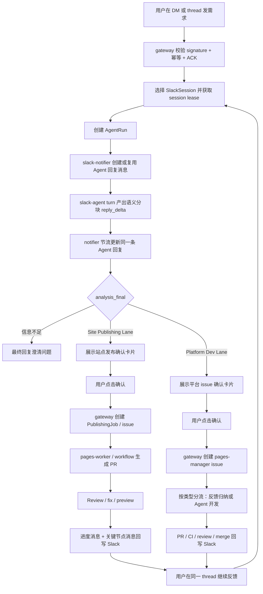

# Slack Platform Runtime

## 定位

本文是 `pages-manager` Slack 运行态的主文档。Slack 相关的运行拓扑、HTTP 入口、会话模型、Slack Agent、语义分块准流式回复、进度消息 / message binding、`slack-notifier`、DB / Redis、K8s 部署和 review checklist 都以本文为准。

目标产品形态一句话概括：

```text
员工在 Slack 里用自然语言描述需求
  -> Slack Agent 负责对话、澄清、分类和需求整理
  -> 用户确认后创建 PublishingJob 或 pages-manager issue
  -> Site Publishing Lane 生成站点 PR / preview
  -> Platform Dev Lane 生成平台 issue / PR / merge 通知
  -> Slack thread 回写状态、链接和后续修改入口
```

Slack 体验分成两层：

| 层级       | 用户感知                 | 技术形态                                                                                                |
| ---------- | ------------------------ | ------------------------------------------------------------------------------------------------------- |
| 需求对话层 | 像 Agent 对话，有实时感  | Slack Agent 内部可 token streaming；Slack 外显按短句、语义片段或 500ms-1000ms 节流更新同一条 Agent 回复 |
| 任务执行层 | 像进度面板，稳定可追踪 | 用户看到进度消息、链接和下一步动作；内部用 message binding / render state 承载更新 |

目标不是把全链路都做成 token-by-token 输出。对话阶段追求接近实时的语义分块准流式：Agent 内部可以 token streaming，但 Slack 对外不能按裸 token 刷屏。执行阶段追求确定感，必须保持阶段化、可审计、可恢复。

项目当前还在测试阶段，不需要为旧 Slack 行为做破坏性兼容。实现上可以直接从一次性 `/internal/slack-agent/analyze` 收敛到 `/internal/slack-agent/turn`；旧 `analyze` 最多保留为本地测试 helper，不作为 K8s runtime 合同。

## 当前代码快照

当前 `feat/slack-preview-gateway` 已具备这些基础：

| 能力                     | 当前位置                                 | 说明                                                                                                    |
| ------------------------ | ---------------------------------------- | ------------------------------------------------------------------------------------------------------- |
| Slack HTTP Events        | `apps/gateway/src/index.js`              | `POST /integrations/slack/events`                                                                       |
| Slack Interactivity      | `apps/gateway/src/index.js`              | `POST /integrations/slack/interactions`                                                                 |
| Slack signature 校验     | `apps/gateway/src/slack/http.js`         | 基于 raw body、timestamp、signing secret 校验                                                           |
| URL verification         | `apps/gateway/src/control-plane/handlers.js` | 返回 Slack challenge                                                                               |
| DM / channel thread 会话 | `apps/gateway/src/slack/session.js`      | `SlackSession` 按 Slack user、thread 和 active context 隔离                                             |
| Slack intake 分类        | `apps/gateway/src/slack/intake.js`       | help、ping、status、自然语言需求、续接修改等前置分类                                                    |
| 基础进度消息             | `packages/slack-notifier/src/index.js`   | Block Kit 展示用户可理解的阶段、issue、PR、preview 和下一步；内部仍绑定 job / work item                  |
| 原地更新卡片             | `packages/slack-notifier/src/index.js`   | 首次 `chat.postMessage`，后续 `chat.update`                                                             |
| 独立 notifier app        | `apps/slack-notifier/src/index.js`       | 内部 HTTP endpoint，正式 K8s 路径持有 bot token                                                         |
| gateway notifier adapter | `apps/gateway/src/slack/notifier.js`     | 调独立 notifier；本地无 URL 时走 fallback                                                               |
| 基础按钮                 | `apps/gateway/src/control-plane/handlers.js` | 确认创建、继续修改、查看链接、选择旧任务、关闭会话                                                 |
| Agent turn               | `apps/slack-agent/src/index.js`          | `/internal/slack-agent/turn` 已有基础合同；NDJSON 路径可流式输出事件；`analyze` 仅作为旧测试 / 兼容路径 |
| Gateway turn adapter     | `apps/gateway/src/control-plane/handlers.js` | 优先请求 NDJSON，能消费 `reply_delta` 并节流更新同一条 Agent 回复                                  |
| Provider 语义分块        | `apps/slack-agent/src/model-provider.js` | 公司 OpenAI-compatible streaming 响应中只抽取 `visibleReply`，聚合成短句 / 语义片段                     |

当前仍需生产化增强：

| 缺口                              | 影响                                                                                   |
| --------------------------------- | -------------------------------------------------------------------------------------- |
| Provider streaming 仍需真环境验证 | 代码已支持 OpenAI-compatible SSE streaming，但依赖模型按要求先输出 `visibleReply` 字段 |
| `turn` 协议仍需生产化             | 已有 `reply_delta` + `analysis_final` 基础消费，但还缺持久 offset 恢复和更完整失败补偿 |
| notifier 仍有同步 HTTP fallback   | 还不是 Redis Stream / Queue consumer，offset 恢复能力不足                              |
| Slack API 调用没有完整持久重试    | `chat.postMessage` / `chat.update` 失败后补偿能力不足                                  |
| Interactivity 仍可扩展            | 已有确认、选择任务、关闭会话和 Platform gate；取消、重新生成、转人工等动作还可继续补齐 |
| Preview 只有链接                  | 还没有截图、图片 block 或文件上传链路                                                  |

## 非目标

- 不做本地 IDE 远程控制。
- 不重新引入 Socket Mode 或本地 listener 作为运行时 fallback。
- 不让 Slash Command 成为多轮对话 runtime。
- 不把所有执行日志逐 token 或逐行刷到 Slack。
- 不让 Slack 消息是否发送成功决定 work item 是否成功。
- 不让 Slack Agent 直接写代码、创建 PR、部署 preview 或读取 GitHub / Cloudflare 写权限。
- 不把 Slack bot token 传给 GitHub Actions runner、coding-agent、builder、site-check 或 deployer。
- 不把模型内部推理、system prompt、provider 原始 response、debug trace、token、secret 回写到 Slack。

## 总体拓扑

Slack 分三层理解：

```text
Slack Platform
  外部 SaaS，负责消息、事件、slash command、interactive action

Slack App / Bot
  统一的平台机器人身份，安装在公司 Slack workspace

pages-manager Slack runtime
  跑在 pages-manager 自己的常驻平台服务中
```

推荐正式拓扑：

```text
Slack Events API / Interactivity / Commands
  ↓ HTTPS
Ingress
  ↓
pages-gateway
  - 校验 Slack signature / timestamp
  - 3 秒内 ACK
  - 写 SlackEvent / SlackMessageBatch / SlackInteractionEvent
  - 维护 SlackSession / SessionMemory / WorkItemLink
  - 创建 AgentRun / PublishingJob / PlatformDevItem
  - 写 AgentRunEvent / JobEvent / PlatformDevEvent
  ↓
MySQL + Redis Stream / Queue
  ↓
apps/slack-agent
  - 加载 session / memory / issue link
  - 调公司 Agent Gateway
  - 输出语义分块 reply_delta + analysis_final
  ↓
pages-worker / executor
  - 创建 issue
  - dispatch coding workflow
  - 处理 review / fix / preview
  ↓
pages-gateway callback / GitHub webhook
  - 校验 attempt
  - 推进 PublishingJob 或 PlatformDevItem 状态机
  - 写 JobEvent 或 PlatformDevEvent
↓
slack-notifier
  - 消费 AgentRunEvent / JobEvent / PlatformDevEvent
  - 限流、去重、retry、dead-letter
  - chat.postMessage / chat.update / reactions.add
  ↓
Slack thread
```

关键边界：

- `pages-gateway` 是 HTTP 入口和状态机入口；负责签名、幂等、权限、session 和状态推进。
- `apps/slack-agent` 是常驻会话理解服务；负责需求摘要、澄清、续接判断和结构化 intent。
- `apps/slack-notifier` 是 Slack Web API 输出服务；正式 K8s 路径只让它持有 `SLACK_BOT_TOKEN`。
- `pages-worker` 和 executor 推进 issue、PR、review、preview，但不直接发 Slack。
- executor 不直接写 MySQL / Redis 最终业务状态；它只能 callback gateway。
- MySQL 是最终状态真相源；Redis / queue 只做 lease、事件分发、短期协调和 rate limit。

## K8s 运行位置

Slack 相关常驻服务放在系统 namespace：

```text
namespace: pages-system
  ├─ pages-gateway
  ├─ slack-agent
  ├─ pages-worker
  ├─ slack-notifier
  ├─ redis / queue
  ├─ mysql
  └─ platform secrets
```

Slack runtime 不跑在 GitHub Actions，也不跑在一次性 job namespace。GitHub Actions 或后续 K8s Job 只适合跑 coding-agent、builder、site-check、controlled-committer、deployer 这类一次性 executor。

生产推荐：

```text
pages-gateway replicas=N
slack-agent replicas=N
slack-notifier replicas=1..N
mysql = shared truth source
redis / queue = lease + stream + rate limit
```

多副本必须满足：

- gateway 多副本不会重复处理同一个 Slack event。
- 同一 `slack_session_id` 同时只有一个 running `AgentRun`。
- notifier 多副本不会重复发送同一个 Slack message / update。
- 任意 Pod 重启后，可以从 DB 找回 session、job、message binding 和 last offset。

## Slack App 入口配置

当前运行方案只使用 HTTP Events / Interactivity，不使用 Socket Mode。

Slack App 需要配置：

```text
Event Request URL:
  <PAGES_GATEWAY_PUBLIC_URL>/integrations/slack/events

Interactivity Request URL:
  <PAGES_GATEWAY_PUBLIC_URL>/integrations/slack/interactions
```

Slash Command 可选，不是当前第一优先级。如果要加，建议只加一个：

```text
/pages
```

Command Request URL：

```text
<PAGES_GATEWAY_PUBLIC_URL>/integrations/slack/commands
```

推荐订阅事件：

```text
app_mention
message.im
message.channels
message.groups
```

处理规则：

- `app_mention`：频道里 @bot 触发，回复到对应 thread。
- `message.im`：DM 中触发，仍按 thread 组织会话。
- `message.channels` / `message.groups`：只处理已跟踪 thread 的后续普通回复；未跟踪 channel 普通消息继续忽略。
- `url_verification`：gateway 直接返回 challenge。
- bot/self/subtype 无关事件：gateway 记录 ignored reason，不进入 Agent。

Slack App 审批和安装后，如果修改了 scopes、Event Subscriptions 或 Interactivity URL，需要重新安装 / 重新审批才会生效。Request URL 只要 Slack 验证成功就能用于事件投递；应用分发到 workspace、权限 scope 和 bot 安装仍受公司 Slack 审批流程影响。

## HTTP 入口合同

### Events

```text
POST /integrations/slack/events
```

顺序：

1. 读取 raw body。
2. 校验 `X-Slack-Signature` 和 `X-Slack-Request-Timestamp`。
3. `url_verification` 直接返回 challenge。
4. 普通事件生成非空 `dedupe_key`，通常来自 `team_id:event_id`。
5. 写 `SlackEvent` / `SlackMessageBatch`。
6. 3 秒内 ACK。
7. 后台 enqueue `slack-agent.turn`，或推进确定性命令。

入口不得同步等待模型、GitHub Actions、preview deploy 或 Slack notifier 完成。

### Interactions

```text
POST /integrations/slack/interactions
```

顺序：

1. 读取 form encoded `payload` 的 raw body。
2. 校验 Slack signature。
3. 解析 `type`、`action_id`、`value`、`team.id`、`user.id`、`channel.id`、`message.ts`。
4. 写 `SlackInteractionEvent` 或等价 command event。
5. 立即 ACK，可用 ephemeral 文本提示“已收到”。
6. 后台交给 gateway / orchestrator 处理实际动作。

按钮点击不能依赖 message 文本反推业务状态，必须用 `action_id + value` 回查 `SlackSession`、`work_item_kind + work_item_id` 或 `SlackMessageBinding`。

interaction dedupe key 必须覆盖单次点击差异，例如：

```text
team_id + payload.type + action_id + action_ts + user.id
team_id + message.channel + message.ts + action_id + user.id + full_payload_hash
```

Slack retry 命中同一条 dedupe 记录时只能重复 ACK，不能重复创建 job、重复关闭会话或重复启动 fix round。

### Commands

```text
POST /integrations/slack/commands
```

Slash Command 只作为快捷入口：

```text
/pages 帮我做一个个人主页
  ↓
gateway 快速 ACK
  ↓
bot 在当前 channel / DM 创建普通 thread 回复
  ↓
后续多轮对话回到 message event + Interactivity
```

不要用 `/preview`、`/site`、`/issue` 等多个相近命令增加学习成本。Slash Command 不能绕过 Slack Agent、gateway 权限校验、session 选择和确认创建规则。

## Secret 和 Token 边界

Slack token 是平台级凭据，不属于员工，也不属于站点。

平台 secret 示例：

```text
secret ref: pages-slack-platform-secret
  SLACK_SIGNING_SECRET
  SLACK_BOT_TOKEN
  SLACK_APP_ID
  SLACK_NOTIFIER_SHARED_SECRET
```

组件边界：

| 组件                      | 需要的 Slack secret                                                                                  | 不应该拿到                                                  |
| ------------------------- | ---------------------------------------------------------------------------------------------------- | ----------------------------------------------------------- |
| `pages-gateway`           | `SLACK_SIGNING_SECRET`、`SLACK_NOTIFIER_SHARED_SECRET`；仅本地 fallback 可临时持有 `SLACK_BOT_TOKEN` | Git push token、Cloudflare deploy token、auto-merge token   |
| `slack-agent`             | 默认不需要 Slack bot token；如需拉 thread / channel 上下文，必须单独评审最小只读路径                 | Git push token、Cloudflare deploy token、auto-merge token   |
| `slack-notifier`          | `SLACK_BOT_TOKEN`                                                                                    | repo write token、Cloudflare deploy token、auto-merge token |
| GitHub Actions / executor | 不需要 Slack token                                                                                   | Slack bot token                                             |

`pages-gateway` 配置 `SLACK_NOTIFIER_URL` 后，正式路径只通过内部 shared secret 调 `slack-notifier`。本地 fallback 只能用于调试，不能带到生产 K8s 默认配置。

Slack Agent 的模型 API key 也是平台级 secret，只能注入给 `apps/slack-agent`：

```text
AGENT_MODEL_PROVIDER=company-agent
AGENT_MODEL_NAME=<company gateway model/router name, optional>
AGENT_GATEWAY_URL=<company OpenAI-compatible BaseURL>
AGENT_MODEL_STREAMING=true
SLACK_AGENT_MAX_CONTEXT_MESSAGES=50
SLACK_AGENT_MAX_OUTPUT_TOKENS=2048
SLACK_AGENT_SEMANTIC_CHUNK_MIN_CHARS=16
SLACK_AGENT_SEMANTIC_CHUNK_MAX_CHARS=72
```

规则：

- `deterministic` 只作为本地 / smoke 兜底。
- `company-agent` 只影响 Slack Agent 的需求理解层，不影响 Coding Agent 运行位置。
- prompt 中只能写规则、issue 规范、权限规则和工具合同，不能写 token 值。
- 用户在 Slack 发 API key 时，Slack Agent 不能回显、不能写 issue / PR / 页面，必须提示改用 secret manager 或管理员配置。

## 身份和权限

Slack 消息不能直接等同于公司员工身份。

```text
Slack team_id + slack_user_id
  ↓
ExternalIdentityBinding
  ↓
User / Employee / OwnerScope
```

规则：

- SSO 绑定跟随用户，不跟随 channel 或 thread。
- 登录绑定主键以 `(team_id, slack_user_id)` 定位。
- 每次创建任务前，gateway 都要确认绑定用户仍是有效员工，并重新计算部门、owner scope 和 admin 权限。
- Channel 只用于限制 bot 可用范围或 owner scope，不能成为登录主体。
- Thread 只用于上下文聚合和回写位置，不能成为共享会话主体。
- 用户只能续接自己名下或自己有权限的 `SlackSession` / work item。
- 如果用户把别人的 `session: sess_xxx`、`job_xxx`、PR link 贴到 Slack，gateway 必须拒绝，不能暴露对方 issue、PR、preview 或 session memory。
- 未绑定 SSO 的 Slack actor 只能收到登录 / 绑定提示，不能创建 `PublishingJob` 或 `PlatformDevItem`。

如果消息来自另一个 Slack bot：

- 可以作为需求证据来源。
- 原始消息、channel、thread、bot user id 要写入 `SlackMessageBatch`。
- 不能直接成为 `requested_by`。
- 没有真人 actor 或 `TrustedSlackBotPolicy` 时，只能记录和总结，不能创建 `PublishingJob` 或 `PlatformDevItem`。

可选模型：

```text
TrustedSlackBotPolicy
  team_id
  bot_user_id
  app_id
  mode: evidence_only | require_human_confirm | service_account
  service_account_id
  allowed_channel_ids_json
  allowed_owner_scope_ids_json
  status
```

## 用户和 Session 模型

Slack Agent 会话按用户隔离，但一个用户可以有多个 session：

```text
userScopeKey = team_id + primary_slack_user_id
sessionKey = explicit session id | channel thread | dm thread | dm task selector
conversationKey = userScopeKey + sessionKey
WorkItemLink = work item / issue / PR / preview alias -> session
```

Slack channel、thread、DM channel 是消息 surface，不是权限主体：

```text
surfaceContext = channel_id + thread_ts + dm_channel_id + event_ts
```

规则：

- 同一个 Slack user 可以同时有多个 `SlackSession`，例如个人主页、活动页、旧 preview 修改和状态咨询。
- 同一个 Slack thread 里如果多人 @bot，每个人只进入自己名下的 `SlackSession`。
- Channel 不能共享 memory、active work item 或 pending questions。
- 用户修改旧 preview 或继续平台 issue 时，优先通过自己的 active `SlackSession` / `WorkItemLink` 找当前 work item；找不到唯一候选时引导用户查看自己的 PR / 任务列表。
- Slack 回写在 channel / thread 里应带 `<@primarySlackUserId>` 前缀，避免多人 thread 串用户。
- Slack 用户资料，例如邮箱和真实姓名，只能作为展示和权限映射辅助；缺失时不能影响 session 隔离。

Session 选择：

- 明确带 `session_id`、`job_xxx`、issue number、PR link 或 preview URL：定位到该用户有权限访问的 session。
- 频道 / thread 消息：默认使用该用户在 `channel_id + thread_ts` 下的 session；没有则创建新的 thread-scoped session。
- DM thread 回复：优先回到原 root message 对应的 session；即使最早的 root message 是普通 DM，也要能通过 `thread_ts` 找回同一 session。
- DM 顶层普通消息：如果用户只有一个未过期 active session，默认续接；如果有多个 active session，必须反问选择。
- DM 顶层显式 `issue:` / `page:` / `site:` 测试命令：创建新的 message-scoped session，避免覆盖正在进行的任务。
- 用户明确说“新建会话”“重新做一个”“另开一个版本”：创建新的 session。
- 用户说“刚才那个”：只在该用户 active session 唯一且未过期时续接，否则提示用户查看自己的 PR / 任务列表再选择。
- 用户点击或发送“关闭会话”后，当前 session 进入 closed，active job / issue / PR 指针被清空，running AgentRun 被失败化；后续即使在同一个 Slack thread 继续发消息，也不能自动复活这个 closed session，只能创建新 session 或通过“我的任务 / 继续 issue #数字 / PR #数字”显式重新选择。

默认 TTL：

| 项                        | 默认值  | 行为                                                                       |
| ------------------------- | ------- | -------------------------------------------------------------------------- |
| active context TTL        | 2 小时  | 超过后不再默认续接；用户明确引用 job / issue / PR / preview 时可恢复       |
| waiting clarification TTL | 1 天    | Agent 问澄清问题后长期未答，状态改为 paused                                |
| recent selectable window  | 14 天   | 只作为“我的 PR / 我的任务”列表的数据窗口；不会在普通 DM 顶层消息里自动续接 |
| archive after inactive    | 90 天   | session 进入 archived 或压缩 memory；WorkItemLink 和审计保留               |
| Slack Agent turn timeout  | 120 秒  | 单轮模型调用和工具规划超过后失败并回写可重试提示                           |
| Slack Agent session lease | 180 秒  | 同一 session 同时只允许一个 running AgentRun                               |
| Provider thread TTL       | 24 小时 | 供应商 thread 只做缓存；DB memory 才是真相源                               |
| Coding Agent run timeout  | 30 分钟 | 一次性 coding workflow 超时后写失败状态                                    |

关闭或过期只影响默认续接，不能删除 GitHub issue、PR、preview、DeployRecord 或 AgentRun。

## 数据模型

正式版至少需要这些持久对象：

| 对象                                                 | 用途                                                   |
| ---------------------------------------------------- | ------------------------------------------------------ |
| `SlackEvent`                                         | Slack HTTP event 幂等、审计和重放                      |
| `SlackInteractionEvent`                              | Interactivity / command 幂等和审计                     |
| `SlackMessageBatch`                                  | 同一 thread / turn 的用户消息聚合和上下文来源          |
| `SlackSession`                                       | `(team_id, slack_user_id, session_key)` 维度的会话状态 |
| `SessionMemory`                                      | 需求摘要、待澄清问题、偏好、最近 preview feedback      |
| `WorkItemLink`                                       | session 与 work item / issue / PR / preview 的关联     |
| `PublishingJob`                                      | Site Publishing Lane 发布任务状态机                    |
| `PlatformDevItem`                                    | Platform Dev Lane issue / PR 状态机                    |
| `WorkItemGate`                                       | 高风险 coding / merge / deploy gate                    |
| `WorkItemFollowup`                                   | Agent running 时排队的 Slack 补充                      |
| `AgentRun`                                           | Slack Agent 或 Coding Agent 的单轮运行                 |
| `AgentRunEvent`                                      | Agent 对用户可见的进度、摘要、澄清、错误               |
| `JobEvent`                                           | job 阶段变化、callback、review、preview、失败          |
| `SlackAgentReplyMessage`                             | 确认创建前的 Agent 对话回复 `channel + ts + offset`    |
| `slack_work_item_status_messages` 或 `SlackMessageBinding` | work item/session 到 Slack card/message 的绑定          |
| `SlackNotificationAttempt`                           | Slack API 调用尝试、错误、重试、rate limit             |
| `ExternalApiCallLog`                                 | Slack/GitHub/Cloudflare/model provider 调用摘要        |

`SlackSession` 建议字段：

```text
session_id
team_id
session_key
session_title
channel_id
thread_ts
dm_channel_id
surface_context_json
primary_user_id
owner_scope_id
active_job_id
active_work_item_kind
active_work_item_id
active_platform_dev_item_id
active_issue_number
active_pr_number
active_preview_url
active_context_expires_at
status
last_intent
last_active_at
closed_at
created_at
updated_at
```

`active_job_id` 只表示 Site Publishing Lane。Platform Dev 必须使用 `active_work_item_kind=platform_dev` 和 `active_work_item_id=<platform_dev_items.id>`。

`SessionMemory`：

```text
session_id
summary
requirements_json
pending_questions_json
preferences_json
last_preview_feedback
last_agent_response
updated_at
```

`WorkItemLink`：

```text
session_id
work_item_kind
work_item_id
publishing_job_id          # 兼容 Site Publishing
issue_number
pr_number
branch_name
preview_url
head_sha
relationship: primary | followup | superseded
status: active | closed | detached
created_at
updated_at
```

`SlackAgentReplyMessage`：

```text
id
team_id
slack_session_id
agent_run_id
publishing_job_id          # nullable，确认创建前为空
work_item_kind             # nullable，确认创建前为空
work_item_id               # nullable，确认创建前为空
channel_id
thread_ts
message_ts
mode: update | native_stream
status: starting | streaming | completed | failed
text_snapshot
last_sent_offset
last_sequence
final_event_id
error_code
error_message
created_at
updated_at
```

建议索引：

```text
unique(team_id, slack_user_id, session_key)
unique(agent_run_id)
index(slack_session_id, updated_at)
index(channel_id, thread_ts, message_ts)
index(status, updated_at)
```

企业级目标推荐保留独立 `SlackAgentReplyMessage`。也可以在统一的 `SlackMessageBinding(message_kind=agent_reply | status_card | milestone)` 中表达，但必须保证对话 delta / offset 字段不会污染执行进度消息模型。

## Slack 到任务流程



自然语言是主入口。`issue:`、`page:`、`site:` 这类前缀可以在测试阶段保留为开发便捷入口，但不是正式产品承诺。

| Slack 输入                            | 行为                                                                        |
| ------------------------------------- | --------------------------------------------------------------------------- |
| 任意自然语言需求                      | 进入 Slack Agent；识别 Site Publishing Lane 或 Platform Dev Lane；信息足够时展示确认卡片 |
| 模糊闲聊 / 信息不足                   | 进入 Slack Agent；回复澄清问题，不创建 job / issue                          |
| pages-manager 开发需求 / bug / 文档   | 创建 `lane:platform-dev` issue；符合策略时进入 Agent 开发                   |
| 产品意见 / 反馈                       | 创建或更新 `type:feedback` issue；默认不直接改代码                          |
| CI/CD / K8s / secret 相关诉求         | 创建高风险 issue；默认 `agent:blocked`，等待人工 gate                       |
| 查询我的任务 / PR                     | Slack Agent 请求 `list_my_work_items`；gateway 只返回当前用户可见任务       |
| 查询历史 / 全部任务                   | `state=all`，返回当前用户 active + inactive 任务                            |
| 查询已关闭 issue / PR                 | `state=closed`，只返回当前用户已关闭、已取消或失败任务；可恢复项展示 reopen |
| 继续 issue #数字 / PR #数字           | Slack Agent 请求 `switch_work_item`；gateway 校验归属后切换当前 session     |
| 重新打开 issue #数字 / PR #数字       | Slack Agent 请求 `reopen_work_item`；gateway 只恢复当前用户可恢复的关闭任务 |
| `status: job_xxx`                     | 查询当前用户有权限访问的 job 状态                                           |
| `help`                                | 返回帮助                                                                    |
| `ping`                                | 连通性回复                                                                  |
| `cancel`                              | 返回取消提示或转人工确认                                                    |
| `关闭会话` / `结束对话`               | 关闭当前选中的 session                                                      |
| `这个任务不用了` / `归档这个 preview` | 关闭当前 active WorkItemLink 或转人工确认                                   |

只有 Slack Agent 明确返回创建类 intent / `confirm_create_issue`，且 `needsClarification=false`，并且用户点击确认后，gateway 才能创建 `PublishingJob` 或 `lane:platform-dev` issue。

Platform Dev Lane 的确认卡片必须展示：

```text
- issue 类型：type:dev / type:bug / type:feedback / ...
- 影响 area：gateway / worker / ci / docs / ...
- 风险等级：risk:low / risk:medium / risk:high
- 默认动作：仅创建 issue / 创建 issue 并进入 Agent 开发候选 / 等待人工 gate
```

`type:feedback`、`type:question` 默认不进入 Coding Agent。`.github/**`、`k8s/**`、Dockerfile、部署脚本、secret、production deploy 相关 issue 默认 high risk，进入开发前需要人工确认。

当前产品化消息形态：

- 确认前的需求整理阶段，优先复用同一条 Agent 回复消息；连续 DM 或同一 thread 补充需求时，用 `chat.update` 更新该消息，不为每轮都新发一张草稿卡。
- `thinking` / `drafting` 阶段的 Agent 回复保持轻量，只用普通 section 文本承载准流式内容；不显示 header、按钮或正式状态字段，避免用户刚发一句话就看到重卡片跳动。
- 信息足够时，Agent 回复消息变成确认卡；Site Publishing Lane 展示“确认发布需求”，Platform Dev Lane 展示“确认创建平台 issue”。卡片只代表确认前草稿，不创建 job / issue。
- 用户点击“继续补充需求”时，原卡片更新为“等待补充”，不会创建 issue，也不会关闭会话。
- 用户点击确认后，原确认卡片更新为“已确认”，确认按钮被移除，避免旧卡片被重复点击。
- 确认后进入执行阶段，由 lane 对应的进度消息接管：Site Publishing Lane 对用户展示站点需求、PR / preview、阻塞原因和下一步；Platform Dev Lane 对用户展示 issue / PR / CI / review / merge 进度。用户后续继续在同一 thread 回复，会更新同一个工作项并触发 fix round 或排队。
- 已有 active job / issue / PR 后，修改类消息不再创建“正在整理需求”的 Agent 占位回复；Agent 对用户修改意图的理解进入进度消息的“本轮修改 / 最终需求”。如果 Agent 需要追问、解释、返回查询结果或说明无法处理，仍然在同一 thread 里直接回复用户。
- 每条用户输入的即时反馈优先用 reaction 表示：收到时加 working reaction，完成时换成 done，失败时换成 failed。文字消息只承载真正的信息，不重复刷“我已收到”。

```text
轻量 Agent 回复：需求整理 / 澄清 / 确认前草稿的准流式正文
确认卡：信息足够后的用户决策点
lane 进度消息：确认后的执行进度、链接、Agent 对本轮修改的理解和后续修改入口
```

## Slack Agent Runtime、进度消息和 notifier 细节

Slack Agent turn 协议、语义分块准流式回复、执行阶段进度消息、Interactivity 动作、`slack-notifier`、本地测试、验收标准和 FAQ 已拆到 [slack-agent-runtime.md](./slack-agent-runtime.md)。

本文保留 Slack 运行态入口、身份权限、session、数据模型和任务流程，作为整体架构入口。
