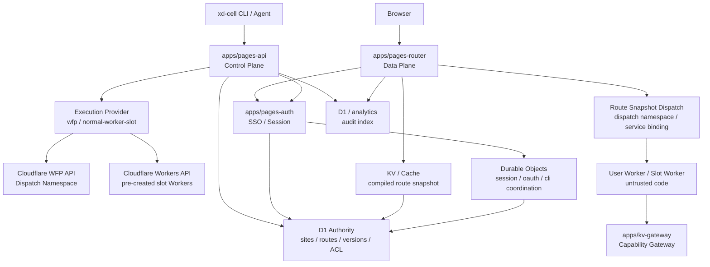

# XD Pages 架构总览

> 本文从 `docs/pages-v2-wfp-architecture.md` 拆分而来，用于控制单篇文档长度。

# XD Pages 多租户执行平台架构设计

## 状态

本文是 `pages-manager` v2 架构总览，用于说明一套带统一身份、发布鉴权、子站 SSO、多租户执行隔离和统一审计的平台。控制面继续使用 `api.pages.xd.team` / `auth.pages.xd.team`，新建 v2 子站默认使用 `workers.xd.team` 后缀；存量 v2 `pages.xd.team` 路由继续保留。用户侧产品名统一为 **XD Pages**；`v2` 只作为内部工程边界、资源命名或迁移讨论使用，不出现在 CLI、OpenAPI、skill、readme、错误提示等用户路径中。

设计目标是先明确旧版 / 新架构边界。旧版 `apps/server` 和它已经创建的 `*.workers.xd.team` exact route 保持不动，继续由旧发布链路服务；v2 通过 hostname claim 与 Cloudflare route specificity 避免覆盖 v1 站点，新建站点默认走 v2 `*.workers.xd.team` wildcard，存量 v2 `*.pages.xd.team` 仍可访问。

参考资料：

- Cloudflare Workers for Platforms：`https://developers.cloudflare.com/cloudflare-for-platforms/workers-for-platforms/`
- Dynamic Dispatch：`https://developers.cloudflare.com/cloudflare-for-platforms/workers-for-platforms/configuration/dynamic-dispatch/`
- Outbound Workers：`https://developers.cloudflare.com/cloudflare-for-platforms/workers-for-platforms/configuration/outbound-workers/`
- Cloudflare Workers Service Bindings：`https://developers.cloudflare.com/workers/runtime-apis/bindings/service-bindings/`

## 背景

域名和产品边界先固定为：

```text
legacy / existing: apps/server + 已存在的 *.workers.xd.team exact route
  - 当前线上服务继续可访问，v2 wildcard 不能覆盖 v1 exact route。
  - 现有 README、API、skill、apps/server 行为不因新架构改动而变化。
  - X-Pages-Token 仍只属于旧版归属标记，不升级为新架构强认证。

XD Pages / v2: api/auth.pages.xd.team + 新建 *.workers.xd.team 子站
  - 新建多租户执行平台架构，默认子站域名为 {slug}.workers.xd.team。
  - 已存在的 {slug}.pages.xd.team v2 route 保留，不做隐式迁移。
  - WFP 是目标执行模式；在 WFP 暂未开通时，允许使用普通 Worker slot 池作为内部兼容执行模式。
  - 新建 API、Auth、Router、D1/KV/DO、执行资源和 SSO redirect URI。
  - 旧 v1 站点不会自动迁移到 v2；v2 创建前必须通过 hostname claim 防止抢占。
```

当前 `pages-manager` 的核心模型是：

```text
管理 API Worker
  -> Cloudflare API 创建/更新每个站点自己的普通 Worker
  -> 为每个站点绑定 route
  -> 用 X-Pages-Token 做站点归属标记
  -> 子站默认靠 IP allowlist 限制访问
```

这个模型适合轻量内部托管，但不适合长期承载任意用户 Worker 代码：

- `X-Pages-Token` 只是归属标记，不是强认证。
- 子站访问控制分散在生成 Worker 或用户 `_worker.js` 中，难以统一策略。
- 每个站点都是普通 account Worker，路由、策略和审计都随站点数量变复杂。
- 用户 Worker 默认不可信时，平台需要统一清洗请求、注入身份、限制能力和审计行为。
- 如果支持上千个 Worker，应该避免每个请求回管理 Worker，也应避免为每个站点维护复杂的一等 Worker/route 状态。

下一代目标是把平台拆成控制面、数据面和执行面：

```text
Control Plane: 登录、发布、站点管理、ACL、版本、审计
Data Plane:    子站请求快路径、SSO gate、策略判断、动态分发
Runtime Plane: 用户 Worker 执行、能力网关、资源隔离
```

## 目标

- 发布站点必须有强认证，支持人类用户、CI 和 agent。
- 发布内容可选择访问可见性。
- 平台登录接入心动 SSO。
- 子站点支持公司统一 SSO 登录和站点级访问策略。
- 支持用户上传任意 Worker 代码，用户 Worker 默认不可信。
- 支持上千个 Worker，数据面请求不回管理 API Worker。
- 使用统一 Execution Mode 承载用户 Worker。目标模式是 Workers for Platforms；WFP 暂不可用时使用普通 Worker slot 池兼容上线。
- 平台 Gateway/Router 统一处理鉴权、审计、header 清洗和分发。
- 新架构使用 `pages.xd.team` 控制面和 `workers.xd.team` 子站后缀独立上线，不影响旧版 `apps/server` exact route。

## 非目标

- 不在第一阶段实现完整管理 UI。
- 不在第一阶段做复杂组织架构同步；先以 SSO profile 中的用户标识、邮箱和显式 ACL 为准。
- 不把心动 SSO 的 `clientSecret` 下发到 CLI、浏览器或用户 Worker。
- 不让用户 Worker 直接持有平台级 Cloudflare API token、全局 KV/R2/D1 binding 或 SSO access token。
- 不做历史站点迁移、资产认领、v1 redirect 或 v1 route 接管；v1 站点继续按原域名访问。

## 旧版普通 Workers API、WFP 与 slot 兼容模式的差异

| 维度     | 旧版普通 Workers API                                          | `wfp` 目标模式                                                               | `normal-worker-slot` 兼容模式                                               |
| -------- | ------------------------------------------------------------ | ----------------------------------------------------------------------------- | ---------------------------------------------------------------------------- |
| 用户代码 | 每个站点是一个 account-level Worker script，例如 `pages-foo` | 每个站点版本是 dispatch namespace 中的 user Worker                            | 每个激活/待激活版本占用一个预创建普通 Worker slot，例如 `pages-v2-slot-007` |
| 路由     | 每个站点维护独立 route，例如 `foo.workers.xd.team/*`         | `*.workers.xd.team` 进入 `pages-router`，并保留存量 `*.pages.xd.team`，router 通过 dispatch namespace 分发 | `*.workers.xd.team` 进入 `pages-router`，并保留存量 `*.pages.xd.team`，router 通过静态 service binding 分发 |
| 鉴权     | 分散在生成 Worker、用户 Worker 或 IP allowlist 中            | 统一在 `pages-router` 做 visibility、SSO、ACL 和 header 注入                  | 同 WFP，用户侧不感知底层执行模式                                             |
| 审计     | 管理操作容易审计，子站访问审计分散                           | router 统一记录访问审计，控制面记录管理审计                                   | 同 WFP                                                                       |
| 隔离     | 每站 Worker 独立，但平台治理分散                             | user Worker 作为不可信租户代码运行在 dispatch namespace                       | slot Worker 作为不可信租户代码运行；能力通过 router 和 gateway 下发          |
| 扩展性   | 站点数量增加时 route/script 管理成本上升                     | 适合大量用户 Worker 和平台化治理                                              | 受预留 slot 数量、router service binding 数量和扩容流程约束                  |
| 快路径   | 请求直接进站点 Worker；若要统一 SSO，需每站包装或中心转发    | 请求进 router，本地验 session 后 dispatch，不回管理 API                       | 同 WFP；slot 扩容是平台运维动作，不在用户请求路径里做                        |

## 核心术语

后续 schema、JWT、header、CLI 和 API 契约统一使用这些名字：

| 术语         | 含义                                               | 是否可变 | 是否可作为安全边界 |
| ------------ | -------------------------------------------------- | -------- | ------------------ |
| `slug`       | 用户可见站点名，例如 `foo`；同一 environment 内唯一 | 首版不开放修改；长期可 rename | 否 |
| `siteId`     | 平台内部站点主键，例如 `site_xxx`                  | 不可变   | 可用于授权关系     |
| `siteUuid`   | 站点数据隔离锚点，删除后重建必须变化               | 不可变   | 是                 |
| `routeId`    | 某个 hostname 到站点版本的路由记录                 | 不可变   | 可用于审计         |
| `versionId`  | 一次 immutable 发布版本                            | 不可变   | 可用于回滚和审计   |
| `workerName` | 执行面的 Worker 名；WFP 模式为 user Worker 名，slot 模式为 slot Worker 名 | 可派生 | 否，需结合 route   |

文档里出现 `site` 时，如果是用户输入或 CLI 展示，应理解为 `slug`；如果是服务端授权、审计或存储隔离，必须显式写 `siteId` 或 `siteUuid`。实现中不能把 `slug` 当作 KV/R2/D1 数据隔离锚点。

## 目标目录

建议新建目录；现有 `apps/server` 继续作为旧版控制面，不参与 v2 控制面和 v2 wildcard 子站请求路径：

```text
apps/
  server/            # 旧版管理 API，继续服务 *.workers.xd.team
  pages-api/         # XD Pages 控制面 API：deploy/list/site/version/access/audit
  pages-auth/        # XD Pages SSO 与 session：OAuth callback、CLI login、access key
  pages-router/      # XD Pages 数据面入口：*.workers.xd.team / 存量 *.pages.xd.team + execution dispatch
  kv-gateway/        # XD Pages 平台 KV 能力网关；旧版不再提供 KV

packages/
  auth/              # cookie、session JWT、SSO profile、ACL 校验
  runtime-contract/  # Gateway -> User Worker 的内部 JWT/header contract
  wfp-client/        # Workers for Platforms API 封装
  worker-slot/       # 普通 Worker slot 池、扩容和绑定清单 helper
  audit/             # 审计事件 schema 和脱敏 helper
```

目录名可以在实现阶段微调，但边界不要混在一个大 Worker 中。

## 总体架构



### 控制面

`pages-api` 只处理管理类请求：

- 发布站点、创建版本、回滚版本。
- 查询站点、删除站点、设置可见性和 ACL。
- 生成、吊销和轮换 CLI token / access key。
- 写管理审计。
- 按 `PAGES_EXECUTION_MODE` 选择内部执行模式，调用 WFP provider 或普通 Worker slot provider 部署用户代码。

控制面可以被 CLI、agent 或未来管理 UI 调用。控制面请求必须有强认证，不能再依赖 `X-Pages-Token`。

### 认证面

`pages-auth` 处理平台身份：

- 接入心动 SSO OAuth authorization code flow。
- 用服务端保存的 `clientSecret` 换取 SSO `access_token`。
- 调用 SSO profile 接口获取用户身份。
- 签发平台 `auth_session`、站点 `site_session`、CLI login result。
- 管理 access key；service token 作为后续机器人身份单独设计。

`clientSecret` 只能存在于 Worker secret 或安全配置中，不能进入浏览器、CLI、用户 Worker、日志或公开文档。

### 数据面

`pages-router` 是子站访问入口：

- 绑定新建 v2 子站默认 `*.workers.xd.team`，并继续绑定存量 v2 `*.pages.xd.team`。
- 按 hostname 查找站点 metadata 和当前 active version。
- 根据站点 visibility 判断是否需要登录。
- 本地校验站点 session，不回 `pages-api`。
- 为 user Worker 注入短期内部认证 JWT 和可信用户上下文。
- 清洗请求中的平台保留 header。
- 按 route snapshot 调用 WFP dispatch namespace 中的 user Worker，或调用普通 Worker slot 的 service binding。
- 清洗 user Worker 返回的响应，防止覆盖平台 cookie/header。
- 写访问审计或采样审计。

### 执行面

用户上传的 Worker 代码部署到统一执行面。目标模式是 Workers for Platforms dispatch namespace；在 WFP 暂未开通或灰度期，可部署到预创建的普通 Worker slot 池。平台通过 `pages-router` 根据 route snapshot 选择实际执行目标。

用户 Worker 默认不可信：

- 不持有平台 SSO token。
- 不持有 Cloudflare API token。
- 不持有全局 KV/R2/D1 binding。
- 不可信任浏览器传入的 `CF-Platform-*` / `X-Pages-*` header。
- 如需平台能力，通过受限 binding、gateway 或 capability 使用。
