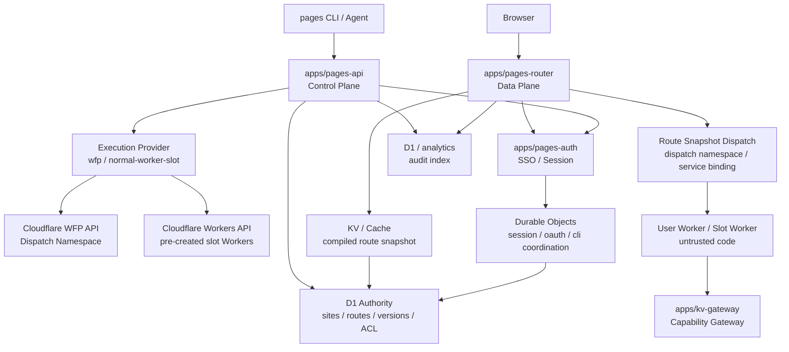

# Pages v2 多租户执行平台架构设计

## 状态

本文是 `pages-manager` v2 架构草案，用于在 `pages.xd.team` 新建一套带统一身份、发布鉴权、子站 SSO、多租户执行隔离和统一审计的平台。

设计目标是先明确 v1 / v2 边界。v1 `*.workers.xd.team` 保持不动，继续由现有 `apps/server` 和旧发布链路服务；v2 使用全新的 `*.pages.xd.team` 域名、资源和代码目录，不做历史站点迁移、不认领 v1 资产、不接管 v1 route。

参考资料：

- `docs/xd-sso.md`：心动统一身份认证 OAuth 接入说明的本地临时参考；该文件不随 v2 PR 提交，上线前删除或改为全量脱敏摘要
- Cloudflare Workers for Platforms：`https://developers.cloudflare.com/cloudflare-for-platforms/workers-for-platforms/`
- Dynamic Dispatch：`https://developers.cloudflare.com/cloudflare-for-platforms/workers-for-platforms/configuration/dynamic-dispatch/`
- Outbound Workers：`https://developers.cloudflare.com/cloudflare-for-platforms/workers-for-platforms/configuration/outbound-workers/`
- Cloudflare Workers Service Bindings：`https://developers.cloudflare.com/workers/runtime-apis/bindings/service-bindings/`

## 背景

域名和产品边界先固定为：

```text
v1 / existing: *.workers.xd.team
  - 当前线上服务继续可访问。
  - 现有 README、API、skill、apps/server 行为不因 v2 改动而变化。
  - X-Pages-Token 仍只属于 v1 归属标记，不升级为 v2 强认证。

v2 / greenfield: *.pages.xd.team
  - 新建多租户执行平台架构。
  - WFP 是目标执行模式；在 WFP 暂未开通时，允许使用普通 Worker slot 池作为内部兼容执行模式。
  - 新建 API、Auth、Router、D1/KV/DO、执行资源和 SSO redirect URI。
  - 用户要使用 v2 时重新发布到 pages.xd.team，不从 workers.xd.team 自动迁移。
```

当前 `pages-manager` 的核心模型是：

```text
管理 API Worker
  -> Cloudflare API 创建/更新每个站点自己的普通 Worker
  -> 为每个站点绑定 route
  -> 用 X-Pages-Token 做站点归属标记
  -> 子站默认靠 IP allowlist 限制访问
```

这个模型适合轻量内部托管，但不适合长期承载任意用户 Worker 代码：

- `X-Pages-Token` 只是归属标记，不是强认证。
- 子站访问控制分散在生成 Worker 或用户 `_worker.js` 中，难以统一策略。
- 每个站点都是普通 account Worker，路由、策略和审计都随站点数量变复杂。
- 用户 Worker 默认不可信时，平台需要统一清洗请求、注入身份、限制能力和审计行为。
- 如果支持上千个 Worker，应该避免每个请求回管理 Worker，也应避免为每个站点维护复杂的一等 Worker/route 状态。

下一代目标是把平台拆成控制面、数据面和执行面：

```text
Control Plane: 登录、发布、站点管理、ACL、版本、审计
Data Plane:    子站请求快路径、SSO gate、策略判断、动态分发
Runtime Plane: 用户 Worker 执行、能力网关、资源隔离
```

## 目标

- 发布站点必须有强认证，支持人类用户、CI 和 agent。
- 发布内容可选择访问可见性。
- 平台登录接入心动 SSO。
- 子站点支持公司统一 SSO 登录和站点级访问策略。
- 支持用户上传任意 Worker 代码，用户 Worker 默认不可信。
- 支持上千个 Worker，数据面请求不回管理 API Worker。
- 使用统一 Execution Mode 承载用户 Worker。目标模式是 Workers for Platforms；WFP 暂不可用时使用普通 Worker slot 池兼容上线。
- 平台 Gateway/Router 统一处理鉴权、审计、header 清洗和分发。
- v2 作为 `pages.xd.team` 上的新平台独立上线，不影响 v1 `workers.xd.team`。

## 非目标

- 不在第一阶段实现完整管理 UI。
- 不在第一阶段做复杂组织架构同步；先以 SSO profile 中的用户标识、邮箱和显式 ACL 为准。
- 不把心动 SSO 的 `clientSecret` 下发到 CLI、浏览器或用户 Worker。
- 不让用户 Worker 直接持有平台级 Cloudflare API token、全局 KV/R2/D1 binding 或 SSO access token。
- 不做历史站点迁移、资产认领、v1 redirect 或 v1 route 接管；v1 站点继续按原域名访问。

## v1 普通 Workers API、v2 WFP 与 v2 slot 兼容模式的差异

| 维度     | v1 普通 Workers API                                          | v2 `wfp` 目标模式                                                             | v2 `normal-worker-slot` 兼容模式                                             |
| -------- | ------------------------------------------------------------ | ----------------------------------------------------------------------------- | ---------------------------------------------------------------------------- |
| 用户代码 | 每个站点是一个 account-level Worker script，例如 `pages-foo` | 每个站点版本是 dispatch namespace 中的 user Worker                            | 每个激活/待激活版本占用一个预创建普通 Worker slot，例如 `pages-v2-slot-007` |
| 路由     | 每个站点维护独立 route，例如 `foo.workers.xd.team/*`         | `*.pages.xd.team` 进入 `pages-router`，router 通过 dispatch namespace 分发    | `*.pages.xd.team` 进入 `pages-router`，router 通过静态 service binding 分发  |
| 鉴权     | 分散在生成 Worker、用户 Worker 或 IP allowlist 中            | 统一在 `pages-router` 做 visibility、SSO、ACL 和 header 注入                  | 同 WFP，用户侧不感知底层执行模式                                             |
| 审计     | 管理操作容易审计，子站访问审计分散                           | router 统一记录访问审计，控制面记录管理审计                                   | 同 WFP                                                                       |
| 隔离     | 每站 Worker 独立，但平台治理分散                             | user Worker 作为不可信租户代码运行在 dispatch namespace                       | slot Worker 作为不可信租户代码运行；能力通过 router 和 gateway 下发          |
| 扩展性   | 站点数量增加时 route/script 管理成本上升                     | 适合大量用户 Worker 和平台化治理                                              | 受预留 slot 数量、router service binding 数量和扩容流程约束                  |
| 快路径   | 请求直接进站点 Worker；若要统一 SSO，需每站包装或中心转发    | 请求进 router，本地验 session 后 dispatch，不回管理 API                       | 同 WFP；slot 扩容是平台运维动作，不在用户请求路径里做                        |

## 核心术语

后续 schema、JWT、header、CLI 和 `.pages.json` 统一使用这些名字：

| 术语         | 含义                                               | 是否可变 | 是否可作为安全边界 |
| ------------ | -------------------------------------------------- | -------- | ------------------ |
| `slug`       | 用户可见站点名，例如 `foo`                         | 可变     | 否                 |
| `siteId`     | 平台内部站点主键，例如 `site_xxx`                  | 不可变   | 可用于授权关系     |
| `siteUuid`   | 站点数据隔离锚点，删除后重建必须变化               | 不可变   | 是                 |
| `routeId`    | 某个 hostname 到站点版本的路由记录                 | 不可变   | 可用于审计         |
| `versionId`  | 一次 immutable 发布版本                            | 不可变   | 可用于回滚和审计   |
| `workerName` | 执行面的 Worker 名；WFP 模式为 user Worker 名，slot 模式为 slot Worker 名 | 可派生 | 否，需结合 route   |

文档里出现 `site` 时，如果是用户输入或 CLI 展示，应理解为 `slug`；如果是服务端授权、审计或存储隔离，必须显式写 `siteId` 或 `siteUuid`。实现中不能把 `slug` 当作 KV/R2/D1 数据隔离锚点。

## 目标目录

建议 v2 新建目录；现有 `apps/server` 继续作为 v1 控制面，不参与 v2 请求路径：

```text
apps/
  server/            # v1 管理 API，继续服务 *.workers.xd.team
  pages-api/         # v2 控制面 API：deploy/list/site/version/access/audit
  pages-auth/        # v2 SSO 与 session：OAuth callback、CLI login、access key
  pages-router/      # v2 数据面入口：*.pages.xd.team + execution dispatch
  kv-gateway/        # v2 平台 KV 能力网关；v1 不再提供 KV

packages/
  auth/              # cookie、session JWT、SSO profile、ACL 校验
  runtime-contract/  # Gateway -> User Worker 的内部 JWT/header contract
  wfp-client/        # Workers for Platforms API 封装
  worker-slot/       # 普通 Worker slot 池、扩容和绑定清单 helper
  audit/             # 审计事件 schema 和脱敏 helper
```

目录名可以在实现阶段微调，但边界不要混在一个大 Worker 中。

## 总体架构



### 控制面

`pages-api` 只处理管理类请求：

- 发布站点、创建版本、回滚版本。
- 查询站点、删除站点、设置可见性和 ACL。
- 生成、吊销和轮换 CLI token / access key。
- 写管理审计。
- 按 `PAGES_EXECUTION_MODE` 选择内部执行模式，调用 WFP provider 或普通 Worker slot provider 部署用户代码。

控制面可以被 CLI、agent 或未来管理 UI 调用。控制面请求必须有强认证，不能再依赖 `X-Pages-Token`。

### 认证面

`pages-auth` 处理平台身份：

- 接入心动 SSO OAuth authorization code flow。
- 用服务端保存的 `clientSecret` 换取 SSO `access_token`。
- 调用 SSO profile 接口获取用户身份。
- 签发平台 `auth_session`、站点 `site_session`、CLI login result。
- 管理 access key；service token 作为后续机器人身份单独设计。

`clientSecret` 只能存在于 Worker secret 或安全配置中，不能进入浏览器、CLI、用户 Worker、日志或公开文档。

### 数据面

`pages-router` 是子站访问入口：

- 绑定 `*.pages.xd.team`。
- 按 hostname 查找站点 metadata 和当前 active version。
- 根据站点 visibility 判断是否需要登录。
- 本地校验站点 session，不回 `pages-api`。
- 为 user Worker 注入短期内部认证 JWT 和可信用户上下文。
- 清洗请求中的平台保留 header。
- 按 route snapshot 调用 WFP dispatch namespace 中的 user Worker，或调用普通 Worker slot 的 service binding。
- 清洗 user Worker 返回的响应，防止覆盖平台 cookie/header。
- 写访问审计或采样审计。

### 执行面

用户上传的 Worker 代码部署到统一执行面。目标模式是 Workers for Platforms dispatch namespace；在 WFP 暂未开通或灰度期，可部署到预创建的普通 Worker slot 池。平台通过 `pages-router` 根据 route snapshot 选择实际执行目标。

用户 Worker 默认不可信：

- 不持有平台 SSO token。
- 不持有 Cloudflare API token。
- 不持有全局 KV/R2/D1 binding。
- 不可信任浏览器传入的 `CF-Platform-*` / `X-Pages-*` header。
- 如需平台能力，通过受限 binding、gateway 或 capability 使用。

## Cloudflare 资源模型

### production

```text
pages-api
pages-auth
pages-router
pages-kv-gateway
target WFP dispatch namespace: pages-production
normal Worker slot pool: pages-v2-production-slot-001..N
D1 authority: production pages metadata
Durable Objects: production auth/session coordination
KV/cache: production router snapshots
audit store: production audit
system API: api.pages.xd.team
system auth: auth.pages.xd.team
site domain: {name}.pages.xd.team
site data KV: pages-shared-data
```

### staging

```text
pages-api-staging
pages-auth-staging
pages-router-staging
pages-kv-gateway-staging
target WFP dispatch namespace: pages-staging
normal Worker slot pool: pages-v2-staging-slot-001..N
D1 authority: staging pages metadata
Durable Objects: staging auth/session coordination
KV/cache: staging router snapshots
audit store: staging audit
system API: api-staging.pages.xd.team
system auth: auth-staging.pages.xd.team
site domain: {name}-staging.pages.xd.team
site data KV: pages-shared-data-staging
```

staging 与 production 必须继续物理隔离：

- 不同 Worker 名称。
- 不同 WFP dispatch namespace。
- 不同普通 Worker slot 池和 service binding。
- 不同 KV/D1/R2。
- 不同 signing key。
- 不同 SSO redirect URI。
- production 不允许 push/PR 自动部署。

默认路由方案也必须物理隔离：

```text
api.pages.xd.team/*             -> pages-api
auth.pages.xd.team/*            -> pages-auth
api-staging.pages.xd.team/*     -> pages-api-staging
auth-staging.pages.xd.team/*    -> pages-auth-staging
*.pages.xd.team/*               -> pages-router
*-staging.pages.xd.team/*       -> pages-router-staging
```

`pages-router` 只能绑定 production D1/KV/DO、production WFP dispatch namespace、production slot service binding 和 production signing key；`pages-router-staging` 只能绑定 staging 资源。业务 router 不允许同时持有两套环境的权威存储、dispatch namespace、slot binding 或 signing secret。

## 资源申请与环境配置

v2 上线前需要把 Cloudflare 资源、心动 SSO 应用和 GitHub Actions 配置一次性梳理清楚。文档、代码和 CI 中只能出现占位名称，不能写真实 account id、zone id、namespace id、client secret 或 token。

WFP 是最终执行面目标；在账号暂未开通 WFP 时，第一版把 v2 wrangler template 里的 `PAGES_EXECUTION_MODE` 固定为 `normal-worker-slot`，使用预创建普通 Worker slot 池上线。这个兼容层只存在于平台内部：用户 CLI、`.pages.json`、AI skill 和 deploy API 都不暴露 execution provider 或 runtime 选择参数。

`pages-kv-gateway`、`pages-kv-gateway-staging`、`pages-shared-data`、`pages-shared-data-staging` 原先只是 v1 预留；确认未投入使用且 KV key count 为 0 后，直接划归 v2。v1 `workers.xd.team` 不再提供 Pages KV，`apps/server` 不签发 KV capability，也不在 v1 deploy workflow 中部署 gateway。

### Cloudflare 资源申请清单

production 和 staging 分开申请或创建：

| 类型                       | production                                                    | staging                                                                                       | 说明                                          |
| -------------------------- | ------------------------------------------------------------- | --------------------------------------------------------------------------------------------- | --------------------------------------------- |
| Workers                    | `pages-api`、`pages-auth`、`pages-router`、`pages-kv-gateway` | `pages-api-staging`、`pages-auth-staging`、`pages-router-staging`、`pages-kv-gateway-staging` | 系统 Worker 物理隔离                          |
| WFP dispatch namespace     | `pages-production`                                            | `pages-staging`                                                                               | 目标执行面；WFP 未开通时可先不启用，但配置仍保留 |
| 普通 Worker slot 池        | `pages-v2-production-slot-001..N`                             | `pages-v2-staging-slot-001..N`                                                                | WFP 不可用时的内部兼容执行面                  |
| D1 database                | `pages_metadata_production`                                   | `pages_metadata_staging`                                                                      | 权威业务库                                    |
| KV namespace               | `pages_router_cache_production`                               | `pages_router_cache_staging`                                                                  | route/policy/JWKS snapshot                    |
| KV namespace               | `pages-shared-data`                                           | `pages-shared-data-staging`                                                                   | v2 Pages KV 站点数据；现有空 namespace 直接划归 v2 |
| Durable Object namespaces  | production bindings                                           | staging bindings                                                                              | OAuth、CLI login、session、policy 协调        |
| Routes / custom domains    | `api.pages.xd.team`、`auth.pages.xd.team`、`*.pages.xd.team/*` | `api-staging.pages.xd.team`、`auth-staging.pages.xd.team`、`*-staging.pages.xd.team/*`        | 由 v2 wrangler template 声明，部署创建/更新 Cloudflare 绑定；不修改 v1 `workers.xd.team` |
| Advanced certificate / DCV | `*.pages.xd.team`                                             | 同证书覆盖或独立策略                                                                          | 参考 partial zone 约束，单独验证 `pages` 子域 |

需要在阶段 0 做 Cloudflare route / DNS / certificate spike，验证 `pages` 与 `*.pages` CNAME、DCV 和 `*-staging.pages.xd.team/*` route 优先级。API/Auth 固定域名和 router wildcard route 写入 v2 wrangler template，系统 Worker 部署时创建/更新 Cloudflare 绑定；partial zone 下 DNSPod CNAME、DCV 委派和证书状态仍需人工确认。该 spike 只能新增 `pages.xd.team` 相关资源，不能修改 v1 `workers.xd.team` DNS、证书或 route。

如果 Cloudflare route 层无法独立匹配 staging 子站，fallback 只能是一个无业务 secret 的 `pages-edge-router-thin`：

```text
*.pages.xd.team/* -> pages-edge-router-thin
  foo.pages.xd.team         -> service binding: pages-router
  foo-staging.pages.xd.team -> service binding: pages-router-staging
```

`pages-edge-router-thin` 只做 hostname 解析和 service binding 转发，不持有 D1/KV/DO、dispatch namespace、slot binding、session/internal signing key、Cloudflare API token 或 SSO secret。它的 L1 cache 只能缓存“hostname -> target service”这类非敏感分流结果，且 production/staging target 必须有 fail-closed 测试覆盖。

### Execution Mode 与普通 Worker slot 兼容层

平台内部支持两种 execution mode：

| mode | 用途 | 用户可见性 | 上线建议 |
| ---- | ---- | ---------- | -------- |
| `wfp` | 目标模式，部署到 Workers for Platforms dispatch namespace | 不可见 | WFP 开通后 production 默认 |
| `normal-worker-slot` | 兼容模式，部署到预创建普通 Worker slot，并由 router 通过静态 service binding 调用 | 不可见 | WFP 未开通时首发默认 |

唯一核心开关是 wrangler template 中随 Git 提交的运行时 var：

```text
PAGES_EXECUTION_MODE=normal-worker-slot | wfp
```

当 `PAGES_EXECUTION_MODE=normal-worker-slot` 时，router template 固定声明部署期 slot 扩容策略：

```text
PAGES_NORMAL_WORKER_SLOT_MIN_AVAILABLE=1
PAGES_NORMAL_WORKER_SLOT_EXPAND_BY=2
PAGES_NORMAL_WORKER_SLOT_MAX_TOTAL=100
```

这些值不是用户发布参数，也不是 GitHub Environment Var。部署脚本 `scripts/provision-pages-v2-slots.mjs` 会在 router 部署前读取 D1 `worker_slots`，当 `available < MIN_AVAILABLE` 时按 `EXPAND_BY` 创建缺失 slot Worker，并受 `MAX_TOTAL` fail closed 保护。脚本随后计算实际需要全量绑定的 `PAGES_NORMAL_WORKER_SLOT_BINDING_COUNT=max(worker_slots.slot_number)`，通过 `$GITHUB_ENV` 传给 `scripts/render-pages-v2-wrangler.mjs`。router 渲染必须绑定 `SITE_SLOT_001..SITE_SLOT_N` 的完整历史范围，不能只绑定本次新增 slot。

`PAGES_EXECUTION_MODE` 不放 GitHub Environment Vars；当前默认值直接写在 `apps/pages-api/wrangler.*.template.toml` 和 `apps/pages-router/wrangler.*.template.toml`。切到 `wfp` 必须走 PR 修改对应 template。`PAGES_EXECUTION_MODE=wfp` 时可以没有 `PAGES_NORMAL_WORKER_SLOT_BINDING_COUNT`；但如果仍有 active / rollback window 内的 route snapshot 指向 `service-binding` slot，部署脚本必须继续提供原全量 binding count 并部署同时持有 WFP dispatch namespace 与 slot bindings 的 router，直到这些 slot route 全部迁移或释放。

不建议再增加 `DEFAULT_EXECUTION_PROVIDER`、`ALLOWED_EXECUTION_PROVIDERS`、`NORMAL_WORKER_NEW_DEPLOY_ENABLED` 这类组合开关。原因是这些开关会把“默认值、允许值、是否新建普通 Worker”拆成多个状态，容易出现互相矛盾的配置。第一版用一个 mode 表达平台当前策略；更细粒度的灰度或站点例外写入 D1 权威表，由管理员 API 或后台任务管理，不暴露给普通用户。

执行模式选择规则：

```text
effectiveMode =
  site.execution_mode_override
  ?? env.PAGES_EXECUTION_MODE
```

`site.execution_mode_override` 只允许平台维护者设置，取值为 `null | wfp | normal-worker-slot`。普通用户 `pages deploy` 不允许指定 provider；CLI help、`.pages.json`、OpenAPI 和 AI skill 都只描述“发布到 XD Pages v2”，不描述 WFP、slot、dispatch namespace 或 service binding。

slot 兼容层不是用户可选 provider，它只是 WFP 未开通期间的内部上线和回滚手段。

#### normal-worker-slot 设计

普通 Worker slot 池用于解决 WFP 暂未开通时的首发上线问题，同时尽量不改变最终架构：

```text
SITE_SLOT_001 -> pages-v2-production-slot-001
SITE_SLOT_002 -> pages-v2-production-slot-002
...
```

staging 使用独立命名，例如：

```text
SITE_SLOT_001 -> pages-v2-staging-slot-001
```

每次新版本发布先从池里分配一个 `available` slot，上传并验证完成后，再通过 route snapshot 把站点切到该 slot。旧 active version 的 slot 在回滚保留窗口内继续保持 `assigned`，这样二次发布不会在 route 激活前改动线上代码，回滚也能只切换 route snapshot。清理窗口结束后，reconciliation 再把不再被 active/rollback window 引用的 slot 清理回 `available`。router 的 service binding 是预先在 wrangler template 中声明的静态 binding，用户发布不需要重新部署 `pages-router`。

slot 状态由 D1 权威表管理：

| 状态 | 含义 | 是否可分配 |
| ---- | ---- | ---------- |
| `provisioning` | 扩容 workflow 正在创建普通 Worker | 否 |
| `available_pending_router` | Worker 已创建，但 router 尚未部署包含对应 service binding 的版本 | 否 |
| `available` | Worker 和 router binding 均就绪 | 是 |
| `assigned` | 已被某个站点版本占用，可能是 active 或 rollback window 内版本 | 否 |
| `disabled` | 手动停用或健康检查失败 | 否 |
| `cleanup_pending` | 站点删除后等待清理或保留期结束 | 否 |

`pages-api` 只能分配 `available` slot。若没有可用 slot，deploy 返回可操作错误，例如 `DEPLOYMENT_CAPACITY_EXHAUSTED`，提示平台维护者扩容；用户不应看到 Cloudflare binding 细节。

扩容是系统 Worker 部署期动作，不在用户发布请求路径里自动创建 Worker：

```text
Deploy Pages V2 <environment>
  1. 执行 D1 migration，确保 worker_slots 表存在。
  2. scripts/provision-pages-v2-slots.mjs <environment> prepare
     - 读取 worker_slots 当前 available 数量和最大 slot_number。
     - available < PAGES_NORMAL_WORKER_SLOT_MIN_AVAILABLE 时，从 max(slot_number)+1 创建 PAGES_NORMAL_WORKER_SLOT_EXPAND_BY 个 ordinary Workers。
     - 创建数量受 PAGES_NORMAL_WORKER_SLOT_MAX_TOTAL 限制，超过则 fail closed。
     - 新 slot 写入 available_pending_router。
     - 输出 PAGES_NORMAL_WORKER_SLOT_BINDING_COUNT=max(worker_slots.slot_number)。
  3. render-pages-v2-wrangler.mjs 用 binding count 全量渲染 SITE_SLOT_001..SITE_SLOT_N。
  4. 部署对应环境 router，并注入 router secrets。
  5. scripts/provision-pages-v2-slots.mjs <environment> activate
     - 只把已经被当前 router 全量 binding 覆盖的 available_pending_router 标记为 available。
```

第一次创建和后续扩容使用同一套 workflow。脚本必须幂等，只创建缺失编号，不覆盖已 assigned 的 slot，不复用 `disabled` / `cleanup_pending` 中间编号。router 每次部署都必须全量绑定 `SITE_SLOT_001..SITE_SLOT_N`，其中 `N` 是当前环境历史最大 slot 编号；不能只绑定本次新增 slot，否则旧 route snapshot 可能指向缺失 binding。

普通 Worker slot 与 WFP 的主要差别只在执行面 dispatch：

- WFP：`pages-router` 通过 dispatch namespace 按 user Worker name 获取执行目标。
- slot：`pages-router` 通过 route snapshot 中的 `dispatch.bindingName` 调静态 service binding。

其它架构保持一致：SSO、ACL、route snapshot、KV gateway capability、审计、header/cookie 清洗和发布/回滚状态机都走同一套平台逻辑。WFP 开通后，新增站点默认使用 `wfp`；已在 slot 上的试点版本可以继续保留到回滚窗口结束，也可以通过一次显式管理员迁移重新发布到 WFP。切到 `wfp` 时不要立刻去掉 slot bindings，除非 D1 和 route snapshot 已确认不存在任何 active / rollback window 内的 `normal-worker-slot` 版本。第一版不强制立即迁移，因为 slot 数量不大，保留兼容路径更利于平稳上线和回滚。

### 心动 SSO 应用配置

production、staging 和 local 建议使用三个独立 SSO 应用，至少也要使用三组独立 redirect URI。OAuth 入口和 callback 都应落到 `pages-auth`，不能落到 `pages-api`，否则控制面会被迫持有 SSO client secret 和 session signing secret。

```text
production app:
  应用名称：xd_pages
  用户访问入口：https://auth.pages.xd.team/.xd-pages/auth/authorize
  SSO认证重定向地址：https://auth.pages.xd.team/.xd-pages/auth/callback

staging app:
  应用名称：xd_pages_staging
  用户访问入口：https://auth-staging.pages.xd.team/.xd-pages/auth/authorize
  SSO认证重定向地址：https://auth-staging.pages.xd.team/.xd-pages/auth/callback
```

本地开发使用单独的 local SSO 应用：

```text
local app:
  应用名称：xd_pages_local
  用户访问入口：http://xd-pages.127.0.0.1.nip.io:8787/.xd-pages/auth/authorize
  SSO认证重定向地址：http://xd-pages.127.0.0.1.nip.io:8787/.xd-pages/auth/callback
```

local SSO 的 `SSO_CLIENT_ID` 和 `SSO_CLIENT_SECRET` 只能放本地 ignored env，例如当前仓库已忽略的 `.env`、`.dev.vars`，或只放 shell 环境变量；不得写入本文档、Git、CLI config、`.pages.json` 或测试快照。若使用 `.env.local`、`.dev.vars.local` 等新文件名，必须先确认它们已被 `.gitignore` 覆盖。若本地调试凭证曾被公开粘贴到 issue、PR、聊天记录或日志，应按公司规范轮换。

本地联调可以先使用公司分配的 OAuth local app。建议只在本机 shell 或已被 `.gitignore` 覆盖的 `.dev.vars` 中配置真实值：

```bash
export PAGES_ENV=local
export PUBLIC_AUTH_BASE=http://xd-pages.127.0.0.1.nip.io:8787
export SSO_REDIRECT_URI=http://xd-pages.127.0.0.1.nip.io:8787/.xd-pages/auth/callback
export SSO_CLIENT_ID=<local-sso-client-id>
export SSO_CLIENT_SECRET=<local-sso-client-secret>
```

`xd-pages.127.0.0.1.nip.io` 用于让 OAuth redirect URI 具备稳定 host，同时仍解析到本机 `127.0.0.1`。本地 callback 路径也统一使用平台保留路径 `/.xd-pages/auth/callback`，避免和用户站点路由冲突。`pages-auth` 配置层支持 `PAGES_ENV=local`；router 首版仍只服务 production/staging 站点域名，本地如需完整子站访问链路需要单独补 local router host allowlist 与 cookie/session 测试。

需要配置：

```text
SSO_CLIENT_ID
SSO_CLIENT_SECRET
SSO_AUTHORIZATION_URL
SSO_TOKEN_URL
SSO_PROFILE_URL
```

`SSO_REDIRECT_URI` 和 `SSO_ALLOWED_USER_SCOPE` 是 Git 可审查的环境常量，当前写在 v2 auth wrangler template 中；`SSO_CLIENT_SECRET` 必须是 Worker secret / GitHub Environment Secret，不能放 `vars`、wrangler template、CLI config 或文档示例。

生产和 staging 的 `SSO_AUTHORIZATION_URL`、`SSO_TOKEN_URL`、`SSO_PROFILE_URL` 必须使用 HTTPS；只有 `PAGES_ENV=local` 允许 HTTP 本地 SSO mock。心动 SSO 当前 OAuth 接口形态是：

```text
GET /cas/oauth2.0/authorize?response_type=code&client_id=...&redirect_uri=...
GET /cas/oauth2.0/accessToken?code=...&client_id=...&client_secret=...&redirect_uri=...&grant_type=authorization_code
GET /cas/oauth2.0/profile?access_token=...
```

因为 provider 要求 `client_secret` 和 `access_token` 出现在 query 中，平台代码、测试、日志和错误响应必须做强脱敏：不得记录完整 token/profile 请求 URL，不得把 `client_secret`、OAuth code、access token、CAS `st`、`tgtId` 或 cookie-like ticket 写入日志、文档、审计和用户可见错误。

心动 SSO profile 当前联调返回形态可用下列伪造样例表达；样例仅用于字段契约说明，不能使用真实账号、真实票据或真实员工信息：

```json
{
  "account": "demo.user@example.test",
  "accountId": "acct_demo_001",
  "ad_account": "demo.user",
  "authWay": "13",
  "email": "demo.user@example.test",
  "employee_status": "1",
  "employeenum": "demo.user",
  "fs_email": "demo.user@example.test",
  "fs_id": "fs_demo_001",
  "isPublicAccount": false,
  "job_number": "1001",
  "loginTime": 1781595126585,
  "permissions": [],
  "realname": "示例用户",
  "roles": [],
  "sort": "0",
  "st": "ST-demo-redacted",
  "tgtId": "TGT-demo-redacted",
  "userId": "usr_xindong_123",
  "wechat_work": "ww_demo_001",
  "service": "http://xd-pages.127.0.0.1.nip.io:8787/.xd-pages/auth/callback",
  "id": "demo.user@example.test",
  "client_id": "xd_pages_local"
}
```

`pages-auth` 第一版只把 profile 归一化为平台身份所需的最小字段：

| 平台字段 | SSO 来源 | 说明 |
| -------- | -------- | ---- |
| `user_id` | `userId`，后备 `id` / `sub` | `users` 表主键，优先使用稳定且不可复用的 SSO `userId`；不要优先用邮箱。 |
| `email` | `email` | 统一转小写，用于展示、审计和邮箱 ACL。 |
| `realname` | `realname` / `name` | 员工姓名，仅用于管理展示、审计可读性和问题排查，不作为权限判断。 |
| `account` | `account` | 当前系统推送帐号，受 SSO 后台应用设置影响；用于身份排查和后续目录对齐，不作为权限判断。 |
| `account_id` | `accountId` / `account_id` | 当前系统推送帐号对应 ID；用于身份排查和后续目录对齐，不作为权限判断。 |
| `employeenum` | `employeenum` / `employeeNum` / `employee_num` | 员工账号；用于身份排查和后续组织目录对齐，不作为权限判断。 |
| `employeeStatus` | `employee_status` / `employeeStatus` | `1` / `active` 映射为 `active`；`0` / `disabled` / `inactive` 映射为 `disabled`；`left` / `leave` / `departed` 映射为 `left`；其它为 `unknown`。 |
| `departments` | 暂不从 SSO profile 获取 | 当前联调 profile 不返回部门；部门 ACL 第一版只保留数据结构，后续通过组织搜索/目录接口补齐。 |
| `sessionVersion` | `sessionVersion` / `session_version` | 缺失时平台默认 `1`。 |

`account`、`account_id`、`employeenum`、`realname` 可以进入 `users` 表，因为它们是常用身份排查字段，且不改变权限判断。`users` 表不再同时保存 `id` 和 `sso_subject` 两个等价字段，避免同一 SSO `userId` 出现两套名字。`fs_id`、`wechat_work`、`ad_account`、`job_number` 暂不进入核心 `users` 表；如果后续要长期使用，应单独设计 `user_identities` 或组织目录同步表。`st`、`tgtId` 是 CAS ticket 类敏感字段，不能持久化到平台业务库，也不能透传给 User Worker。

### Worker bindings

#### pages-api

```text
vars:
  PAGES_ENV
  PAGES_EXECUTION_MODE
  PUBLIC_API_BASE
  PUBLIC_AUTH_BASE
  PUBLIC_SITE_SUFFIX
  WFP_DISPATCH_NAMESPACE
  WFP_COMPATIBILITY_DATE
  CF_API_BASE_URL
  ACCESS_KEY_ACTIVE_PEPPER_ID
  ACCESS_KEY_PEPPERS

bindings:
  D1: PAGES_METADATA
  KV: ROUTE_SNAPSHOTS
  Durable Objects: ROUTE_POINTER_LOCKS
  service: PAGES_AUTH

secrets:
  CF_ACCOUNT_ID
  CF_API_TOKEN
  CLOUDFLARE_ZONE_ID
  ACCESS_KEY_PEPPER_*
```

`PAGES_EXECUTION_MODE` 是平台内部执行模式总开关。WFP 未开通时在 template 中设为 `normal-worker-slot`；WFP 开通且验证完成后通过 PR 改为 `wfp`。它是 Git 可审查的架构配置，不是 GitHub Environment Var，不能由 CLI、`.pages.json` 或用户请求覆盖。`pages-api` 运行时读取这个值决定新发布部署到哪个内部执行面；`pages-router` 的 wrangler 渲染会结合 `PAGES_EXECUTION_MODE` 和部署脚本计算出的 `PAGES_NORMAL_WORKER_SLOT_BINDING_COUNT` 决定持有哪些 dispatch binding。第一版不提供 `auto` fallback；如果后续要做灰度自动回退，必须同时设计 router 双绑定、部署状态机和失败回滚语义。

`CF_ACCOUNT_ID` 和 `CF_API_TOKEN` 是 `pages-api` 运行时调用 Cloudflare API / Workers for Platforms API 或 ordinary Worker deploy API 的配置，只能注入 `pages-api`。`CF_API_TOKEN` 不得注入 router、auth、user Worker、CLI、`.pages.json` 或公开文档。`CLOUDFLARE_API_TOKEN` 只用于 Wrangler / GitHub Actions 部署，不能作为 Worker runtime secret 注入。

`WFP_DISPATCH_NAMESPACE` 必须与 `PAGES_ENV` 强绑定：production 只能是 `pages-production`，staging 只能是 `pages-staging`。`packages/wfp-client` 的 `readWfpConfig` 会在运行时做这层校验，部署脚本也应做静态校验。`WFP_COMPATIBILITY_DATE` 当前在 wrangler template 中固定为 `2026-06-15`，保证 Worker 模块语义可复现；需要升级时走 PR 修改模板。`CF_API_BASE_URL` 默认是 `https://api.cloudflare.com/client/v4`；production / staging 即使配置该值，也必须保持 host 为 `api.cloudflare.com`，避免把 `CF_API_TOKEN` 发往非 Cloudflare API host。local/test 才允许使用其它 HTTPS host 做 mock。

`ACCESS_KEY_PEPPERS` 是 access key HMAC pepper registry，格式为 `pepperId:secretEnvName`，例如 `pepper_2026_06:ACCESS_KEY_PEPPER_202606`。`ACCESS_KEY_ACTIVE_PEPPER_ID` 指向当前签发新 access key 使用的 pepper id。registry 只包含 secret env 名，可以写入 wrangler template 和 workflow 接受 Git 审查；真实 pepper 值只能作为 `ACCESS_KEY_PEPPER_*` Worker secret 注入 `pages-api`，不能写进 wrangler template、GitHub vars、CLI config、`.pages.json` 或文档示例。

`pages-api` 不能持有 `auth_session`、`site_session` 或 `internal_worker_jwt` 的 signing secret。控制面如需校验用户态 token，只能使用 verify-only JWKS / public key，或通过 `PAGES_AUTH` service binding 完成一次性 code / session 校验；不能在 API Worker 中签发子站 session 或 router internal JWT。

#### pages-auth

```text
vars:
  PAGES_ENV
  PUBLIC_AUTH_BASE
  PUBLIC_API_BASE
  PAGES_SESSION_JWT_ACTIVE_KID
  PAGES_SESSION_JWT_KEYS
  SSO_AUTHORIZATION_URL
  SSO_TOKEN_URL
  SSO_PROFILE_URL
  SSO_CLIENT_ID
  SSO_REDIRECT_URI

bindings:
  Durable Objects: OAUTH_STATES, CLI_LOGINS, AUTH_SESSIONS
  service: PAGES_API

secrets:
  SSO_CLIENT_SECRET
  PAGES_SESSION_JWT_SECRET_*
```

production / staging 的 `SSO_AUTHORIZATION_URL`、`SSO_TOKEN_URL`、`SSO_PROFILE_URL` 和 `SSO_CLIENT_ID` 是稳定、非 secret 的 SSO 应用拓扑配置，当前直接写在 `pages-auth` wrangler template 中并通过 PR 审查：production client id 为 `xd_pages`，staging client id 为 `xd_pages_staging`。`SSO_CLIENT_SECRET` 必须通过 secret 注入，不能写入 template、GitHub Vars、文档示例、CLI config 或 `.pages.json`。`PAGES_SESSION_JWT_KEYS` 是 `kid:alg:secretEnvName` registry，真实密钥值只存在于对应 secret env。

SSO callback 在签发 `auth_session`、`site_session` code 或 CLI token 之前，必须通过 `PAGES_API` service binding 调 `pages-api.internal/.xd-pages/internal/users/upsert` 同步用户权威记录。即使 SSO profile 显示用户已 disabled / left，也要先同步并 bump `sessionVersion`，再返回 403。这样 `pages login` 成功后，控制面 `users` 表已经有 active 用户状态；用户离职或禁用后，旧 CLI token / access key 也会被 API 层的用户状态校验拒绝。

#### pages-router

```text
vars:
  PAGES_ENV
  PUBLIC_AUTH_BASE
  PUBLIC_API_BASE
  PUBLIC_SITE_SUFFIX
  ROUTE_CACHE_TTL_SECONDS
  ROUTER_IP_ALLOWLIST_CIDRS
  ROUTER_JWKS_URL
  PAGES_SESSION_JWT_ISSUER
  PAGES_SESSION_JWT_ACTIVE_KID
  PAGES_SESSION_JWT_KEYS
  PAGES_CAP_JWT_ACTIVE_KID
  PAGES_CAP_JWT_KEYS
  SITE_SESSION_IDLE_TTL_SECONDS
  SITE_SESSION_FRESHNESS_TTL_SECONDS
  INTERNAL_WORKER_JWT_TTL_SECONDS

bindings:
  KV: ROUTE_SNAPSHOTS
  dispatch namespace: PAGES_DISPATCH
  service: SITE_SLOT_001..SITE_SLOT_N
  service: PAGES_AUTH
  service: XD_PAGES_KV_GATEWAY

secrets:
  PAGES_SESSION_JWT_SECRET_*
  PAGES_CAP_JWT_SECRET_*
```

router 不需要 Cloudflare API token。router 只能 dispatch 到当前环境的 WFP namespace 或当前环境预绑定的 slot service binding。`ROUTER_IP_ALLOWLIST_CIDRS` 是第一版强制配置；缺失或格式错误时 router 必须 fail closed。当前实现用统一的 `PAGES_SESSION_JWT_*` registry 签发和校验 `site_session` 与 `internal_worker_jwt`，通过 `PAGES_SESSION_JWT_ISSUER`、`purpose`、`aud`、`kid` 和 `env` 区分用途；不要再配置独立的 `INTERNAL_JWT_*` 或 `SESSION_SIGNING_*` 名称，避免文档和 wrangler template 串线。

router wrangler 渲染阶段会从 template 读取 `PAGES_EXECUTION_MODE`，并从部署脚本输出读取 `PAGES_NORMAL_WORKER_SLOT_BINDING_COUNT`。当 `PAGES_EXECUTION_MODE=normal-worker-slot` 时，`PAGES_NORMAL_WORKER_SLOT_BINDING_COUNT` 必填，用于生成 `SITE_SLOT_001..N` service binding；当 `PAGES_EXECUTION_MODE=wfp` 时，这个值可为空，也可以保留为正整数，用于让 router 在 WFP 新发布之外继续服务尚未排空的 slot route。生成后的 router 业务逻辑不依赖扩容阈值。binding count 必须和 D1 `worker_slots` 当前环境历史最大 `slot_number` 保持一致；扩容时先创建缺失 slot 并写入 `available_pending_router`，再重新渲染并部署对应环境 router，router 部署与 secret 注入成功后才能把新 slot 标记为 `available`。确认不存在 active / rollback window 内的 slot route 后，才可以让部署脚本输出空 binding count 并重新部署 router 去掉 slot bindings。

#### pages-kv-gateway

```text
vars:
  PAGES_ENV
  PAGES_CAP_JWT_ACTIVE_KID
  PAGES_CAP_JWT_KEYS

bindings:
  KV: SITE_DATA

secrets:
  PAGES_CAP_JWT_SECRET_*
```

沿用现有 capability key registry 思路；registry 名称可以随 Git 固定，但 production/staging 的真实 `PAGES_CAP_JWT_SECRET_*` 值必须来自不同 GitHub Environment Secret。

### GitHub Actions 配置

GitHub Environments 应至少有：

```text
staging
production
```

配置项按三层处理：

1. 可随 Git 提交、可审查的架构常量写在 v2 `wrangler.*.template.toml` 或 v2 deploy workflow 中。
2. 不可随 public Git 提交、但安全要求正常的环境配置放 GitHub Environment `vars`。
3. token、client secret、签名密钥、pepper 等高敏配置放 GitHub Environment `secrets`。

当前随 Git 提交的非敏感常量包括：

```text
PAGES_ENV
PAGES_EXECUTION_MODE
PAGES_NORMAL_WORKER_SLOT_EXPAND_BY
PUBLIC_API_BASE
PUBLIC_AUTH_BASE
PUBLIC_SITE_SUFFIX
SLACK_PAGES_ALERT_MENTION_USER_ID
SSO_AUTHORIZATION_URL
SSO_REDIRECT_URI
SSO_TOKEN_URL
SSO_PROFILE_URL
SSO_CLIENT_ID
WFP_DISPATCH_NAMESPACE
WFP_COMPATIBILITY_DATE
ACCESS_KEY_ACTIVE_PEPPER_ID
ACCESS_KEY_PEPPERS
PAGES_SESSION_JWT_ISSUER
PAGES_SESSION_JWT_ACTIVE_KID
PAGES_SESSION_JWT_KEYS
PAGES_CAP_JWT_ACTIVE_KID
PAGES_CAP_JWT_KEYS
OAUTH_STATE_TTL_SECONDS
CLI_LOGIN_TTL_SECONDS
AUTH_SESSION_IDLE_TTL_SECONDS
AUTH_SESSION_ABSOLUTE_TTL_SECONDS
SITE_SESSION_IDLE_TTL_SECONDS
SITE_SESSION_ABSOLUTE_TTL_SECONDS
SITE_SESSION_FRESHNESS_TTL_SECONDS
ROUTE_CACHE_TTL_SECONDS
INTERNAL_WORKER_JWT_TTL_SECONDS
SSO_ALLOWED_USER_SCOPE
```

`CF_API_BASE_URL` 只用于本地测试或特殊网络环境；生产和 staging 默认不配置，使用 Cloudflare 官方 API base。若生产或 staging 因代理需求必须覆盖，也只能覆盖到 `https://api.cloudflare.com/client/v4` 这一官方 host，不能指向任意第三方域名。

GitHub Environment `vars` 放非敏感但不可随 public Git 提交的环境配置：

```text
CLOUDFLARE_ACCOUNT_ID
PAGES_V2_D1_DATABASE_ID
PAGES_V2_ROUTE_SNAPSHOTS_KV_ID
PAGES_V2_SITE_DATA_KV_ID
ROUTER_IP_ALLOWLIST_CIDRS
```

v2 wrangler template 声明 API/Auth custom domain 和 router route。`pages-router` / `pages-router-staging` 的 route 使用 `zone_name = "xd.team"`，因此 workflow 不需要额外引入 `CLOUDFLARE_ZONE_ID`，但 `CLOUDFLARE_API_TOKEN` 必须具备部署 Worker、创建/更新 Worker route 和 custom domain 绑定的权限。DNSPod CNAME 与证书 DCV 不由当前 workflow 自动管理。

GitHub Environment `secrets` 只放高敏配置：

```text
CLOUDFLARE_API_TOKEN
CF_API_TOKEN
SSO_CLIENT_SECRET
PAGES_SESSION_JWT_SECRET_*
PAGES_CAP_JWT_SECRET_*
ACCESS_KEY_PEPPER_*
```

Cloudflare account id、D1/KV namespace id 不是凭证，v2 workflow 按 `vars` 读取；它们仍然不应写进 public repo。`PAGES_EXECUTION_MODE` 和 `WFP_DISPATCH_NAMESPACE` 名称本身不是凭证，但它们是强架构/环境边界，必须按 environment 固定在 template 并通过 PR 评审。

当前 `deploy-pages-v2.yml` / `deploy-pages-v2-staging.yml` 的 GitHub Environment 配置应按 workflow 实际名称填写：

| 名称                                  | 类型    | 使用方                         | 说明 |
| ------------------------------------- | ------- | ------------------------------ | ---- |
| `CLOUDFLARE_ACCOUNT_ID`               | var     | v2 系统 Worker wrangler 渲染和部署 | 用于 `account_id` 与 Wrangler 部署 env；workflow 会把同一个值作为 runtime secret `CF_ACCOUNT_ID` 注入 `pages-api` |
| `PAGES_V2_D1_DATABASE_ID`             | var     | `pages-api` wrangler 渲染      | 当前环境的 D1 metadata database id |
| `PAGES_V2_ROUTE_SNAPSHOTS_KV_ID`      | var     | `pages-api` / `pages-router` wrangler 渲染 | 当前环境的 route snapshot KV namespace id |
| `PAGES_V2_SITE_DATA_KV_ID`            | var     | `pages-kv-gateway` wrangler 渲染 | 当前环境的 Pages KV site data namespace id；production / staging 必须不同 |
| `ROUTER_IP_ALLOWLIST_CIDRS`           | var     | `pages-router` wrangler 渲染   | 必填，router 缺失或无效时 fail closed |
| `CLOUDFLARE_API_TOKEN`                | secret  | Wrangler 部署                  | 只能用于 GitHub Actions / Wrangler，不注入 Worker runtime；权限需覆盖 Worker 部署、Worker route 和 custom domain 绑定 |
| `CF_API_TOKEN`                        | secret  | `pages-api` runtime            | 通过 `scripts/put-pages-v2-secrets.sh apps/pages-api` 注入，供 Cloudflare Workers / WFP API 调用 |
| `SLACK_PAGES_ALERT_WEBHOOK_URL`       | secret  | `pages-api` runtime            | Slack Incoming Webhook URL；用于 slot 容量耗尽等平台运维告警，只注入 `pages-api`，不能写入 wrangler template、GitHub Vars 或文档 |
| `SSO_CLIENT_SECRET`                   | secret  | `pages-auth` runtime           | OAuth token exchange secret，只注入 auth Worker |
| `ACCESS_KEY_PEPPER_*`                 | secret  | `pages-api` runtime            | 必须覆盖 `ACCESS_KEY_PEPPERS` registry 中每个 `secretEnvName` |
| `PAGES_SESSION_JWT_SECRET_*`          | secret  | `pages-auth` / `pages-router` runtime | 必须覆盖 `PAGES_SESSION_JWT_KEYS` registry 中每个 `secretEnvName` |
| `PAGES_CAP_JWT_SECRET_*`              | secret  | `pages-router` / `pages-kv-gateway` runtime | 必须覆盖 `PAGES_CAP_JWT_KEYS` registry 中每个 `secretEnvName` |

v2 平台部署使用独立 workflow：`deploy-pages-v2.yml` 只允许 `workflow_dispatch` 手动部署 production；`deploy-pages-v2-staging.yml` 支持手动部署，也可以在 `staging` 分支的 v2 app / package / render script 相关文件变更时自动部署。它们只处理 v2 系统 Worker：`pages-api`、`pages-auth`、`pages-router`、`pages-kv-gateway`，不部署 v1 `apps/server`、ACK、用户站点或发布执行器。

v2 runtime secret 注入使用 `scripts/put-pages-v2-secrets.sh <app>`。它会在部署前用 `DRY_RUN=1` 校验 registry 和必需 secret 是否齐全，部署后再写入 Worker secret。`pages-api` 只注入 `CF_ACCOUNT_ID`、`CF_API_TOKEN`、`SLACK_PAGES_ALERT_WEBHOOK_URL` 和 `ACCESS_KEY_PEPPER_*`；`pages-auth` 注入 `SSO_CLIENT_SECRET` 和 `PAGES_SESSION_JWT_SECRET_*`；`pages-router` 注入 `PAGES_SESSION_JWT_SECRET_*` 和 `PAGES_CAP_JWT_SECRET_*`；`pages-kv-gateway` 只注入 `PAGES_CAP_JWT_SECRET_*`。

`SLACK_PAGES_ALERT_MENTION_USER_ID` 是 `pages-api` wrangler template 中固定的非敏感告警接收人 id，用于 slot 容量告警正文里的单次 Slack mention。`PAGES_NORMAL_WORKER_SLOT_EXPAND_BY` 同时出现在 `pages-router` 和 `pages-api` template：router 部署期用它决定每次新增多少个 slot，`pages-api` 只把它显示在容量不足告警的“扩容”字段里。

### 配置校验

部署脚本必须 fail closed：

- v2 系统 Worker 的拓扑配置以环境显式模板为准：`apps/pages-api/wrangler.production.template.toml`、`apps/pages-api/wrangler.staging.template.toml`、`apps/pages-auth/wrangler.production.template.toml`、`apps/pages-auth/wrangler.staging.template.toml`、`apps/pages-router/wrangler.production.template.toml`、`apps/pages-router/wrangler.staging.template.toml`、`apps/kv-gateway/wrangler.production.template.toml`、`apps/kv-gateway/wrangler.staging.template.toml`。`pages-kv-gateway` 不复用 v1 旧生成链路。
- v2 使用 `node scripts/render-pages-v2-wrangler.mjs <app> <production|staging>` 渲染最终 `wrangler.toml`。渲染器只做 `__PLACEHOLDER__` 占位符替换、必填项检查和环境串用校验；Worker 名、域名、service binding、dispatch namespace 等拓扑值直接写在对应环境模板里，避免把 v2 环境逻辑藏进 shell 分支。
- `apps/pages-api/migrations/` 是 v2 D1 authority schema 的显式迁移源。部署 `pages-api` 前必须先执行对应环境的 `wrangler d1 migrations apply`，确保 `sites`、`site_routes`、`site_versions`、`worker_slots`、`deployments` 等表结构先于 Worker 代码上线。
- `scripts/gen-wrangler.sh` 继续服务 v1 `apps/server` 和 `apps/xdads-302`；`apps/kv-gateway` 的旧 v1 部署链路应退役，v2 gateway 不复用这条旧生成链路。
- production workflow 只能手动触发。
- staging workflow 可以由 `staging` 分支触发。
- `PAGES_ENV=production` 时，API/auth/site suffix 必须是 production 域名。
- `PAGES_ENV=staging` 时，API/auth/site suffix 必须是 staging 域名。
- signing key registry 中的 active kid 必须能找到对应 secret。
- `PAGES_EXECUTION_MODE` 必须在 `pages-api` 和 `pages-router` 对应环境 template 中各出现一次，只能是 `normal-worker-slot` 或 `wfp`；不得从 GitHub Environment Vars 注入。
- `WFP_DISPATCH_NAMESPACE` 必须与 `PAGES_ENV` 匹配，不能 staging/prod 串用。
- `PAGES_EXECUTION_MODE=wfp` 时必须配置并验证当前环境 WFP dispatch namespace；`normal-worker-slot` 时部署脚本必须先完成 slot provision，至少存在一个 `available` slot，且最终渲染出的 router wrangler 配置中有对应 service binding。
- `CF_ACCOUNT_ID` / `CF_API_TOKEN` 必须只出现在 `pages-api` runtime；router/auth/thin router 不能持有。
- production / staging 的 `CF_API_BASE_URL` 必须是 `https://api.cloudflare.com/client/v4`，不能把 `CF_API_TOKEN` 发送到其它 host。
- `SLACK_PAGES_ALERT_WEBHOOK_URL` 必须作为 GitHub Environment secret 注入 `pages-api`，不能放 GitHub Vars、wrangler template 或日志；告警发送失败不得影响用户部署响应。
- D1、KV、Durable Object binding 必须指向当前环境资源。
- `ROUTER_IP_ALLOWLIST_CIDRS` 必须存在、可解析、只包含公司批准的内网/VPN/办公出口 CIDR；缺失时部署或启动必须 fail closed。
- `CF_API_TOKEN` 只能注入 `pages-api` runtime；`CLOUDFLARE_API_TOKEN` 只能出现在 GitHub Actions / Wrangler 部署环境。
- `pages-router` 和 `pages-router-staging` 的 wrangler 配置不能同时出现两套环境 binding 或两套 signing key。
- slot service binding 必须与当前环境一致，例如 production router 只能绑定 `pages-v2-production-slot-*`，staging router 只能绑定 `pages-v2-staging-slot-*`。
- 如果启用 `pages-edge-router-thin`，它只能配置 service binding，不能配置 D1/KV/DO、dispatch namespace、slot binding 或 signing secret。
- Worker 生成的 wrangler 配置不能残留 `__PLACEHOLDER__`。
- `public-docs` 输出的 base URL 必须与当前 Worker 环境一致。

### Release gate 与 smoke checklist

提交前必须完成本地和 CI 静态验证：

```bash
git diff --check
git ls-files --error-unmatch docs/xd-sso.md # 期望失败，表示本地 SSO 参考未被跟踪
node --test scripts/render-pages-v2-wrangler.test.js scripts/pages-v2-secrets.test.js scripts/workflows.test.js
pnpm lint
pnpm test
```

staging 首次部署前必须完成：

1. GitHub `staging` Environment 已配置上表中的 vars/secrets，且真实 D1/KV/secret 值不出现在仓库、日志或文档中。
2. Cloudflare 已创建 staging D1、staging route snapshot KV 和 staging site data KV；`pages-api-staging`、`pages-auth-staging`、`pages-router-staging`、`pages-kv-gateway-staging` 以及对应 route/custom domain 由 v2 workflow 的 wrangler deploy 创建/更新。partial zone 的 DNSPod CNAME 和证书 DCV 已提前准备或确认可生效。如果 staging template 中 `PAGES_EXECUTION_MODE=normal-worker-slot`，已创建 staging slot 池并让 router service binding 数量与 slot 数一致；如果为 `wfp`，已创建 `pages-staging` dispatch namespace。
3. SSO staging 应用 redirect URI 指向 `https://auth-staging.pages.xd.team/.xd-pages/auth/callback`，不指向 `api-staging.pages.xd.team`。
4. 手动或由 `staging` 分支触发 `Deploy Pages V2 Staging`，先用 `component=all` 验证四个 v2 系统 Worker 一起部署；单组件部署只用于已确认依赖兼容的修复。
5. workflow 中四个 `DRY_RUN=1 scripts/put-pages-v2-secrets.sh ...` 步骤先通过，再执行真正 secret 注入。
6. `https://api-staging.pages.xd.team/openapi.json` 只能返回 staging base URL，不能出现 production 或 v1 `workers.xd.team` API 地址。
7. `pages login --env staging` 能完成 SSO、device code 手动确认和 CLI token 保存。
8. `pages deploy --env staging` 至少验证 static、SPA 和 custom `.js/.mjs` Worker 三类 artifact；`.ts` Worker 入口在未接入 bundler 前必须 fail closed。
9. staging 子站访问验证 IP allowlist、`public`、`org`、`acl`、`owner`、`disabled`、header/cookie 清洗、`site_session` freshness 和 rollback。
10. v1 `api.workers.xd.team`、`*.workers.xd.team`、旧 skill 和旧发布 workflow 不受 staging v2 部署影响。

production 首次部署前必须完成：

1. staging smoke checklist 全部通过，并确认 Cloudflare route / DNS / certificate 只新增 `pages.xd.team` 相关资源。
2. GitHub `production` Environment 已配置独立 production D1/KV、执行面资源、SSO app、JWT secret、access key pepper 和 IP allowlist。执行面资源按 production template 中的 `PAGES_EXECUTION_MODE` 校验：`normal-worker-slot` 需要 production slot 池，`wfp` 需要 `pages-production` dispatch namespace。
3. `Deploy Pages V2 Production` 只能通过 `workflow_dispatch` 触发；push/PR 不得触发 production。
4. 生产首次发布使用 `component=all`，避免 service binding 指向旧版本或缺失 Worker。
5. 发布后先验证 `api.pages.xd.team/openapi.json`、`auth.pages.xd.team` 登录入口和一个受控试点站点。
6. 回滚策略是重新 dispatch 上一个已知好 commit 的 workflow，或按组件手动部署上一个 commit；不得通过修改 v1 `workers.xd.team` route 回滚 v2。

## 存储与一致性模型

v2 不应把 KV 当成站点 metadata 或 session 的唯一事实来源。推荐分层：

```text
D1:
  系统权威业务库，保存 users、sites、routes、versions、ACL、access keys、audit index。

Durable Objects:
  强一致协调点，处理 OAuth state、一次性 code、CLI login、session 刷新/吊销、策略失效协调。

KV:
  编译后的快路径读缓存，例如 route snapshot、policy snapshot、JWKS/public key cache。

Cache / Worker 内存:
  pages-router 的 L1 超短 TTL 缓存，降低同一边缘重复读取。

JWT Cookie:
  快路径本地验签 envelope，不作为不可吊销的唯一权威状态。
```

选择原则：

| 数据类型                           | 权威存储                       | 快路径                 | 说明                              |
| ---------------------------------- | ------------------------------ | ---------------------- | --------------------------------- |
| 用户、站点、版本、成员、ACL        | D1                             | KV snapshot + L1 cache | 关系型数据，需要查询和审计        |
| 路由表、active version、visibility | D1                             | route snapshot         | 权限相关，KV 只做缓存             |
| 普通 Worker slot 池状态            | D1                             | route snapshot         | 扩容与分配必须强一致              |
| OAuth state、一次性 code           | Durable Objects                | 无                     | 必须防重放、单次消费              |
| CLI login polling                  | Durable Objects                | 无                     | 同一 login transaction 需要强一致 |
| auth/session 刷新与吊销            | Durable Objects + D1 index     | JWT 本地验签           | DO 协调，D1 记录索引和审计        |
| JWKS / public signing keys         | D1 或配置                      | KV / Cache             | 可缓存，靠 `kid` 轮换             |
| 审计事件                           | D1 index + 后续 analytics sink | 可异步批量写           | 禁止写入 secret 和 token          |

### D1 权威表

以下是逻辑 schema，字段类型在实现建表脚本时再细化。约定：

- 主键使用不暴露内部含义的 ID，例如 `usr_`、`site_`、`route_`、`ver_`、`dep_`。
- 时间统一存 ISO string 或 epoch milliseconds，但同一个库内必须一致。
- CLI token 和 access key 只存 hash，不存明文。
- JSON 字段只放低频变更或结构不稳定的扩展信息；核心查询字段必须列化。

#### users

```sql
users
  user_id             -- SSO profile userId
  account             -- 当前系统推送帐号
  account_id          -- SSO profile accountId
  email
  realname            -- SSO profile realname
  employeenum         -- SSO profile employeenum
  employee_status     -- active / disabled / left / unknown
  session_version     -- 用户级 session 失效版本
  last_login_at
  created_at
  updated_at
```

`user_id` 直接对应 SSO profile 中稳定且不可复用的 `userId`。如果未来某个环境只能拿到邮箱，需要在风险清单中标记“邮箱复用/变更”问题，不能静默把邮箱当 `user_id`。

#### sites

```sql
sites
  id                  -- site_xxx
  slug                -- 用户可见站点名
  owner_user_id
  default_visibility  -- public / org / acl / owner
  execution_mode_override -- null / wfp / normal-worker-slot；仅平台维护者可写
  site_uuid           -- 存储隔离锚点，删除后重建必须变化
  created_at
  updated_at
  deleted_at
```

`slug` 可变或可复用，不能作为数据隔离锚点；`site_uuid` 用于 KV/R2/D1 等站点数据隔离。

#### site_routes

```sql
site_routes
  id                  -- route_xxx
  hostname            -- foo.pages.xd.team
  site_id
  environment         -- production / staging
  runtime             -- worker / disabled
  execution_provider  -- wfp / normal-worker-slot
  worker_name         -- WFP user worker name 或普通 Worker slot name
  dispatch_type       -- dispatch-namespace / service-binding
  dispatch_binding_name -- slot 模式为 SITE_SLOT_001；WFP 模式为 null
  slot_id             -- slot 模式引用 worker_slots.id；WFP 模式为 null
  active_version_id
  visibility          -- public / org / acl / owner / disabled
  policy_version
  route_generation    -- active version / workerName 切换代数
  route_status        -- active / disabled / deleted
  cache_tier          -- fast / sensitive / strict
  created_at
  updated_at
```

`site_routes` 是 router 的权威解析表。`visibility` 和 `policy_version` 属于安全边界字段，不能只存在 KV snapshot。`runtime` 表示路由是否进入用户代码，`execution_provider` 表示用户代码部署在哪类执行面；这样未来从 slot 切换到 WFP 时，不需要改变用户侧 API。

#### site_versions

```sql
site_versions
  id                  -- ver_xxx
  site_id
  deployment_id
  worker_name
  runtime             -- worker
  execution_provider  -- wfp / normal-worker-slot
  dispatch_type       -- dispatch-namespace / service-binding
  dispatch_binding_name -- slot 模式记录激活时 binding；WFP 模式为 null
  slot_id             -- slot 模式记录占用 slot；WFP 模式为 null
  artifact_kind       -- static / spa / worker
  artifact_ref        -- wfp://...、slot://...、r2://... 等内部 artifact 引用
  content_hash
  created_by
  created_at
```

版本记录必须 immutable。回滚只更新 `site_routes.active_version_id`，不修改历史 version 内容。

#### worker_slots

```sql
worker_slots
  id                  -- slot_xxx
  environment         -- production / staging
  slot_number         -- 1..N
  worker_name         -- pages-v2-production-slot-001
  binding_name        -- SITE_SLOT_001
  status              -- provisioning / available_pending_router / available / assigned / disabled / cleanup_pending
  assigned_site_id
  assigned_route_id
  assigned_at
  last_deployed_version_id
  last_seen_at
  health_status       -- unknown / healthy / unhealthy
  notes
  created_at
  updated_at
```

唯一约束：

```text
unique(environment, slot_number)
unique(environment, binding_name)
unique(environment, worker_name)
```

`worker_slots` 是普通 Worker slot 池的权威表。`pages-api` 分配 slot 时必须在 D1 transaction / CAS 中把 `available` 改成 `assigned`，并写入目标 `site_id`、`route_id` 和 `version_id`。同一站点后续 deploy 不覆盖当前 active slot，而是分配新的 available slot；旧 slot 在回滚/审计窗口内保留。删除站点或回滚窗口结束后，slot 先进入 `cleanup_pending`；清理完成后才回到 `available`。

#### deployments

```sql
deployments
  id                  -- dep_xxx
  site_id
  version_id
  actor_user_id
  actor_type          -- user / access_key / system
  source              -- cli / agent / api
  visibility
  status              -- pending / uploaded / verified / activating / succeeded / failed / rolled_back
  idempotency_key
  idempotency_scope   -- env + actor/access_key + site_id + operation
  request_hash        -- canonical request hash
  terminal_response_json
  previous_version_id
  error_code
  error_message
  created_at
  completed_at
```

部署记录用于审计和故障排查。`error_message` 必须脱敏，不能保存 Cloudflare token、capability 或用户上传内容。

幂等性规则：

- 唯一键为 `(environment, actor_id 或 access_key_id, site_id, operation, idempotency_key)`。
- 首次请求保存 canonical request hash。
- 同 key + 同 hash：如果已有终态，重放 terminal response；如果非终态，返回同一个 deployment。
- 同 key + 不同 hash：返回 409，不能创建新 version 或新 deployment。
- deploy 和 rollback 都必须遵守该规则。

#### site_members

```sql
site_members
  site_id
  user_id
  role                -- owner / collaborator / viewer
  created_by
  created_at
```

`owner` 至少保留一名。删除 owner 或转移 owner 属于高风险操作，需要 recent login。

#### site_acl_entries

```sql
site_acl_entries
  id                  -- acl_xxx
  site_id
  subject_type        -- email / department；group 为未来预留，不进入第一版公开 API
  subject_value       -- 邮箱或稳定 department id/path
  access_role         -- viewer / editor
  effect              -- allow；第一版不支持 deny
  created_by
  created_at
```

第一版 ACL 采用 allow-only + OR 叠加：

```text
allow if:
  user.email in ACL(email)
  OR user.departments intersects ACL(department)
```

同一站点可添加多条 ACL entry，例如“指定多个邮箱”或“指定邮箱 + 部门”。命中任意一条 allow entry 即可访问；没有命中则拒绝。用户侧指定某个人时必须填写邮箱，不填写 SSO `userId`、`accountId`、工号、企微 ID 或其它内部身份字段。

第一版不支持 `deny`、排除用户、`AND` 条件、部门内角色条件、嵌套表达式或策略语言。当前 API 只开放 `email`、`department`；`group` 和内部 `user` subject type 先保留为未来方向，不阻塞 MVP。`owner`、session subject、审计归因仍使用平台内部 `userId`，但不作为用户可填写的 ACL subject。

`department` 只有在组织系统能提供稳定、不可复用 ID、成员快照版本和可控刷新 TTL 后才应在生产开放。启用后，成员变更必须能触发 `policyVersion` 或 `sessionVersion` 失效。`group` 等更复杂主体等组织目录语义稳定后再评审。

#### access_keys

```sql
access_keys
  id                  -- ak_xxx
  owner_user_id
  key_hash
  name
  scopes              -- JSON array，例如 ["deploy:site"]
  site_id             -- null 表示用户级 key；非 null 表示限定站点
  expires_at
  last_used_at
  revoked_at
  created_at
```

access key 明文只在创建时显示一次，之后只存 hash。key 的 scope 和 site 限制必须在 `pages-api` 权威校验，不能只靠 CLI 自觉。

access key 生成与存储规则：

- 使用 CSPRNG 生成至少 192-bit 随机值。
- 明文格式可以带非敏感前缀和环境提示，例如 `xdp_prod_...`、`xdp_stg_...`，但服务端不能只靠前缀判权。
- 存储使用 HMAC-SHA-256 + server-side pepper，并记录 `pepper_id` 以支持轮换。
- 校验使用常量时间比较。
- 默认创建 site-scoped + expiry 的 key；user-level key 需要 recent login、显式确认和强审计。

#### auth_sessions_index

```sql
auth_sessions_index
  sid
  user_id
  issued_at
  last_seen_at
  expires_at
  absolute_expires_at
  revoked_at
  auth_time
  user_agent_hash
  ip_hash
```

D1 中的 session index 用于查询、审计和批量吊销。实际刷新/吊销竞争由 Durable Object 协调。

#### audit_events

```sql
audit_events
  id                  -- aud_xxx
  trace_id
  event_type
  actor_user_id
  actor_type          -- user / access_key / system / anonymous
  site_id
  route_id
  version_id
  decision            -- allow / deny / redirect / error
  status_code
  ip_hash
  user_agent_hash
  metadata_json       -- 脱敏扩展字段
  created_at
```

`audit_events` 可以先作为 D1 index，后续再接入专门的 analytics sink。D1 中只保留便于检索和关联的字段，事件 body 必须脱敏。

### Durable Object 状态

Durable Objects 不存大批量业务数据，只处理强一致协调。

#### OAuthStateDO

Object id：

```text
oauth_state:{state_id}
```

状态：

```json
{
  "stateId": "st_xxx",
  "returnTo": "https://foo.pages.xd.team/path",
  "siteHost": "foo.pages.xd.team",
  "createdAt": "2026-06-15T00:00:00.000Z",
  "expiresAt": "2026-06-15T00:10:00.000Z",
  "consumedAt": null
}
```

用途：

- 防 CSRF。
- 绑定 `return_to`。
- 保证 OAuth callback 只消费一次。

#### CliLoginDO

Object id：

```text
cli_login:{login_id}
```

状态：

```json
{
  "loginId": "login_xxx",
  "loginSecretHash": "sha256:...",
  "deviceCodeHash": "sha256:...",
  "requestedScopes": ["deploy:site"],
  "environment": "production",
  "status": "pending",
  "userId": null,
  "pollAttempts": 0,
  "createdAt": "2026-06-15T00:00:00.000Z",
  "expiresAt": "2026-06-15T00:10:00.000Z",
  "completedAt": null,
  "consumedAt": null
}
```

用途：

- CLI `pages login` 轮询。
- 浏览器 SSO 成功后写入登录结果。
- CLI 领取 token 后标记 `consumedAt`，防止重复领取。

CLI login 必须使用 `login_id + login_secret` 双值模型。`login_id` 可以出现在浏览器 URL 和轮询路径中；`login_secret` 只保存在 CLI 进程内，用于 poll/consume 时证明请求方就是发起登录的 CLI。服务端只保存 `loginSecretHash`，比较时使用常量时间比较。登录结果只能领取一次，TTL 建议 5-10 分钟，并对 poll/consume 失败次数限流和审计。

首版浏览器登录 URL 由 `pages-auth` 返回，形如：

```text
https://auth.pages.xd.team/.xd-pages/auth/authorize?cli_login_id={loginId}
```

`cli_login_id` 可以出现在浏览器 URL 中。`device_code` 不能出现在 authorize URL、日志或 Referer 中；它只显示在 CLI 终端，并由用户在 SSO 成功后的浏览器确认页手动输入。`login_secret` 不进入 URL、日志或浏览器，只在 CLI poll 时随请求体提交。

为防止攻击者生成登录链接诱导他人授权，CLI login 还必须有 device confirmation：

- CLI 在终端显示短码，例如 `12345678`，并展示 environment、auth host 和请求 scope。
- 浏览器 SSO 成功后，页面必须明确提示“正在授权 pages CLI”，并要求用户手动输入终端短码，再确认 environment、auth host 和 scope。
- 浏览器确认表单必须带服务端签发的短 TTL confirm token，绑定 `cli_login_id`、当前 `auth_session.sid` 和用户；确认 POST 必须校验 exact `Origin` / same-origin fetch metadata，防止其它 `*.pages.xd.team` 子站 CSRF 自动确认。
- 用户未确认短码前，`CliLoginDO` 不能写入 completed user，也不能让 CLI 领取 token。
- 后续如果改成本机 loopback callback，也应配合 PKCE / nonce，把浏览器回调绑定到本地 CLI。

#### UserSessionDO

Object id：

```text
user_session:{user_id}
```

状态：

```json
{
  "userId": "usr_xxx",
  "sessionVersion": 3,
  "revokedBefore": "2026-06-15T00:00:00.000Z",
  "recentAuthTime": "2026-06-15T00:00:00.000Z"
}
```

用途：

- 协调 `auth_session` 刷新。
- 用户被禁用或管理员踢下线时 bump `sessionVersion`。
- 判断高风险操作是否满足 recent login。

#### SitePolicyDO

Object id：

```text
site_policy:{site_id}
```

状态：

```json
{
  "siteId": "site_xxx",
  "policyVersion": 12,
  "strictUntil": null,
  "lastInvalidatedAt": "2026-06-15T00:00:00.000Z"
}
```

用途：

- 协调站点 ACL / visibility / disabled 变更。
- 对 `disabled`、封禁等 strict 事件提供权威校验入口。
- 避免多个并发管理操作生成错乱的 `policyVersion`。

D1 是 `site_routes.policy_version`、`route_generation` 和最终 access policy 的 source of truth。`SitePolicyDO` 只做并发 lock / lease、短期 strict flag 和失效协调；如果 DO 状态与 D1 不一致，以 D1 为准，并由 reconciliation job 重建 DO / KV snapshot。

### KV 与 Cache 数据结构

KV key 必须带环境前缀，避免 staging/prod 串环境：

```text
{env}:route_pointer:{hostname}
{env}:route_snapshot:{hostname}:{route_generation}:{policy_version}
{env}:policy_snapshot:{site_id}:{policy_version}
{env}:jwks:{kid}
```

#### route snapshot

```json
{
  "schemaVersion": 2,
  "hostname": "foo.pages.xd.team",
  "siteId": "site_123",
  "siteUuid": "su_123",
  "slug": "foo",
  "routeId": "route_123",
  "environment": "production",
  "runtime": "worker",
  "executionProvider": "normal-worker-slot",
  "workerName": "pages-v2-production-slot-007",
  "dispatch": {
    "type": "service-binding",
    "slotId": "slot_007",
    "bindingName": "SITE_SLOT_007"
  },
  "kv": {
    "enabled": true,
    "scopes": ["kv:get", "kv:set", "kv:delete"]
  },
  "activeVersionId": "ver_42",
  "artifactKind": "spa",
  "contentHash": "sha256:...",
  "visibility": "org",
  "policyVersion": 12,
  "routeGeneration": 42,
  "strictUntil": null,
  "staleUntil": "2026-06-15T00:02:00.000Z",
  "tombstoneGeneration": null,
  "routeStatus": "active",
  "cacheTier": "fast",
  "updatedAt": "2026-06-15T00:00:00.000Z"
}
```

WFP 模式的 route snapshot 只替换执行面 dispatch 信息，其它鉴权、KV、审计字段保持一致：

```json
{
  "schemaVersion": 2,
  "runtime": "worker",
  "executionProvider": "wfp",
  "workerName": "foo_v42",
  "dispatch": {
    "type": "dispatch-namespace"
  },
  "kv": {
    "enabled": true,
    "scopes": ["kv:get", "kv:set", "kv:delete"]
  }
}
```

staging snapshot 必须使用 staging hostname 和 `environment=staging`，例如 `foo-staging.pages.xd.team`。router 发现 hostname 后缀与 snapshot environment 不一致时必须拒绝。

为了让发布 / 回滚的 generation 可比较，route snapshot 采用两层 key：

```text
{env}:route_pointer:{hostname} -> { routeId, routeGeneration, policyVersion, snapshotKey, updatedAt }
{env}:route_snapshot:{hostname}:{routeGeneration}:{policyVersion} -> immutable snapshot body
```

router 的 L1 cache 必须缓存 pointer 和 snapshot。当前实现以 D1 `site_routes` 为权威：发布 / 回滚先用 D1 CAS 切换 active route，再写 immutable snapshot 和 route pointer；如果 snapshot / pointer 写入失败且 KV pointer 尚未提交，API 立即恢复 previous route 并让操作失败。KV route pointer 是 router 可见的提交点；一旦 pointer 已写入，后续 DO state 写入失败不能再让控制面回滚 D1，只能由 reconciliation 修复 DO state 或重建 pointer。写 route pointer 前必须读取现有 pointer 做单调版本保护，禁止较低 `routeGeneration` 或同 generation 较低 `policyVersion` 覆盖更新的 pointer。ACL / visibility 这类 policy-only 变更不应冒充发布 generation，但必须 bump `policyVersion` 并生成新的 immutable snapshot key，避免覆盖旧 snapshot。router 发现 pointer generation 或 policyVersion 大于 L1 snapshot 时，必须刷新 snapshot；pointer 缺失或 malformed 时按故障矩阵 fail closed 或查 D1。

#### policy snapshot

```json
{
  "schemaVersion": 1,
  "siteId": "site_123",
  "policyVersion": 12,
  "visibility": "acl",
  "allowedUsers": ["usr_123"],
  "allowedEmails": ["user@example.com"],
  "allowedDepartments": ["dept_123"],
  "allowedGroups": [],
  "updatedAt": "2026-06-15T00:00:00.000Z"
}
```

第一版应控制 policy snapshot 大小。如果 ACL 很大，router 应走 `sensitive` 或 `strict` 路径查 D1/DO，不把大量成员列表塞进 KV。

#### L1 memory cache

`pages-router` 进程内可以缓存：

```text
route snapshot: 5-30 秒
public signing keys: 5-10 分钟
negative route lookup: 5-30 秒
```

L1 cache 不可作为权限依据，只是减少同一边缘反复读 KV/D1。

### Cookie 与 JWT 数据结构

#### auth_session cookie

Claims：

```json
{
  "iss": "https://auth.pages.xd.team",
  "aud": "pages:production",
  "sid": "sid_xxx",
  "sub": "usr_xxx",
  "sessionVersion": 3,
  "authTime": 1780000000,
  "iat": 1780000000,
  "exp": 1782592000
}
```

#### site_session cookie

Claims：

```json
{
  "iss": "https://router.pages.xd.team",
  "aud": "site:foo.pages.xd.team",
  "sid": "ssid_xxx",
  "sub": "usr_xxx",
  "site": "site_123",
  "route": "route_123",
  "policyVersion": 12,
  "sessionVersion": 3,
  "iat": 1780000000,
  "exp": 1780604800
}
```

#### internal_worker_jwt

Claims：

```json
{
  "iss": "https://router.pages.xd.team",
  "aud": "worker:foo.pages.xd.team",
  "sub": "usr_xxx",
  "email": null,
  "profileDisclosure": "minimal",
  "site": "site_123",
  "route": "route_123",
  "version": "ver_42",
  "roles": ["viewer"],
  "iat": 1780000000,
  "exp": 1780000060,
  "trace_id": "tr_xxx"
}
```

JWT 只使用占位示例。真实 token、真实用户邮箱和真实 signing secret 不得写入文档、测试或日志。

JWT 验证清单：

- 必须校验 `iss`、`aud`、`exp`、`nbf`/`iat`、`kid`、签名算法和环境绑定。
- `iss` 应使用环境相关 issuer，例如 `https://auth.pages.xd.team`、`https://router.pages.xd.team`、`https://auth-staging.pages.xd.team` 或 `https://router-staging.pages.xd.team`，不能只校验短字符串。
- `aud` 必须绑定用途和 host，例如 `pages:production`、`site:foo.pages.xd.team`、`worker:foo.pages.xd.team`。
- `kid` 必须来自当前环境 key registry；production token 不能被 staging key 验证，反之亦然。
- 高风险一次性 token 或能力 token 应包含 `jti`，用于审计、限流或必要时吊销。

`auth_session` 由 `pages-auth` 签发，`site_session` 和 `internal_worker_jwt` 由 `pages-router` 签发。三者可以共享 key registry 结构，但必须通过 `iss`、`aud`、`kid` 和环境绑定区分用途，不能让某类 token 被另一类 token 的校验逻辑接受。

`internal_worker_jwt` 默认不包含真实邮箱、姓名、部门名等直接 PII。User Worker 默认只能拿到稳定但不暴露身份细节的 `sub` / scoped user id。只有站点显式启用 profile disclosure scope，且访问策略允许时，router 才能注入邮箱等 profile 字段，并必须在 route snapshot、审计和 SDK contract 中记录该披露级别。

### Router 读取路径

`site_routes` 是权威路由表。`pages-router` 通过 hostname 解析 route，但不应每个请求都查 D1。发布或策略变更后，`pages-api` 生成 `route_snapshot:{hostname}`，结构见上文 `KV 与 Cache 数据结构`。

router 查找顺序：

```text
1. L1 memory cache 中的 route pointer + snapshot，TTL 5-30 秒
2. KV route pointer，再读 pointer 指向的 immutable route snapshot
3. D1 site_routes 权威表
```

KV snapshot 只能加速读取，不能成为权限和路由的唯一来源。权限敏感字段必须以 D1 为权威。

### 缓存失效

核心靠版本号，不靠“删除所有缓存”：

```text
site.policyVersion
user.sessionVersion
accessKey.version
jwks.kid
```

写入顺序必须是：

```text
1. 先提交 D1 / Durable Object 权威变更。
2. 再生成新的 immutable KV route snapshot / policy snapshot。
3. 再写 route pointer 指向新的 `routeGeneration` + `policyVersion` snapshot，写入前做单调版本保护。
4. 最后让 router L1 cache 自然过期，或对 strict 事件触发主动刷新。
```

例子：用户被移出 ACL。

```text
1. pages-api 在 D1 更新 site_members。
2. pages-api 将 site_routes.policy_version += 1。
3. pages-api 写入新的 immutable route snapshot。
4. pages-api 写入新的 route pointer。
5. pages-router 的旧 L1 snapshot 最多在 TTL 窗口内存在。
6. 旧 site_session 中的 policyVersion 与新 pointer/snapshot 不匹配时，router 要求重新鉴权或拒绝。
```

站点 `disabled`、删除、封禁和 access key 吊销属于更敏感操作。它们应在 D1/DO 写入成功后立即写入 tombstone pointer 或 bump `strictUntil`，让 router 不再使用旧 snapshot；如业务要求接近实时生效，router 对这些状态走 strict check，直接查 D1 或 DO。

### 一致性等级

不同路径允许不同一致性成本：

| 等级        | 适用场景                                   | 一致性策略                                |
| ----------- | ------------------------------------------ | ----------------------------------------- |
| `fast`      | 普通 `public` / `org` 页面访问             | 本地 JWT + L1/KV snapshot，允许短传播窗口 |
| `sensitive` | `acl` / `owner` 站点访问                   | 更短 snapshot TTL，版本不匹配时强制刷新   |
| `strict`    | disabled、删除、封禁、access key 创建/吊销 | 直接查 D1/DO，不能只信缓存                |

目标不是让所有子站请求都强一致，而是把强一致成本用在会影响安全边界的路径上。

### 故障处理矩阵

router 遇到缓存、权威存储或 dispatch 异常时，必须按 cache tier 明确处理，不能由实现者临场决定：

| 场景                         | `fast`                                               | `sensitive`                        | `strict`                 |
| ---------------------------- | ---------------------------------------------------- | ---------------------------------- | ------------------------ |
| L1 miss                      | 读 KV / D1                                           | 读 KV / D1                         | 读 D1/DO                 |
| KV miss                      | 查 D1 并回填 snapshot                                | 查 D1 并回填 snapshot              | 查 D1/DO，不依赖 KV      |
| snapshot 过期但结构合法      | `public` 可短暂 max-stale；`org` 需重新检查 session  | 强制刷新；刷新失败则拒绝或重新登录 | 不使用 stale             |
| pointer generation 领先      | 刷新 snapshot；失败则按 D1/DO 可用性决策             | 强制刷新；失败则拒绝或重新登录     | 查 D1/DO                 |
| tombstone / strictUntil 命中 | 不使用 stale，直接查 D1/DO 或拒绝                    | 不使用 stale，直接查 D1/DO 或拒绝  | 拒绝或查 D1/DO           |
| snapshot malformed           | fail closed                                          | fail closed                        | fail closed              |
| hostname 与 environment 不符 | fail closed                                          | fail closed                        | fail closed              |
| D1/DO 超时                   | `public` 可返回短暂 503 或 max-stale；受保护站点拒绝 | 拒绝或 503，不扩大权限             | 拒绝或 503               |
| dispatch 404 / worker 缺失   | 返回平台 502/503，写审计                             | 返回平台 502/503，写审计           | 返回平台 502/503，写审计 |
| disabled / deleted           | 不 dispatch                                          | 不 dispatch                        | 不 dispatch              |

`max-stale` 只能用于不扩大访问权限的 public 路径，并且必须同时满足 snapshot 未超过 `staleUntil`、没有 tombstone、没有 `strictUntil` 命中、有审计标记和告警指标。任何 malformed、串环境、保留 host/path mismatch 都必须 fail closed。

### 发布与回滚状态机

v2 发布不能简单理解为“上传 Worker 后写 active version”。发布状态机必须先决定内部 execution mode，再通过对应 provider 完成上传和 verify，最后用同一套 active route / route snapshot 切换流程生效。

```text
1. pages-api 校验 actor、scope、site 权限、idempotency key 和 payload limit。
2. 规范化并校验 artifactBundle。
3. 计算 effective execution mode：
     site.execution_mode_override ?? PAGES_EXECUTION_MODE。
4. D1 创建 deployments(status=pending)。
5. status=uploading。
6. 调用 execution provider：
     wfp:
       上传 user Worker 到目标环境 dispatch namespace。
       artifact_ref 形如 wfp://{namespace}/{workerName}。
     normal-worker-slot:
       找到或分配该站点的 available slot。
       覆盖对应 ordinary Worker slot 代码。
       artifact_ref 形如 slot://{environment}/{slotId}/{workerName}。
7. status=uploaded。
8. provider verify：
     wfp: 通过 Cloudflare WFP API 读取新 user Worker。
     normal-worker-slot: 通过 Cloudflare ordinary Worker API 或 slot health endpoint 做最小 verify。
9. status=verified。
10. 创建 immutable site_versions，记录 runtime、execution_provider、dispatch_type、slot_id、artifact_ref 和 content_hash。
11. status=activating。
12. 用 D1 transaction / CAS 更新 site_routes:
     active_version_id = newVersion
     worker_name = newWorkerName
     execution_provider = effective provider
     dispatch_type / dispatch_binding_name / slot_id = provider 返回的 dispatch target
     route_generation += 1
     policy_version 按需更新
13. 写 route snapshot / route pointer 指向新的 `routeGeneration` + `policyVersion`。
14. status=succeeded，返回 url、deploymentId、versionId。公开响应不返回 `worker_name`、`execution_provider`、slot id、service binding 或 dispatch namespace；这些只存在于 D1 权威表、route snapshot 和平台审计中。
```

失败处理：

- 1-8 失败：保留旧 active version，不创建新 active route。
- 9 之后、route 激活前失败：保留旧 active version；已创建但未激活的 version 保留为非 active 历史记录或由 reconciliation 标记。
- route 激活必须用上一版 route 的 `active_version_id`、`route_generation` 和 `policy_version` 做 CAS；如果并发 deploy / rollback / policy change 已更新 route，本次操作返回 `ROUTE_ACTIVATION_CONFLICT`，清理本次上传的执行面资源，保留并发成功的 route。
- route 激活成功但 snapshot / pointer 写入失败：当前实现立即恢复 previous route，并把 deployment 标记为 `failed`，避免 router 看到 D1 与 KV 指针不一致的半激活状态。route pointer 写入 KV 是 router 可见的提交点；如果 KV pointer 已提交但 DO 自身 pointer state 写入失败，操作仍应视为提交成功，由 reconciliation 修复 DO state，不能回滚 D1。
- `succeeded` 写入失败：deployment 可由 reconciliation job 修正为 `succeeded` 或 `failed_with_active_route`。
- 已上传但未激活的 user Worker / assets 第一版可由 failed deployment、非 active version、WFP 命名规则或 slot `last_deployed_version_id` 推导为 orphan；后续 reconciliation 负责延迟 GC，不立即删除，避免误删正在回滚的版本。若需要更强可观测性，再补显式 orphan 标记表。

回滚不是修改历史 version 内容，而是复用同一套 active route 切换流程，把 `active_version_id`、`worker_name`、`execution_provider` 和 dispatch target 切回目标 version，并 bump `route_generation`。slot 模式下，回滚到旧版本前需要确认该旧版本仍存在可执行 artifact；如果 slot 已被新代码覆盖且没有保留旧 artifact，必须先重新部署目标 version 到同一 slot，再激活 route。所有 deploy / rollback 必须写审计。

## 域名和路由

production 和 staging 使用显式环境域名，不通过 query、header 或同一个 API host 切环境：

| 用途               | production             | staging                        |
| ------------------ | ---------------------- | ------------------------------ |
| 控制面 API         | `api.pages.xd.team`    | `api-staging.pages.xd.team`    |
| 认证服务           | `auth.pages.xd.team`   | `auth-staging.pages.xd.team`   |
| 子站域名           | `{name}.pages.xd.team` | `{name}-staging.pages.xd.team` |
| 目标 WFP namespace | `pages-production`     | `pages-staging`                |
| 普通 Worker slot   | `pages-v2-production-slot-*` | `pages-v2-staging-slot-*` |

长期路由目标：

```text
api.pages.xd.team/*             -> pages-api
auth.pages.xd.team/*            -> pages-auth
api-staging.pages.xd.team/*     -> pages-api-staging
auth-staging.pages.xd.team/*    -> pages-auth-staging
*-staging.pages.xd.team/*       -> pages-router-staging
*.pages.xd.team/*               -> pages-router
```

当前 v1 `workers` 和 `*.workers` DNS / route / certificate 保持不动。v2 需要在 DNSPod 侧新增或确认 `pages` 与 `*.pages` CNAME、证书 DCV；Cloudflare custom domain / route 绑定由 v2 wrangler template 随部署创建/更新。所有验证都只针对 `pages.xd.team`，不能改动 `workers.xd.team`。

需要确认 Cloudflare 侧 wildcard route / custom domain 绑定策略：

- `pages-router` 需要稳定接收 production 子站。
- `pages-router-staging` 需要稳定接收 `*-staging.pages.xd.team`。
- `api.pages.xd.team`、`auth.pages.xd.team`、`api-staging.pages.xd.team` 和 `auth-staging.pages.xd.team` 应作为平台保留域名，不能被用户站点占用。
- 平台保留路径使用 `/.xd-pages/*`，避免与用户站点业务路径冲突。

router 必须根据 hostname 推导环境，并校验 route record：

```text
foo.pages.xd.team          -> environment=production
foo-staging.pages.xd.team  -> environment=staging
```

环境推导结果必须与 `site_routes.environment`、execution provider、dispatch target、D1/DO/KV binding 和 signing key 一致，不一致时 fail closed。

如果 Cloudflare route 层无法优雅拆分 `*-staging.pages.xd.team` 与普通 production 子站，可以先使用 `pages-edge-router-thin` 作为统一入口，再通过 service binding 转发到环境专属 router。禁止让一个业务 router 同时绑定 production 和 staging 的 D1/DO/KV、dispatch namespace、slot binding 或 signing key。

`pages-edge-router-thin` 的 hostname 分流必须使用显式 allowlist 和严格 parser：

| host pattern                                  | target                               |
| --------------------------------------------- | ------------------------------------ |
| `api.pages.xd.team`                           | fail closed，应该由 exact route 处理 |
| `auth.pages.xd.team`                          | fail closed，应该由 exact route 处理 |
| `api-staging.pages.xd.team`                   | fail closed，应该由 exact route 处理 |
| `auth-staging.pages.xd.team`                  | fail closed，应该由 exact route 处理 |
| `{slug}-staging.pages.xd.team`                | `pages-router-staging`               |
| `{slug}.pages.xd.team`                        | `pages-router`                       |
| 保留 slug、非法 host、非 `pages.xd.team` 后缀 | fail closed                          |

thin router 不能根据 query、header、cookie 或用户输入切环境。

## 系统命名空间、保留路径与门禁

v2 必须统一系统 API、认证 API、子站访问、平台 callback、runtime endpoint 和用户 Worker 路由的边界。原则是：

```text
平台 host 不能被用户站点占用。
平台路径先由 pages-router / pages-auth 处理，不能默认 dispatch 到 User Worker。
系统 API 按风险分级门禁。
User Worker 永远不可信，入站/出站 header 与 cookie 必须清洗。
```

### 保留 Host 与站点名

以下 host 为平台保留：

```text
api.pages.xd.team
api-staging.pages.xd.team
auth.pages.xd.team
auth-staging.pages.xd.team
admin.pages.xd.team
admin-staging.pages.xd.team
router.pages.xd.team
router-staging.pages.xd.team
kv-gateway.pages.xd.team
kv-gateway-staging.pages.xd.team
*.internal.pages.xd.team
```

以下 slug 也应作为站点名保留字，production 和 staging 都不能注册：

```text
api
api-staging
auth
auth-staging
admin
admin-staging
manager
manager-staging
router
router-staging
kv-gateway
kv-gateway-staging
pages
login
logout
callback
oauth
sso
internal
```

production 还应保留 `-staging` 后缀，避免用户创建看起来像 staging 的 production 站点，例如 `foo-staging.pages.xd.team`。保留名校验应在 `pages-api` 的创建和重命名路径统一执行，不能只放在 CLI。

### 保留路径

所有平台路径统一放在 `/.xd-pages/` 下：

```text
/.xd-pages/auth/login
/.xd-pages/auth/callback
/.xd-pages/auth/logout
/.xd-pages/runtime/*
/.xd-pages/api/*
/.xd-pages/health
/.xd-pages/metadata
```

`pages-router` 收到 `/.xd-pages/*` 时必须先进入平台路由，默认不 dispatch 到 User Worker。允许 dispatch 的例外必须显式列在代码和测试中，例如某个 generated runtime adapter。

用户站点业务路径不要使用 `/.xd-pages/`。如果用户上传静态文件或 Worker 路由占用该前缀，平台路径优先。

### Canonical Endpoint Map

系统 API 和平台 callback 使用固定 host + 固定路径，避免 CLI、OpenAPI、router 和 v1 文档各自发明路径：

| host                         | endpoint                     | 用途                        | 公开性                         |
| ---------------------------- | ---------------------------- | --------------------------- | ------------------------------ |
| `api.pages.xd.team`          | `/openapi.json`              | production OpenAPI          | public-docs                    |
| `api.pages.xd.team`          | `/skill.md`、`/readme.md`    | agent / 用户文档            | public-docs                    |
| `api.pages.xd.team`          | `/.xd-pages/api/session`     | 浏览器态 API session 换发   | auth-flow，需 auth 一次性 code |
| `api.pages.xd.team`          | `/.xd-pages/api/sites`       | 站点列表和管理              | user-api                       |
| `api.pages.xd.team`          | `/.xd-pages/api/deployments` | 发布、版本、回滚            | deploy-api                     |
| `api.pages.xd.team`          | `/.xd-pages/api/access-keys` | access key 创建、吊销       | user-api，创建/查看需 recent   |
| `api.pages.xd.team`          | `/.xd-pages/api/admin/*`     | 审计、管理员操作            | admin-api                      |
| `auth.pages.xd.team`         | `/.xd-pages/auth/login`      | 浏览器登录入口              | auth-flow                      |
| `auth.pages.xd.team`         | `/.xd-pages/auth/callback`   | SSO OAuth callback          | auth-flow                      |
| `auth.pages.xd.team`         | `/.xd-pages/auth/logout`     | 平台登出                    | auth-flow                      |
| `auth.pages.xd.team`         | `/.xd-pages/cli/login/start` | CLI login transaction 创建  | auth-flow                      |
| `auth.pages.xd.team`         | `/.xd-pages/cli/login/poll`  | CLI login 轮询              | auth-flow，需 login secret     |
| `{slug}.pages.xd.team`       | `/.xd-pages/auth/callback`   | 子站 site_session 补发      | auth-flow，由 router 处理      |
| `{slug}.pages.xd.team`       | `/.xd-pages/runtime/*`       | generated runtime / SDK API | subsite runtime，平台优先      |
| `api-staging.pages.xd.team`  | 同 production API path       | staging API                 | 只能返回 staging 环境配置      |
| `auth-staging.pages.xd.team` | 同 production auth path      | staging auth                | 只能使用 staging SSO redirect  |

v2 OpenAPI 和 CLI 只使用 `/.xd-pages/api/*`。`/deploy`、`/list`、`/site` 等路径属于 v1 `api.workers.xd.team`，不在 v2 `api.pages.xd.team` 上兼容或转发。

浏览器访问 `api.pages.xd.team` 时收不到 `auth.pages.xd.team` 的 `__Host-pages_auth_session`。因此 API host 不直接使用 `auth_session` cookie：

- CLI 和 CI 调 API 使用 `Authorization: Bearer <cli_token/access_key>`。
- 未来管理 UI 如需浏览器态 API，先由 `auth.pages.xd.team` 通过一次性 code / service binding 换发 `api.pages.xd.team` 下的 host-only `__Host-pages_api_session`。
- `api_session` 必须 `Secure; HttpOnly; SameSite=Lax; Path=/`，并配套 Origin / Referer allowlist、CSRF token、CORS fail-closed。
- 禁止为了让 API 收到登录态而把平台 session 改成 `.pages.xd.team` 父域 cookie。

### API 门禁等级

系统 API 按等级处理：

| 等级           | 示例                                                            | 认证                                    | 额外要求                                                                       |
| -------------- | --------------------------------------------------------------- | --------------------------------------- | ------------------------------------------------------------------------------ |
| `public-docs`  | `/openapi.json`、`/skill.md`、`/readme.md`、`/.xd-pages/health` | 无                                      | 只返回非敏感配置，不能暴露 secret、token、内部资源 id，不能返回串环境 API 地址 |
| `auth-flow`    | `/.xd-pages/auth/*`、`/.xd-pages/cli/login/*`                   | SSO state / auth_session / login secret | redirect allowlist、CSRF state、一次性 code、poll/consume 限流                 |
| `user-api`     | `/.xd-pages/api/sites`、`/.xd-pages/api/access-keys`            | CLI token、access key 或 api_session    | scope + owner/collaborator 校验                                                |
| `deploy-api`   | `/.xd-pages/api/deployments`、`/.xd-pages/api/versions`         | CLI token 或 access key                 | scope、site 权限、payload 限制、idempotency、审计                              |
| `admin-api`    | `/.xd-pages/api/admin/*`、`/.xd-pages/api/audit/*`              | admin session                           | recent login、管理员角色、强审计                                               |
| `internal-api` | service binding only                                            | service binding 或内部签名              | 不暴露公网路由                                                                 |

`public-docs` 端点必须根据请求 host 动态生成环境相关地址。`api-staging.pages.xd.team/openapi.json` 只能返回 staging API、auth 和子站域名示例；production 端点只能返回 production 地址。

v2 发布 API 不能依赖 `X-Pages-Token`。`X-Pages-Token` 只属于 v1 归属标记，不进入 v2 鉴权模型。

### Router IP Allowlist

第一版 `pages-router` 和 `pages-router-staging` 必须先做公司网络 IP allowlist，再进入 visibility、SSO、ACL 和 dispatch 判断。默认策略是：**子站只能从公司内网、VPN、办公出口或明确允许的公司代理出口访问**。

执行顺序：

```text
1. 校验 request IP 是否命中当前环境 allowlist。
2. 不命中：直接 403，不读取站点 ACL，不跳 SSO，不 dispatch 到 User Worker。
3. 命中：继续 hostname/env 校验、route snapshot、visibility、SSO/ACL。
```

IP allowlist 规则：

- production 和 staging 使用独立 allowlist 配置，可以相同但必须显式配置，不能共享隐式默认值。
- allowlist 来源应是 Worker runtime `vars` 或配置快照，例如 `ROUTER_IP_ALLOWLIST_CIDRS`，不能由用户站点或 `.pages.json` 控制。
- 需要正确解析 Cloudflare 提供的客户端 IP；如果请求不经过 Cloudflare 标准链路或无法可信取得客户端 IP，必须 fail closed。
- allowlist 变更属于高风险操作，需要审计、配置校验和快速回滚。
- 第一版的 `public` 只表示“公司网络内匿名可访问”，不表示互联网公开。

如果未来需要真正公网公开站点，应新增显式 visibility，例如 `internet_public`，并单独评审 WAF、滥用防护、缓存、审计和法务/合规要求；不要复用第一版 `public`。

### 子站访问门禁

子站访问由 `pages-router` 根据 route snapshot 和必要的 strict check 决策：

| visibility | router 行为                                                             |
| ---------- | ----------------------------------------------------------------------- |
| `public`   | 命中 router IP allowlist 后可匿名访问，仍记录访问审计或采样审计         |
| `org`      | 需要有效 `site_session`，且用户 employee status 为 active；没有时走 SSO |
| `acl`      | 需要有效 `site_session`，并命中任意一条 allow-only ACL                  |
| `owner`    | 需要 owner 或 collaborator 身份                                         |
| `disabled` | 直接拒绝，不 dispatch 到 User Worker                                    |

router 必须先处理门禁，再 dispatch 到 User Worker。User Worker 不能自行决定是否绕过平台门禁。

`org`、`acl` 和 `owner` 都不是“只要登录过就永久可访问”。签发或刷新 `site_session` 时必须确认用户仍是允许访问的人：

- `employee_status=active` 才能访问 `org` 站点。
- `employee_status=unknown`、`disabled`、`left` 默认拒绝，或进入 strict 校验后仍不能确认则拒绝。
- SSO profile 的原始状态必须映射为规范值；未知原始值必须映射为 `unknown`，不能因为字段非空就当作 active。
- 受保护站点需要 profile freshness。推荐 `org` / `acl` / `owner` 的 SSO profile freshness 不超过 15 分钟；超过 freshness 时必须重新查 SSO profile、刷新本地 user 状态，或拒绝访问。
- 用户禁用、离职、管理员踢下线、SSO profile 显示状态变化时，必须 bump `user.sessionVersion`，并让旧 `auth_session` / `site_session` 在可接受窗口内失效。
- 推荐受保护站点的 user status 快路径缓存 TTL 为 5-15 分钟；高风险站点或 `strict` 事件直接查 `UserSessionDO` / D1。

离职/禁用状态发现机制至少要有一种：

- SSO / 组织系统 webhook 主动通知并批量 bump `sessionVersion`。
- 定时同步员工状态，发现变更后吊销 session。
- 每次登录、session 刷新和 profile freshness 过期时强制重查 SSO profile。

如果三种都不可用，`org` 可见性不能宣称接近实时吊销，只能按 profile freshness SLA 管理风险。

### Header 与 Cookie 保留区

入站 dispatch 前，`pages-router` 必须删除浏览器或上游伪造的保留 header：

```text
CF-Platform-*
X-Pages-*
X-XD-Pages-*
```

同时必须重写传给 User Worker 的 `Cookie` header，删除所有平台保留 cookie：

```text
__Host-pages_*
__Secure-pages_*
```

`__Host-pages_site_session` 与未来的其它平台 session/capability cookie 只能由 router 自己消费，不能被 dispatch 给 User Worker。用户业务 cookie 可以保留，但如果解析失败、重复 cookie 名冲突或命中平台保留前缀，必须 fail closed 或删除可疑项并记录安全审计。

然后由 router 注入新的可信 header：

```text
CF-Platform-Auth
CF-Platform-User
CF-Platform-Email
CF-Platform-Site-Id
CF-Platform-Site-Slug
CF-Platform-Version
CF-Platform-Trace-Id
```

User Worker 响应返回后，router 必须删除或覆盖平台保留 cookie/header：

```text
Set-Cookie: __Host-pages_*
Set-Cookie: __Secure-pages_*
CF-Platform-*
X-Pages-*
X-XD-Pages-*
```

router 还必须解析 User Worker 返回的所有 `Set-Cookie`：

- 默认只允许 host-only cookie。
- 拒绝或删除任何 `Domain=.pages.xd.team`、`Domain=pages.xd.team`、平台保留 host、跨环境 host 或其它父域 cookie。
- 拒绝用户 Worker 设置 `__Host-pages_*`、`__Secure-pages_*`、`CF-Platform-*`、`X-Pages-*` 相关保留 cookie/header。

这样可以防止不可信 User Worker 覆盖平台 session、伪造身份、污染 sibling 子站或污染下游审计。

### Callback 与 Redirect 防护

所有登录和回调流程都必须防 open redirect：

- `return_to` 只能是当前站点 host 或平台 allowlist host。
- `state` 必须由平台生成，绑定 `return_to`、site host、过期时间和一次性消费状态。
- OAuth callback 只能消费一次，过期后必须重新开始登录。
- callback 成功后跳回 `/.xd-pages/auth/callback`，再由 router 302 到原始路径。
- SSO `access_token`、refresh token、平台 session 和 CLI token 永远不能进入 URL、fragment、query、Referer 或浏览器可持久化存储。
- OAuth code 只允许出现在 SSO callback query 中，必须短 TTL、一次性消费，并在日志、错误上报和追踪系统中脱敏。
- token exchange 优先使用服务端 POST；如果 SSO 接口只能 GET，服务端必须禁止记录完整 URL/query，并对 `code`、`client_secret`、`access_token` 等参数做强脱敏。

### Rate Limit 与 Payload Limit

门禁还应包含基础滥用防护：

- `auth-flow`：限制同 IP / 同 user 的登录启动和 callback 失败次数。
- `deploy-api`：限制上传体积、文件数量、单文件大小、并发部署数。
- `user-api`：限制 access key 创建、删除、ACL 修改频率。
- `subsite`：按站点和用户做可选访问限流，避免单站影响平台。

限流状态可以按风险选择 Durable Objects、D1 记录或边缘缓存；高风险管理操作必须可审计。

## 站点可见性模型

建议第一版支持：

| visibility | 含义                       | 是否需要登录 | 典型用途             |
| ---------- | -------------------------- | ------------ | -------------------- |
| `public`   | 公司网络内匿名可访问       | 否           | 内部报告、demo       |
| `org`      | 公司 SSO 用户可访问        | 是           | 默认内部站点         |
| `acl`      | 指定邮箱或部门可访问       | 是           | 项目私有预览         |
| `owner`    | owner 可访问               | 是           | 管理预览、敏感站点   |
| `disabled` | 暂停访问                   | 不适用       | 下线、风控、事故处理 |

发布权限与访问权限必须分开：

```text
deploy permission: 谁能发布、覆盖、回滚、删除
access permission: 谁能访问子站内容
```

默认建议：

- 新站点默认 `org`，比 `public` 更安全。
- CLI 支持显式 `--visibility public|org|acl|owner`。

第一版所有 visibility 都受 `pages-router` IP allowlist 约束。`public` 只是跳过 SSO/ACL，不跳过公司网络限制。

## SSO 登录链路

### 首次访问受保护子站

```text
1. Browser -> https://foo.pages.xd.team/
2. pages-router 校验客户端 IP 命中公司 allowlist
3. pages-router 读取 route snapshot，发现需要登录
4. pages-router 检查当前 host 的 site_session，未命中
5. 302 -> pages-auth 登录入口，带 return_to 和 state
6. pages-auth 检查 auth_session
7. 无 auth_session 时跳转心动 SSO authorize
8. 心动 SSO callback -> pages-auth
9. pages-auth 服务端换 access_token 并读取 profile
10. pages-auth 签发 auth_session
11. pages-auth 生成一次性 code，302 回 foo 的平台 callback
12. pages-router 校验 code/state，签发 foo host 下的 site_session
13. pages-router 302 回原始 return_to
14. 再次请求 foo，pages-router 本地验 site_session
15. pages-router 注入内部 JWT，dispatch 到 user Worker
```

平台 callback 路径建议：

```text
/.xd-pages/auth/callback
```

不要使用 `/callback`，避免与用户站点业务路由冲突。

### 后续访问快路径

```text
1. Browser -> https://foo.pages.xd.team/
2. pages-router 校验客户端 IP 命中公司 allowlist
3. pages-router 本地校验 site_session
4. pages-router 读取 L1/KV route snapshot
5. pages-router 对比 site_session.policyVersion 和 route snapshot.policyVersion
6. pages-router 生成 30-60 秒内部 JWT
7. dispatch 到 foo 对应 user Worker
8. 返回响应
```

后续访问不应回 `pages-api` 或 `pages-auth`，除非：

- session 过期。
- 站点策略进入 `strict` 校验路径。
- 用户或站点被封禁。
- 命中风控或高风险操作。

## Cookie 与 Token

### auth_session

```text
Host: auth.pages.xd.team
Cookie: __Host-pages_auth_session
属性: Secure; HttpOnly; SameSite=Lax; Path=/
idle TTL: 14 天
absolute TTL: 30 天
续期: 支持滑动续期
用途: 证明用户已通过心动 SSO 登录 pages 平台
```

该 cookie 不下发到子站域名，也不下发到 `api.pages.xd.team`。`auth_session` 可以做得相对长，减少用户重新扫码或重新认证的频率；但它不应是完全不可吊销的纯 stateless JWT。推荐由 Durable Object 协调发行、刷新和吊销，并在 D1 保存可查询索引。session 记录至少包含 `sid`、`userId`、`issuedAt`、`lastSeenAt`、`expiresAt`、`absoluteExpiresAt`、`revokedAt` 和 `authTime`。

如果需要浏览器态管理 API，必须单独签发 `api.pages.xd.team` host-only `api_session`，不能把 `auth_session` 改成父域 cookie。

高风险操作仍应要求 recent login，例如：

- 删除站点。
- 创建或查看 access key。
- 修改 owner、collaborators 或 ACL。
- 将站点可见性改为 `public`。

### site_session

```text
Host: foo.pages.xd.team
Cookie: __Host-pages_site_session
属性: Secure; HttpOnly; SameSite=Lax; Path=/
idle TTL: 1-3 天
absolute TTL: 7 天
续期: 支持滑动续期
用途: 子站访问快路径本地校验
```

该 cookie 只在当前子站 host 生效，避免一个子站的站点 session 被其他子站复用。`site_session` 比内部 JWT 长很多，是为了让受保护子站的日常访问尽量停留在 `pages-router` 快路径，不频繁跳回 `pages-auth` 补发。

`site_session` 仍需要可控失效。首版采用“较长 cookie TTL + 较短身份 freshness”的方式：cookie 可以按 `SITE_SESSION_IDLE_TTL_SECONDS` 存活，但受保护站点还必须满足 `SITE_SESSION_FRESHNESS_TTL_SECONDS`，默认和最大值都按 15 分钟处理；超过该窗口后 router 会带 `SITE_SESSION_STALE` 回到 auth 重新基于 SSO profile 补发。建议 claims 或 DO/D1 session record 中包含：

```text
sub: user id
siteId: site id
sid: site session id
policyVersion: site access policy version
sessionVersion: user/site session invalidation version
userCheckedAt: 本次 SSO/profile 派生身份的确认时间
iat / exp
```

`pages-router` 默认本地验签，并对比 route snapshot 中的 `policyVersion`。当站点 ACL、visibility、owner、用户状态或封禁状态变化时，通过 `policyVersion` 或 `sessionVersion` 让旧 session 快速失效。版本状态来自 L1/KV route snapshot；只有 `strict` 路径才直接查 D1 或 Durable Object。

用户级吊销不能只依赖 route snapshot。router 至少需要一种 user revocation 快路径：

- 首版必须校验 `userCheckedAt` freshness，避免离职/禁用状态最多滞留到完整 `site_session` TTL。
- 在受保护站点访问时，短 TTL 缓存 `userId -> sessionVersion / employee_status`，来源是 `UserSessionDO` 或 D1 index。
- 当 `site_session.sessionVersion` 小于用户最新 `sessionVersion`，必须拒绝或重新登录。
- 对禁用、离职、封禁、管理员踢下线这类事件，最大生效窗口应由配置控制，并在监控中暴露。

### internal_worker_jwt

```text
传递位置: Gateway -> User Worker 的平台保留 header
生命周期: 30-60 秒
用途: 让 User Worker 验证请求来自 pages-router，并读取可信用户上下文
```

完整 claims 结构见上文 `Cookie 与 JWT 数据结构`。真实实现不得在文档、测试或日志中使用真实用户邮箱、真实 token 或真实 secret。

`internal_worker_jwt` 不是平台 API 或 gateway 的通用 bearer capability。它只用于让 User Worker 验证“本次请求来自 pages-router，并携带可信用户上下文”。任何平台能力调用仍必须使用独立 capability，并校验 `aud`、`siteId`/`siteUuid`、`routeId`、scope、method/path，必要时绑定 `jti` 防重放。

### CLI 本地状态与配置

CLI 只适配 v2 `pages.xd.team` 平台。它不发布、不管理、不回退兼容 v1 `workers.xd.team` 站点；v1 继续使用现有 API、skill 和发布流程。

当前 v2 CLI 落地为 `apps/pages-cli` workspace package，bin 名称为 `pages`。CLI 只负责本地 UX、项目绑定、凭据读取、artifact hash 和调用 v2 API/Auth；不会直连 Cloudflare，也不会绕过 `pages-api` 的权限判断。

v2 CLI 使用 pages 平台签发的 token，不直接持有心动 SSO `access_token`：

- `pages login` 打开浏览器，完成 SSO 后 CLI 轮询登录结果。
- `pages login --env staging` 登录 staging；默认登录 production。
- `pages login --access-key <key>` 只在用户显式传入 access key 时保存该 access key；普通 deploy 默认也可直接读取 `PAGES_ACCESS_KEY`。
- CLI token 支持过期、scope、吊销和本地安全存储。
- CI 默认使用 `access key`，不使用个人浏览器 session。`service token` 只有在后续需要组织级机器人身份时再单独设计，不混入 MVP。
- CLI token、access key 和本地 profile 必须按 environment 隔离保存，staging token 不能调用 production API。
- CLI 内置环境只能指向 v2 production/staging：`api.pages.xd.team`、`api-staging.pages.xd.team`、`auth.pages.xd.team`、`auth-staging.pages.xd.team` 和 `*.pages.xd.team`。
- CLI 不得静默调用 `api.workers.xd.team`，也不得把 v2 deploy 发布到 `*.workers.xd.team`。

凭证边界：

| 凭证            | 使用者           | 典型存储                          | 权限模型                           |
| --------------- | ---------------- | --------------------------------- | ---------------------------------- |
| `auth_session`  | 浏览器平台登录   | auth host HttpOnly cookie         | 用户登录态，不直接用于 CLI deploy  |
| `site_session`  | 浏览器访问子站   | 子站 host HttpOnly cookie         | 子站访问，不用于管理 API           |
| `CLI token`     | 本地 CLI         | OS secret store                   | 用户身份 + scope + env             |
| `access key`    | CI / agent       | CI secret 或用户显式保存的 secret | 可限定 site/scope/expiry           |
| `service token` | 未来机器人身份   | 组织级 secret store / CI secret   | 暂不进入 MVP                       |
| `internal JWT`  | router -> Worker | 请求内短期 header                 | 请求身份 envelope，不是 capability |

CLI 本地状态分三层：

```text
Secret store:
  CLI token、refresh token、用户明确保存的 access key。

Global config:
  默认 env、custom env、最近登录时间等非敏感 profile 元数据。

Project binding:
  当前目录绑定的 site/env/url/version，不保存任何凭证。
```

#### Secret store

优先使用系统安全存储：

```text
macOS: Keychain
Linux: Secret Service / libsecret（当前实现通过 secret-tool opt-in）
Windows: 后续可接 Credential Manager / DPAPI；当前实现必须走安全 fallback ACL 检查
CI: environment variables
fallback:
  macOS/Linux: $XDG_CONFIG_HOME/xd-pages/credentials.json 或 ~/.config/xd-pages/credentials.json, chmod 0600
  Windows: %APPDATA%\xd-pages\credentials.json, ACL 当前用户 only
```

secret key 必须带 environment：

```text
xd-pages:production
xd-pages:staging
xd-pages:local
xd-pages:custom
```

Windows fallback 文件没有 `chmod 0600` 语义，CLI 必须检查 ACL：只允许当前 Windows 用户读写，不允许 `Everyone` 或普通 `Users` 组读取。不满足时拒绝读取 secret，或提示用户执行修复命令。

access key 默认只通过环境变量传入：

```bash
PAGES_ACCESS_KEY=... pages deploy ./dist --name foo
```

本地 CLI 不应自动从环境变量持久化 access key。只有用户明确执行 `pages login --access-key <key>` 这类命令时，才允许写入 secret store，并且输出不得回显 key 明文。access key 的 scope、site 限制和过期时间仍以 `pages-api` 权威记录为准。

#### Global config

全局 profile 只存非敏感信息。当前实现路径：

```text
macOS/Linux: $XDG_CONFIG_HOME/xd-pages/profile.json 或 ~/.config/xd-pages/profile.json
Windows: %APPDATA%\xd-pages\profile.json
```

示例：

```json
{
  "activeEnvironment": "production",
  "environments": {
    "production": {
      "credentialType": "cli_token",
      "lastLoginAt": "2026-06-15T00:00:00.000Z"
    },
    "custom": {
      "environment": "custom",
      "apiBaseUrl": "http://127.0.0.1:8787",
      "authBaseUrl": "http://127.0.0.1:8787",
      "siteDomainSuffix": "127.0.0.1.nip.io"
    }
  }
}
```

profile 只用于本地显示和用户体验，服务端不能信任。真实权限只看 CLI token、access key 和服务端存储。profile 禁止出现 token、access key、cookie、Cloudflare id、SSO secret 或 capability。

CLI 可以支持：

```bash
pages env list
pages env use staging
pages env set custom --api http://127.0.0.1:8787 --auth http://127.0.0.1:8787
```

内置 `production` / `staging` 是 v2 固定环境，不能被本地 profile、环境变量或普通 override 改写。`local` 也是固定本地 SSO 开发入口：`http://xd-pages.127.0.0.1.nip.io:8787`。需要更灵活调试时使用 `custom`。当前 M4 实现先只允许 custom 指向 loopback：

- 本机开发：`localhost` / `127.0.0.1` / `::1`，可使用 HTTP。

如果后续要允许公司专用 v2 测试域，必须由 CLI 内置或受信发布配置提供 allowlist；用户本地 profile 不能自行扩大 allowlist。custom env 不能作为 v1 `workers.xd.team` 兼容入口，也不能指向任意第三方 host。

env 安全规则：

- production/staging 不可变，固定指向 `api.pages.xd.team`、`auth.pages.xd.team`、`api-staging.pages.xd.team`、`auth-staging.pages.xd.team` 和对应 site suffix。
- 登录前必须展示将要打开的 auth host、API host、environment 和请求 scope。
- API host 变化后，旧 token 不自动复用；credential key 以 environment 隔离。
- 如果 API/auth/site suffix 指向 `workers.xd.team` 或不在 custom env allowlist 中，CLI 应直接拒绝，并提示用户该 host 不属于 v2 CLI 信任域。

#### Project binding `.pages.json`

`.pages.json` 是项目目录和远端站点的本地映射，不是身份凭证。它可以提升 CLI 和 AI 的上下文体验：

- 避免每次部署都询问站点名。
- 防止当前目录误部署到不相关站点。
- 让 `pages open`、`pages status`、`pages rollback` 有默认目标。
- 让 AI skill 读取项目绑定，而不是猜测站点名。

`.pages.json` 是否提交到业务项目 Git 由业务项目自己决定；但它必须始终保持非敏感。本仓库的 demo `.pages.json` 仍不提交。

`.pages.json` 只描述 v2 `pages.xd.team` 站点绑定。CLI 读取到 `workers.xd.team` URL 或 v1 API 配置时必须 fail closed，不能把旧项目配置“自动升级”为 v2，也不能反向操作 v1 站点。

当前 M4 实现使用 flat v1 binding，表示“当前目录在某个 environment 下的默认绑定”：

```json
{
  "version": 1,
  "environment": "production",
  "siteId": "site_xxx",
  "slug": "foo",
  "defaultArtifactKind": "spa",
  "lastDeploymentId": "dep_xxx",
  "lastVersionId": "ver_xxx",
  "updatedAt": "2026-06-15T00:00:00.000Z"
}
```

CLI 显式指定 `--env staging` 时，如果当前 `.pages.json` 是 production 绑定，不能复用 production `siteId` 调 staging API；它应当使用 slug 创建或绑定 staging 站点，或提示用户补充目标。未来如果需要同一目录同时持有 production/staging 两套绑定，应升级为 `version: 2` 的 multi-env schema，并保留迁移测试。

`.pages.json` 禁止存：

- CLI token。
- access key。
- SSO access token。
- Cloudflare token、account id、zone id、KV namespace id。
- cookie、session、signed capability。

CLI 日常命令契约建议：

```bash
pages login [--env staging] [--access-key <key>] [--no-open]
pages deploy ./dist --slug foo --visibility org
pages status [--site site_xxx] [--deployment dep_xxx]
pages rollback ver_xxx
pages open [--print]
pages env list
pages env use staging
pages env set custom --api http://127.0.0.1:8787 --auth http://127.0.0.1:8787
```

配置优先级从高到低：

```text
显式 CLI 参数
  > 环境变量，例如 PAGES_CLI_ENV / PAGES_ACCESS_KEY
  > 当前目录 .pages.json 的 environment/siteId/slug
  > profile.json 的 activeEnvironment/custom env
  > CLI 内置 production 默认值
```

如果远端站点被重命名、删除或当前用户失去权限，CLI 必须停止自动部署，提示用户重新 `pages bind` 或选择新的 site；不能用旧 `.pages.json` 静默创建同名新站。

`.pages.json` 的 `version` 必须随不兼容变更递增。CLI 读取未知 version 时不能静默忽略，应提示升级 CLI 或重新绑定项目。

### 最小 API 契约

完整 OpenAPI 可在实现阶段展开，但 v2 架构需要先固定这些契约：

| Method   | Path                                    | Auth                                   | 幂等性 / 状态                                         |
| -------- | --------------------------------------- | -------------------------------------- | ----------------------------------------------------- |
| `POST`   | `/.xd-pages/cli/login/start`            | 无                                     | 返回 `loginId`、浏览器 URL；CLI 保存 `loginSecret`    |
| `POST`   | `/.xd-pages/cli/login/poll`             | `loginId + loginSecret`                | pending / completed / expired；completed 只能消费一次 |
| `GET`    | `/.xd-pages/api/sites`                  | CLI token / api_session / `read:site` access key | 分页返回当前 actor 可见站点，不返回 token             |
| `PATCH`  | `/.xd-pages/api/sites/{id}`             | owner CLI token / api_session          | 修改 visibility，bump `policyVersion`，刷新 snapshot  |
| `GET`    | `/.xd-pages/api/sites/{id}/acl`         | CLI token / api_session                | 返回站点 ACL，不返回 token 或 session                 |
| `PUT`    | `/.xd-pages/api/sites/{id}/acl`         | owner CLI token / api_session          | allow-only 全量替换 ACL，bump `policyVersion`         |
| `POST`   | `/.xd-pages/api/deployments`            | CLI token / access key                 | 必须带 `Idempotency-Key`；返回 deployment 状态        |
| `GET`    | `/.xd-pages/api/deployments/{id}`       | CLI token / `read:site` access key     | 用于轮询 deploy 状态                                  |
| `POST`   | `/.xd-pages/api/versions/{id}/rollback` | CLI token / access key                 | 必须带 `Idempotency-Key`；走同一发布状态机            |
| `POST`   | `/.xd-pages/api/access-keys`            | api_session + recent login             | 明文只返回一次                                        |
| `DELETE` | `/.xd-pages/api/access-keys/{id}`       | api_session + recent login / CLI token | 吊销后进入 strict 失效路径                            |

所有带 `Idempotency-Key` 的 API 都必须保存 request hash。同 key 不同 request hash 返回 409；同 key 同 hash 返回原 deployment 状态或 terminal response。

access key scope 必须在 API 层强制执行：`deploy:site` 只允许发布，`rollback:site` 只允许回滚，`read:site` 才能读取站点和 deployment 元数据。ACL 读取和策略管理首版只允许用户 CLI token / 未来 api_session，不允许 access key。

`/.xd-pages/internal/consume-site-code` 和 `/.xd-pages/internal/verify-cli-token` 不是公开 API。它们只能通过 Worker service binding 访问，并要求请求 host 为 `pages-auth.internal`；即使路径相同，公网 `auth.pages.xd.team` / `auth-staging.pages.xd.team` 访问也必须返回 404。`pages-api` 只能通过 `PAGES_AUTH` binding 校验 CLI token，不能持有签发或验签用的私密 signing secret。`pages-api.internal/.xd-pages/internal/users/upsert` 同样只能由 service binding 调用，用于 SSO callback 后同步用户权威表。

统一错误响应：

```json
{
  "error": {
    "code": "PAGES_AUTH_REQUIRED",
    "message": "Login required.",
    "requestId": "req_xxx",
    "action": "Run `pages login` and retry."
  }
}
```

错误响应必须给出可操作 `action`，但不能包含 secret、token、完整 SSO URL query、Cloudflare 资源 id 或用户上传内容。

## Gateway -> User Worker Header 约定

`pages-router` 调用 user Worker 前注入：

```text
CF-Platform-Auth: <internal_worker_jwt>
CF-Platform-User: <user-id>
CF-Platform-Site-Id: <site-id>
CF-Platform-Site-Slug: <slug>
CF-Platform-Version: <version-id>
CF-Platform-Trace-Id: <trace-id>
```

`CF-Platform-Email`、`CF-Platform-Name`、`CF-Platform-Groups` 等 profile header 默认不注入。只有站点显式申请并通过平台策略允许的 profile disclosure scope 后，router 才能注入对应 header；这些字段必须同时出现在 `internal_worker_jwt` 的受控 claims 中，避免 header 与 JWT 不一致。

安全规则：

- 入站请求中已有的 `CF-Platform-*`、`X-Pages-*` 必须删除。
- dispatch 给 User Worker 前必须移除 `__Host-pages_*`、`__Secure-pages_*` 等平台 cookie，不能把 `site_session`、`auth_session`、capability cookie 或未来平台 cookie 暴露给 User Worker。
- 只有 `pages-router` 可以生成 `CF-Platform-Auth`。
- User Worker 可以读取这些 header，但不能把它们当作浏览器身份来源。
- SDK 可以提供 `verifyPlatformRequest(request, env)`，帮助 user Worker 验内部 JWT。
- User Worker 响应中的平台保留 cookie/header 必须被 router 删除或覆盖。

## 发布链路

### 人类用户

```text
pages login
  -> CLI 调 pages-auth /.xd-pages/cli/login/start
  -> CLI 本地保存 login_secret，服务端生成 login_id 和短码并只保存 loginSecretHash
  -> CLI 展示短码、environment、auth host、scope
  -> 打开浏览器到 pages-auth 登录页，URL 只包含 cli_login_id，不包含短码和 login_secret
  -> 用户通过心动 SSO 登录
  -> 浏览器确认页要求用户手动输入终端短码
  -> CLI 带 login_secret 轮询 /.xd-pages/cli/login/poll
  -> 获取 pages CLI token

pages deploy ./dist --name foo --visibility org
  -> CLI 调 pages-api /.xd-pages/api/deployments
  -> CLI 计算 artifact hash，并生成 artifactBundle
     custom Worker: 读取入口模块内容
     static / SPA: 生成 worker.mjs，内嵌 base64 asset map
  -> pages-api 校验 CLI token 和发布权限
  -> pages-api 规范化 artifactBundle，校验 kind/mainModule/modules
     artifactBundle 必填，并参与 idempotency request hash
  -> pages-api 按 PAGES_EXECUTION_MODE 上传到内部执行面
  -> pages-api verify 后创建 immutable version
  -> pages-api 通过发布状态机切换 active route 和 route snapshot
  -> 返回 https://foo.pages.xd.team

pages deploy ./dist --name foo --visibility org --env staging
  -> CLI 调 api-staging.pages.xd.team
  -> pages-api-staging 写 staging D1 / 当前执行面
  -> 返回 https://foo-staging.pages.xd.team
```

### CI / Agent

```text
PAGES_ACCESS_KEY=... pages deploy ./dist --name foo
```

access key 要求：

- 可限定 owner、site、scope、过期时间。
- 可吊销。
- 不得在日志输出。
- 不得等价于全局管理员权限。
- 明文只显示一次，存储时使用 hash/HMAC + server-side pepper。
- 校验时使用常量时间比较，并记录 `last_used_at`、来源 env、site/scope 决策。
- key 格式应带非敏感前缀和环境提示，例如 `xdp_prod_...`、`xdp_stg_...`，但不能仅靠前缀判权。

### AI Skill

v2 AI skill 最终只负责调用 v2 CLI：

```text
用户 -> AI -> pages CLI -> pages-api
```

不再让 AI 直接拼接 API、猜测 token、解释复杂 OpenAPI 或手写 multipart 请求。现有 v1 skill / 文档继续服务 `workers.xd.team`，不因 v2 CLI 改造而改变行为。

## 用户 Worker 运行边界

用户 Worker 默认不可信。

平台必须保证：

- 不把平台 secret 作为 binding 注入 user Worker。
- 不把 SSO `access_token`、auth session、site session 传入 user Worker。
- 不让 user Worker 直接访问全局 metadata store、session store 或 audit store。
- 用户 Worker 的平台能力通过最小权限 binding 或 gateway 暴露。
- 第一版如果尚未接入 Outbound Worker，只能承诺最小化披露和平台能力直连保护；不能宣称可阻止恶意 User Worker 外传其已可见的数据。

用户 Worker 可获得：

- 当前请求。
- 当前站点有限 metadata。
- 平台注入的短期身份 JWT；claims 必须最小化，避免不必要 PII。
- 站点级 KV/R2/D1 等能力的受限 gateway。

baseline egress policy：

- 平台 runtime / SDK 不得自动把 `CF-Platform-*`、`X-Pages-*`、`Cookie`、`Authorization`、`internal_worker_jwt` 或任何平台 capability 带到外部请求。
- User Worker 可能显式外传它已经可见的数据；因此 internal JWT claims 必须最小化，平台 capability 必须独立签发、短 TTL、限定 scope，并避免把敏感平台 secret 暴露给 User Worker。
- 禁止 User Worker 直连平台内控 host 的强制执行需要 Outbound Worker、egress proxy 或受控 fetch/gateway。未接入前，平台能力必须通过 service binding 或 capability gateway 暴露，并对访问平台保留 host 的尝试做审计/告警。
- 高风险 egress、异常失败率和访问平台保留 host 的尝试必须进入审计或安全告警。
- 后续引入 Outbound Worker 后，再强制执行 allowlist/denylist、数据外传检测、每站点 subrequest 限额和封禁策略。

当前 SDK 提供 `readPlatformContext(request)` 读取 router 注入的最小上下文，并校验 `CF-Platform-*` headers 与 `internal_worker_jwt` claims 的一致性。它不会返回 raw JWT 或 capability；User Worker 不能把该 helper 的返回值当作平台能力，也不能用它绕过 gateway scope。由于第一版 internal JWT 使用 router 持有的 HS256 session key，User Worker 侧不持有验签 secret；未来如果升级为非对称签名和 JWKS，再把该 helper 升级为真正的 cryptographic verify。

## Pages KV 与平台能力

现有 `apps/kv-gateway` 代码改为 v2-owned gateway，不再由 v1 `apps/server` 签发或部署：

```text
User Worker / generated SPA runtime
  -> capability
  -> kv-gateway
  -> 真实 KV namespace
```

第一版统一开放 `get` / `set` / `delete` 三个动作。对外 API 命名使用 `set`，不使用 `put`；gateway 内部仍可以调用 Cloudflare KV 的 `put()` 实现写入。

Worker SDK 路径：

```text
Browser request
  -> pages-router
  -> User Worker
     headers:
       CF-Platform-Auth: <internal_worker_jwt>
       CF-Platform-KV-Capability: <short_lived_capability>
     binding:
       XD_PAGES_KV_GATEWAY
  -> pages-kv-gateway
  -> SITE_DATA KV
```

普通 Worker slot 和 WFP user Worker 都使用同一套 SDK contract。slot 模式下，slot Worker 的上传 metadata 写入 `XD_PAGES_KV_GATEWAY` service binding；WFP 模式下，user Worker 上传到 dispatch namespace 时同样写入 gateway service binding。User Worker 不长期保存 capability，router 每次 dispatch 前按 route snapshot 和请求上下文签发短 TTL `CF-Platform-KV-Capability`，scope 来自 snapshot 中的 `kv.scopes`。

`pages-kv-gateway` 必须校验：

- capability `iss`、`aud`、`kid`、签名算法和环境。
- `exp` / `nbf` / `iat`，TTL 应控制在几十秒到几分钟内，默认按请求级短 TTL。
- `siteUuid`、`routeId`、`versionId`、scope 和 method/path 是否匹配。
- `kv:get` 只能读，`kv:set` 只能写，`kv:delete` 只能删。
- key prefix 只能落在平台推导出的当前站点 namespace 下。

Browser SDK 路径不把 gateway token 暴露给浏览器，而是走 router 保留路径 proxy：

```text
pages.kv.get(key)    -> POST   /.xd-pages/runtime/v1/kv/get    { key, type }
pages.kv.set(key,v)  -> POST   /.xd-pages/runtime/v1/kv/set    { key, value, type, expirationTtl? }
pages.kv.delete(key) -> POST   /.xd-pages/runtime/v1/kv/delete { key }
```

`pages-router` 收到 `/.xd-pages/runtime/v1/kv/*` 时先走平台门禁、site_session / visibility / ACL 校验、CSRF / Origin 策略和 payload 限制，再由 router 生成 gateway capability 并调用 `pages-kv-gateway`。浏览器请求永远不能直接访问 `kv-gateway.pages.xd.team`，也不能看到 `CF-Platform-KV-Capability`。

v2 需要调整：

- capability issuer 使用 v2 身份，例如 `pages-v2`，不能继续使用 v1 `pages-manager`。
- capability 的 subject 应绑定 site UUID、version 或 worker identity。
- capability 不包含用户身份；用户身份由 `CF-Platform-Auth` 表示。
- 浏览器仍不能直接拿 gateway token 或 capability。

### site scope 与 user scope

当前 Pages KV 是站点级能力，安全边界是 `siteUuid`：

```text
site.kv:
  s/{slug}--{siteUuid}/k/{key}
```

`slug` 只用于可读性和排查，不能作为隔离锚点；删除同名站点后新建站点必须得到新的 `siteUuid`，因此不会继承旧 KV 前缀。这适合存站点配置、共享草稿、轻量状态和站点级缓存，但不应被当作用户数据库。业务代码自行约定 `users/{userId}/...` 前缀不能形成平台级隔离，因为 userId 可能来自浏览器、业务参数或不可信 Worker 代码。

如果未来需要用户级数据隔离，应在 SDK/API 层显式引入 `user` scope：

```ts
pages.site.kv.get('app/config');
pages.user.kv.get('settings');
```

对应存储前缀由平台推导：

```text
site.kv:
  s/{slug}--{siteUuid}/k/{key}

user.kv:
  s/{slug}--{siteUuid}/u/{userId}/k/{key}
```

`userId` 必须来自 `pages-router` 注入的 `CF-Platform-Auth` 签名身份，不能由浏览器、SDK 调用方或 User Worker 自行传入。第一版 user scope 只建议支持当前登录用户自己的 `get` / `set` / `delete`，不支持 list、管理员读取他人数据、团队空间或共享用户组空间。

该能力不阻塞 v2 SSO / router / execution provider 主架构。推荐顺序：

1. 先完成 SSO、`pages-router` 和内部 JWT。
2. 再扩展 `kv-gateway` capability 与 key prefix。
3. 再在 SDK 中暴露 `pages.site.kv` / `pages.user.kv`。
4. 最后补访问审计、文档和上线说明。

## 静态站点和 SPA

v2 需要验证当前 execution mode 对 static/spa assets 的支持边界；这不影响 v1 Workers Assets 发布链路。当前 M5 闭环采用“CLI 生成 user Worker 模块”的方式先打通发布路径：

```json
{
  "kind": "static|spa|worker",
  "mainModule": "worker.mjs",
  "modules": [
    {
      "name": "worker.mjs",
      "type": "application/javascript+module",
      "content": "export default { ... }"
    }
  ]
}
```

custom Worker 发布时，CLI 读取用户指定的 `.js` / `.mjs` 文件内容作为 module。`.ts` 入口第一版不直接上传；在接入 bundler / transpile 前，CLI 必须给出 `WORKER_TYPESCRIPT_UNSUPPORTED` 这类明确错误，避免把 TypeScript 当作 JavaScript module 部署。static / SPA 发布时，CLI 遍历目录并排除 `.pages.json`、`.git`、`node_modules`、`.DS_Store`，生成一个 `worker.mjs`：文件内容以 base64 asset map 内嵌，static 按 path 返回文件，SPA 在未命中时 fallback 到 `index.html`。这个 bundle 不包含本地绝对路径、CLI token、access key、Cloudflare 资源 id 或 `.pages.json` 内容。

`pages-api` 只接受必填的 `artifactBundle` 后调用内部 execution provider 上传，不从用户环境读取文件，也不把 Cloudflare 凭证下发给 CLI。当前 API JSON body 上限是 1 MiB，CLI 首版 static / SPA generated-worker 路径限制原始文件总量不超过 512 KiB、文件数不超过 1000；超限时 CLI 提前失败，API 对超大请求返回 `PAYLOAD_TOO_LARGE` / 413。大站点、多二进制资产和长期缓存优化应演进到 R2 / asset store 或 Cloudflare 原生 asset 能力，但 CLI 命令和 deploy API 的用户心智保持不变。

建议实现时准备两种路径：

1. 小型 static / SPA：继续由平台生成 user Worker 模块，适合文档、demo 和轻量内部工具。
2. 中大型 static / SPA：将静态资产放入 R2 或专用 asset store，由 generated user Worker 或 router asset layer 读取。
3. 如果 Cloudflare 后续提供更合适的 WFP assets 组合能力，可以替换服务端实现；CLI 仍只暴露 `pages deploy ./dist --name foo`。

无论采用哪种路径，对用户暴露的心智保持一致：

```text
pages deploy ./dist --name foo
```

用户不需要理解 execution provider、dispatch namespace、slot、asset store、gateway 或 Cloudflare binding。

## 审计

管理审计由 `pages-api` 写入：

- login
- deploy
- rollback
- delete
- visibility change
- ACL change
- access key create/revoke

访问审计由 `pages-router` 写入或采样写入：

- request id / trace id
- site
- version
- user id / anonymous
- decision: allow / deny / redirect
- visibility
- IP hash 或脱敏 IP
- user agent 摘要
- status code

禁止记录：

- Cookie
- Authorization
- SSO access token
- CLI token
- access key
- internal_worker_jwt
- 请求 body 中的业务敏感内容

## 监控、告警与容量保护

第一版至少需要这些指标：

- route snapshot age、L1/KV hit ratio、D1 fallback rate。
- router IP allowlist deny count、unknown client IP count、allowlist config version。
- strict check latency / error rate。
- dispatch success rate、dispatch 404/5xx、user Worker CPU/subrequest 超限，按 `execution_provider` 维度拆分。
- WFP deploy success/failure、slot deploy success/failure、deploy duration、orphan worker count。
- slot capacity：available / assigned / disabled / available_pending_router 数量、容量水位、扩容失败数、长时间未使用 slot。
- 普通 Worker slot 容量耗尽时，`pages-api` 通过 `SLACK_PAGES_ALERT_WEBHOOK_URL` 发送 Slack 运维告警；第一版消息只 @ `SLACK_PAGES_ALERT_MENTION_USER_ID` 一次，并展示“环境 / 容量 / 剩余 / 扩容”。其中“容量”是当前已用 Worker / 当前总 Worker，“剩余”是当前可被发布使用的 available Worker 数量。按钮使用 GitHub Actions URL button，打开 `https://github.com/xindong/pages-manager/actions` 让维护者手动运行对应环境的 Pages V2 deploy workflow。不要在 `pages-api` 中保存 GitHub token，也不要让 Slack button 直接触发部署。
- SSO login start/callback failure、CLI login poll/consume failure。
- cross-env guard trip、reserved host/path mismatch。
- audit write backlog、audit dropped/sampled count。

基础容量保护：

- `deploy-api`：限制上传总大小、文件数量、单文件大小、并发部署数和 Cloudflare API retry/backoff。
- `subsite`：按 site/user/IP 做可选限流，避免单站影响平台。
- `kv-gateway`：按 siteUuid、capability scope 和 key prefix 做读写限流。
- `audit`：允许采样访问审计，但管理审计和 deny/security 事件不能静默丢弃。

阶段 0 需要确认目标阈值：站点数、版本数、单站 QPS、部署并发、资产大小、审计保留周期和告警渠道。阈值没确认前，文档只能作为设计草案，不能作为容量承诺。

### Reconciliation 与清理

需要一个后台 reconciliation job 或管理员工具，负责修复最终一致性和清理资源：

| 对象                        | 职责                                                                                                                                      |
| --------------------------- | ----------------------------------------------------------------------------------------------------------------------------------------- |
| route snapshot              | 对比 D1 `route_generation`、KV pointer 和 immutable snapshot，修复缺失或过期 pointer                                                      |
| deployment                  | 修正卡在 `activating` / `uploaded` 的状态，补齐 terminal response                                                                         |
| worker slot                 | 对比 `worker_slots`、router binding 和 Cloudflare ordinary Worker，发现 `available_pending_router` 卡住、assigned 但无 active route、长期未使用等状态 |
| orphan user worker / assets | reconciliation 根据 failed deployment、非 active version、WFP 命名规则、slot 状态和审计引用推导 orphan；后续可升级为显式标记表和 mark-and-sweep 清理 |
| key registry                | 检查 active/draining/retired key 与最大 token TTL 是否匹配                                                                                |

key rotation 生命周期：

```text
publish -> activate -> drain -> retire
```

重叠窗口至少覆盖最大 token TTL + route/JWKS KV TTL。retire 前必须确认没有仍需验证该 `kid` 的 session、internal JWT、capability 或 rollback window。

## 平稳上线阶段

### 阶段 0：设计与资源验证

- 确认 Workers for Platforms 可用性、配额、billing 和 staging 资源；如果暂未开通，确认 `normal-worker-slot` 兼容上线范围。
- 确认普通 Worker slot binding 数量上限、router wrangler template 可读性、扩容 workflow、容量告警和回滚流程。
- 新增并验证 `pages` / `*.pages` DNS、证书 DCV 和 Cloudflare route；确认不影响 v1 `workers` / `*.workers`。
- 验证 Cloudflare route：`*-staging.pages.xd.team/*` 是否稳定进入 `pages-router-staging`，且 API/auth exact route 优先级正确。
- 如果 route spike 不满足要求，验证 `pages-edge-router-thin` fallback，确认它不持有业务 secret。
- 确认 SSO redirect URI。
- 确认 static/spa assets 在当前 execution mode 下的实现路径。
- 确认 SSO profile 是否包含稳定 user id、邮箱和 employee status。
- 确认公司内网、VPN、办公出口和必要代理出口的 CIDR 清单，并确定维护/回滚流程。
- `docs/xd-sso.md` 只作为本地临时参考，不进入提交；上线前删除该文件，或替换为不含 token-like 示例、真实 host query、危险日志和硬编码口令的脱敏摘要。
- 增加 workflow 静态校验：production 不允许 push/PR 自动部署，token 名称、route pattern、resource id、binding 环境必须匹配。

### 阶段 1：新控制面与 CLI 登录

- 新增 `pages-auth`。
- 新增 `pages-api` 的登录态校验和 access key。
- v2 CLI 支持 `pages login`、`login_id + login_secret` 轮询和 `PAGES_ACCESS_KEY`。
- v2 AI skill 改为只调用 v2 CLI。
- 现有 `apps/server` 继续服务 v1 `workers.xd.team`，v2 不改 v1 API、skill、README 或发布行为。

### 阶段 2：发布 MVP（可上线受保护站点的最小闭环）

- 新增 `pages-router`。
- 新增 `pages-router-staging`，production/staging router 物理隔离。
- 按 `PAGES_EXECUTION_MODE` 启用执行面：
  - WFP 未开通：`normal-worker-slot`，先创建少量 staging / production slot。
  - WFP 已开通：`wfp`，使用 dispatch namespace。
- 用户仍只执行 `pages deploy ./dist --name foo`，不暴露 execution provider 参数。
- 支持 `public` 和 `org` visibility。
- 支持 router IP allowlist 强限制；未命中公司网络直接 403。
- 支持站点级 `site_session`、员工 active 状态校验、header/cookie 清洗和 `internal_worker_jwt`。
- 支持发布/回滚状态机、route snapshot generation 和基础故障矩阵。
- 支持最小化披露、平台能力 gateway 和 egress 审计；强制 egress 阻断进入阶段 4。
- 支持访问审计。

### 阶段 3：子站 SSO 与 ACL

- 支持 `acl` 和 `owner` visibility。
- 支持 allow-only OR ACL：`user`、`email`、`department`。
- `group`、`deny`、条件表达式、collaborator 管理和策略语言进入后续阶段，等组织目录和权限语义稳定后再开放。
- 完成更细的 user/session revocation、risk policy 和管理 UI 入口。

### 阶段 4：执行面治理

- WFP 开通后，通过 PR 将 `pages-api` 和 `pages-router` 的默认 `PAGES_EXECUTION_MODE` 从 `normal-worker-slot` 切到 `wfp`。
- 根据试点情况决定是否迁移已有 slot 站点；不强制迁移也可以作为短期回滚手段保留。
- 禁用普通 Worker 新站点分配，只允许已有 slot 站点维护或管理员迁移。
- Outbound Worker / 强制 egress policy。
- 更细的资源限制。
- 更完善的审计查询。
- 管理 UI。

## 风险和约束

| 风险                        | 说明                             | 缓解                                                                 |
| --------------------------- | -------------------------------- | -------------------------------------------------------------------- |
| SSO clientSecret 泄露       | OAuth 换 token 需要 secret       | 只放 Worker secret，不进 CLI/浏览器/日志                             |
| session 不可吊销            | 纯本地 JWT 验证性能好但吊销慢    | 短 TTL + sid + 高风险操作查状态                                      |
| staging/prod 串环境         | route 或 binding 选错影响 P0     | 双 router 物理隔离，thin router 不持有 secret                        |
| 子站公网暴露                | `public` 容易被误解为互联网公开  | router 强制 IP allowlist，第一版仅公司网络可访问                     |
| 用户 Worker 伪造身份        | 浏览器可伪造普通 header          | router 清洗入站 header，并注入签名内部 JWT                           |
| User Worker 覆盖平台 cookie | 不可信代码可返回 Set-Cookie      | router 清洗平台保留 cookie/header                                    |
| User Worker 设置父域 cookie | 可污染 sibling 子站或平台 host   | 只允许 host-only cookie，拒绝父域 Domain                             |
| internal JWT 被当能力凭证   | User Worker 可复制短期 JWT       | 平台能力使用独立 capability，不信 internal JWT                       |
| v1/v2 心智混淆              | 用户可能以为 v2 会接管旧域名     | 文档、CLI help、错误提示和 skill 明确 `workers` 是 v1、`pages` 是 v2 |
| assets 承载方式不确定       | WFP、slot 与 Workers Assets 组合需验证 | 阶段 0 做 spike，准备 R2/asset store 备选                       |
| WFP 暂未开通                | 首发无法使用目标执行面           | 使用 `normal-worker-slot` 兼容层，用户 API 不变，后续切换默认 mode   |
| slot binding 数量上限       | 普通 Worker slot 需要 router 静态 binding | 预留小规模池、容量告警、人工扩容 workflow，WFP 开通后停止扩张 |
| slot 过早清理               | rollback window 内 slot 被释放会导致旧版本无法直接切回 | `worker_slots.assigned_version_id` 与 active/rollback window 对齐，清理只由 reconciliation 执行 |
| 新 wildcard 配置风险        | `*.pages.xd.team` 是 v2 核心入口 | staging 验证、DNS/证书/route 静态校验、快速回滚                      |
| production 自动部署风险     | 当前项目要求生产手动部署         | CI 继续保持 production manual                                        |

## 需要进一步确认的问题

1. 心动 SSO 是否能提供稳定用户唯一 ID、邮箱和员工状态；离职或禁用状态是否会实时体现在 profile。
2. 是否有组织/部门/群组接口可用于 `acl` 的 group 规则。
3. Workers for Platforms 在当前账号何时开通，以及 dispatch namespace、user worker、outbound worker 的配额和计费。
4. 普通 Worker service binding 在当前账号和 Worker 中的数量上限、部署时长、日志和计费边界。
5. WFP user Worker 或普通 Worker slot 是否可直接承载 static/spa assets 模型；如果不能，优先选择 R2 还是独立 asset store。
6. 访问审计的保留周期、查询方式和敏感字段脱敏标准。
7. CLI custom env 的开放范围：是否允许用户 override v2 内置 production/staging，还是只允许新增 v2 local/custom；无论哪种方式都不用于 v1 兼容。
8. Cloudflare route 是否支持 `*-staging.pages.xd.team/*` 稳定优先于 `*.pages.xd.team/*`；如果不支持，是否接受 `pages-edge-router-thin`。
9. SSO token endpoint 是否支持 POST；如果只能 GET，日志脱敏链路是否可验证。
10. SSO profile 中 employee status 原始值到 `active / disabled / left / unknown` 的映射表和 freshness SLA。
11. MVP 是否必须强制 egress 阻断；如果必须，需要把 Outbound Worker 提前到阶段 2。
12. 公司内网/VPN/办公出口 CIDR 的权威来源、更新频率和紧急回滚流程。

## 第一版验收标准

- 用户必须登录后才能发布 v2 站点。
- 用户 CLI 不暴露 execution provider；`pages deploy` 由平台 `PAGES_EXECUTION_MODE` 决定部署到 WFP 或 ordinary Worker slot。
- WFP 未开通时，`normal-worker-slot` 能发布试点站点；WFP 开通后切换默认 mode 不改变用户命令。
- production/staging 由不同 router Worker 和不同资源承载；如果使用 thin router，它不能持有业务 secret。
- pages-router 第一版必须强制 IP allowlist；未命中公司网络的请求直接 403，且不 dispatch 到 User Worker。
- `pages deploy --visibility org` 发布的站点，未登录访问会跳转 SSO。
- `org` 站点只允许 active employee 访问；disabled/left/unknown 默认拒绝或 strict 校验后拒绝。
- 登录后访问受保护子站不回 `pages-api`。
- User Worker 收到签名内部 JWT，不能依赖浏览器 cookie。
- 浏览器伪造的 `CF-Platform-*` / `X-Pages-*` header 会被删除。
- User Worker 不能设置平台保留 cookie 或父域 cookie。
- `internal_worker_jwt` 不被平台 API / gateway 当作通用 capability。
- 发布和回滚遵循状态机，失败不会覆盖旧 active version。
- CLI login 需要用户在浏览器确认终端短码、environment、auth host 和 scope。
- API host 不直接依赖 auth host 的 `auth_session`；浏览器态 API 使用独立 host-only `api_session`。
- `public` 站点在公司网络内无需登录可访问，但仍有站点 metadata 和审计；第一版不支持互联网公开子站。
- CLI 支持浏览器登录和 access key 两种模式。
- CLI 只支持 v2 `pages.xd.team`，不能静默调用 `api.workers.xd.team`，也不能发布或管理 `*.workers.xd.team` 站点。
- v1 `workers.xd.team` 站点、API、skill 和发布链路不受 v2 改动影响。
- 文档、测试和日志不包含真实 secret、真实 token 或真实 Cloudflare 资源 id。
