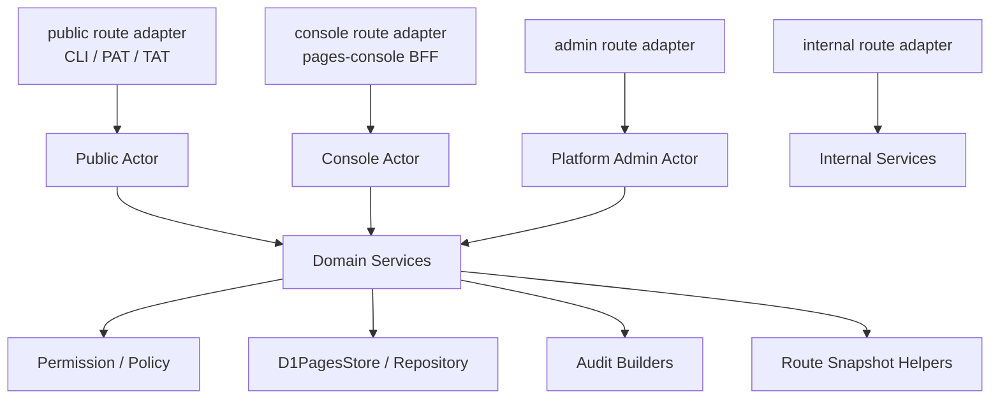

# pages-api 领域服务层渐进重构计划草案

> 状态：草案，后续实施前需要重新 review 当前代码、补充实现计划并拆分 PR。
>
> 本文记录 `apps/pages-api` 多入口 API 向统一领域服务层收敛的计划，不作为当前运行行为真相源。当前行为仍以代码、测试、`apps/pages-api/src/openapi.js`、`docs/api-boundary.md` 和相关架构文档为准。

## 背景

`pages-api` 目前已经支持多类入口：

- public API：CLI、AI agent、Personal Access Token、Team Access Token 调用。
- console API：`pages-console` BFF 通过 service binding 调用 `pages-api.internal/.xd-pages/api/console/*`。
- admin API：console admin 子路径，额外要求平台管理员权限。
- internal API：`pages-auth`、router、内部控制面调用 `pages-api.internal/.xd-pages/internal/*`。

现状不是完全散乱的 handler。`D1PagesStore` 已经承担了大量原子写入、事务和一致性保护，`sites.js`、`route-snapshot.js`、`runtime-config.js` 也有一些共享 helper。

主要问题是：用例编排和权限 policy 仍散落在 public、console、deploy、admin handler 中。随着 PAT / TAT、团队角色、console 管理能力和 deploy 行为继续扩张，容易出现 CLI、AK、console 三套入口业务规则不一致。

## 目标

将 `pages-api` 从当前结构：

```text
多入口 handler + shared store/helper
```

渐进收敛为：

```text
多入口 adapter + 统一领域 service + shared store
```

最终希望做到：

- 各入口保留自己的鉴权边界和响应协议。
- 权限判断、站点资产规则、Access Token 规则、团队角色规则、runtime config 规则统一在领域服务层。
- `store` 继续作为 D1 repository 和事务原语，不把 HTTP、actor、业务 policy 混入 store。
- 每一步重构都不改变 URL、响应字段、数据库结构和已公开行为，除非另有明确 feature PR。

## 非目标

- 不一次性重写 `apps/pages-api`。
- 不改变 CLI / skill / console 的用户可见行为。
- 不把 `pages-api` 公开为手写 HTTP API；用户入口仍是 CLI / skill / console。
- 不移动 secret、token、cookie、session 或 provider resource id 到日志、审计、列表响应中。
- 不在本计划中实现新的业务能力；新能力应单独走设计和实现计划。
- 不把 v1 `apps/server` 纳入新服务层设计。

## 当前共享与重复

### 已共享的部分

- 入口分流集中在 `apps/pages-api/src/index.js`。
- public API 统一使用 `authenticateApiRequest()` 解析 CLI Token / PAT / TAT。
- console API 统一使用 `requireConsoleUserSession()` 校验用户 active、`sessionVersion` 和可选 platform admin。
- 站点、路由、hostname claim 的关键写入在 `D1PagesStore` 中完成，例如 `createSite()`、`deleteSite()`、`transferSiteOwner()`。
- visibility、ACL、runtime config generation、secret revision、deployment idempotency 等关键写入在 store 中有事务或并发保护。
- route snapshot 写入与失败回滚已有 helper，可被 public、console、deploy 路径复用。

### 仍重复的部分

- public `createSite()`、console `createConsoleSite()`、deploy auto-create 分别校验 slug、visibility、团队 publisher/admin 权限，再调用 `store.createSite()`。
- site 管理权限有多套近似逻辑：`actorCanManageSite()`、`actorCanDeploy()`、`hasPublisherRole()` 等。
- public 和 console 的 runtime secrets 都分别做 name/value 校验、audit 写入和 active Worker secret sync。
- ACL / visibility 更新已共享 normalize/snapshot helper，但 body 解析、权限判断、写入与错误响应仍分散。
- Access Key 的 public / console 创建逻辑已有部分共享，但 PAT / TAT、site scope、scope、过期策略仍没有独立领域服务承载。

## 目标架构



入口 adapter 只负责：

- 路由匹配。
- HTTP method 校验。
- 解析 request body / query。
- 调用入口专属鉴权。
- 将鉴权结果转换为统一 actor。
- 调用领域 service。
- 将 service 结果格式化为当前 API 响应。

领域 service 负责：

- 业务规则。
- 权限 policy 调用。
- store 事务原语编排。
- audit metadata。
- route snapshot 写入与失败回滚。
- 受控错误码。

## 服务拆分建议

### Actor / PermissionService

建议文件：

- `apps/pages-api/src/services/actor.js`
- `apps/pages-api/src/services/permission-service.js`

职责：

- 统一表达 `UserActor`、`PersonalAccessTokenActor`、`TeamAccessTokenActor`、`ConsoleActor`、`PlatformAdminActor`。
- 提供 `canReadSite()`、`canPublishSite()`、`canTransferSite()`、`canManageRuntimeConfig()`、`canAdminTeam()`、`canManageAccessKey()` 等判断。

收益：

- 收敛最容易漂移的权限判断。
- 为后续 Site / Access Key / Team / Deployment service 打基础。

风险：

- 必须确保 CLI Token、PAT、TAT、console session、platform admin 的语义不混淆。
- platform admin 不应默认拥有所有站点 owner 权限；只能进入平台治理能力。

优先级：P1。

### AccessKeyService

建议文件：

- `apps/pages-api/src/services/access-key-service.js`

职责：

- PAT / TAT 创建、列表、撤销。
- scope、site scope、过期时间校验。
- plaintext 只在创建时返回一次。
- 统一 public / console 创建入口的规则。

收益：

- 当前 public / console 已经共享半套创建逻辑，抽取成本较低。
- 可以清晰表达 site-scoped 只是作用范围，不是第三类 token。

风险：

- 不能让 Access Key 创建 Access Key。
- 不能在列表、日志、审计或错误响应中暴露完整 token / hash / pepper 信息。

优先级：P1。

### SiteAccessService

建议文件：

- `apps/pages-api/src/services/site-access-service.js`

职责：

- visibility 更新。
- ACL entries normalize / grant / revoke / replace。
- route snapshot 写入。
- snapshot 失败后的 visibility / ACL 回滚。

收益：

- public site API 和 console site access API 的重复度高。
- 访问控制是安全敏感路径，统一 service 能降低 fail-open 风险。

风险：

- pages-api 只管理策略；内容访问仍由 pages-router 执行。
- unknown visibility / malformed ACL 必须 fail closed。
- snapshot 写失败必须回滚。

优先级：P1。

### RuntimeConfigService

建议文件：

- `apps/pages-api/src/services/runtime-config-service.js`

职责：

- runtime vars 写入 / 删除。
- runtime secrets 写入 / 删除。
- secret name/value 校验。
- secret audit。
- active Worker secret sync。
- deployment runtime config snapshot 校验和回滚协作。

收益：

- public secret API、console runtime config、deployment runtime snapshot 都会触碰这组规则。
- 能避免 secret 处理逻辑在多个 handler 里分叉。

风险：

- secret value 只能进入写入路径，不得进入列表、日志、审计导出或错误响应。
- active Worker secret sync 失败时的错误码和恢复路径必须保持现有行为。

优先级：P1/P2。

### SiteService / SiteOwnershipService

建议文件：

- `apps/pages-api/src/services/site-service.js`
- `apps/pages-api/src/services/site-ownership-service.js`

职责：

- 站点创建。
- 站点删除。
- 站点归属转移。
- deploy 前站点解析。
- hostname claim 调用。
- owner/team/publisher 规则。
- `site.owner.transfer` audit。

收益：

- 直接解决 public / console / deploy 站点规则漂移问题。
- 支撑后续 console 站点转移归属能力。

风险：

- 涉及 public site API、console site API、deploy 流程三条入口，改造面中高。
- deploy 中既有“创建新站点”和“发布已有站点”的路径必须保持不变。
- TAT 暂不支持转个人的规则必须保持。

优先级：P1/P2。

### TeamService

建议文件：

- `apps/pages-api/src/services/team-service.js`

职责：

- 自定义团队创建。
- 团队成员角色变更。
- 团队成员移除。
- 团队设置。
- 删除团队前资产检查。
- 团队 Access Key 所属关系校验。

收益：

- 团队角色是站点、AK、console 的公共依赖，服务化后权限语义更清晰。

风险：

- 部门团队信息不可编辑。
- 团队删除必须先处理站点和 AK 等资产。
- 部门 hydration 和部门合并已有较复杂 store 事务，第一阶段不建议强搬。

优先级：P2。

### DeploymentService

建议文件：

- `apps/pages-api/src/services/deployment-site-resolver.js`
- `apps/pages-api/src/services/deployment-runtime-snapshot.js`
- `apps/pages-api/src/services/publish-plan-parser.js`
- 后续再考虑 `apps/pages-api/src/services/deployment-service.js`

职责：

- publish plan / multipart body 解析。
- deploy 前站点解析、创建和归属转移。
- runtime config snapshot。
- idempotency。
- provider upload / verify。
- route activation。
- rollback。
- cleanup。
- webhook。

收益：

- 长期收益最大，可以把 `deployments.js` 从大型编排文件拆小。

风险：

- 当前 `deployments.js` 风险最高，承载上传协议、WFP 编排、route activation、rollback、runtime snapshot、清理和 webhook。
- 不建议第一阶段完整抽取。

优先级：P3，最后做。

### Admin / Webhook / Internal Services

建议文件：

- `apps/pages-api/src/services/admin-governance-service.js`
- `apps/pages-api/src/services/webhook-service.js`
- `apps/pages-api/src/services/internal-user-service.js`

职责：

- platform admin grant/revoke。
- admin dashboard/read model。
- webhook subscription CRUD 和 delivery。
- SSO user upsert、部门补全、部门团队 hydration。

收益：

- 有助于 admin 能力继续增长时保持边界清晰。

风险：

- 当前 admin read model 重复少，收益不如 Site / AK / Runtime。
- webhook URL 是敏感 bearer secret，服务化时必须保持 URL 加密、mask、SSRF 校验和日志边界。

优先级：P3。

## 分阶段实施计划

### 阶段 0：行为锁定

目标：不改业务结构，只补充 characterization tests。

覆盖：

- CLI Token / PAT / TAT。
- personal / team owned site。
- viewer / publisher / admin。
- site-scoped AK。
- site transfer。
- visibility / ACL。
- runtime vars / secrets。
- console admin gate。
- deploy 创建个人站点、创建团队站点、发布已有团队站点、归属转移。

验收：

- focused tests 覆盖当前行为。
- `pnpm test` 通过。
- 没有 URL、响应、DB schema 变更。

### 阶段 1：Actor / PermissionService

目标：先抽最基础的 actor 和权限判断。

步骤：

- 新增 actor normalizer 和 permission helper。
- 先不移动业务流程，只替换重复的 `actorCan*` / `has*Role` 判断。
- public / console / deploy 的权限测试保持不变。

验收：

- 权限相关测试通过。
- 代码中重复权限判断明显减少。
- platform admin 没有被误用为站点 owner 权限。

### 阶段 2：AccessKeyService、SiteAccessService、RuntimeConfigService

目标：抽重复度高、相对独立的服务。

步骤：

- 将 PAT / TAT 创建、列表、撤销迁入 AccessKeyService。
- 将 visibility / ACL 更新迁入 SiteAccessService。
- 将 vars / secrets 写入、删除、audit、active Worker secret sync 迁入 RuntimeConfigService。
- handler 保持薄适配，不改变响应结构。

验收：

- Access Key plaintext 只在创建时返回一次。
- site-scoped AK 仍不能越权创建新站点或转移归属。
- secret value 不出现在列表、日志、审计导出或错误响应。
- snapshot 失败回滚测试通过。

### 阶段 3：SiteService / SiteOwnershipService

目标：统一站点生命周期和归属规则。

步骤：

- 先迁移 create / delete。
- 再迁移 transfer。
- 最后让 deploy 前站点解析调用同一套 service。
- 保留原有 route adapter 的 response formatter。

验收：

- public site API、console site API、deploy 流程行为一致。
- 个人 AK、团队 AK、用户 CLI token 在团队站点场景下的行为符合当前 Access Token 模型。
- `site.owner.transfer` audit 仍完整记录 source、fromOwner、toOwner。

### 阶段 4：TeamService

目标：统一团队基础管理能力。

步骤：

- 迁移团队创建、团队设置、成员角色变更、成员移除。
- 迁移删除团队前资产检查。
- 部门团队 hydration / merge 暂时保留在 store 或现有 handler，除非后续有明确收益。

验收：

- 部门团队信息不可编辑。
- 删除团队前必须处理站点和有效 AK。
- 团队 admin / publisher / viewer 语义不变。

### 阶段 5：Deployment Resolver 拆分

目标：先拆部署流程中与站点/权限/配置相关的前半段，不拆完整编排。

步骤：

- 抽 publish plan parser。
- 抽 deployment site resolver。
- 抽 runtime config snapshot helper。
- 继续保留 provider upload、route activation、cleanup 主编排在 `deployments.js`。

验收：

- deploy 创建个人站点、创建团队站点、发布已有站点、归属转移行为不变。
- idempotency 行为不变。
- rollback 行为不变。

### 阶段 6：DeploymentService 编排拆分

目标：最后拆最高风险的 deployment 主编排。

步骤：

- 每个 PR 只移动一个子流程：idempotency、provider upload、route activation、cleanup、webhook。
- 每次移动后跑完整 deployment focused tests。
- 不与业务新能力混在同一个 PR。

验收：

- deployment 全量测试通过。
- staging 手动部署验证通过。
- production 仍只允许手动 workflow 触发。

## 建议 PR 节奏

| PR | 内容 | 风险 | 说明 |
| --- | --- | --- | --- |
| PR 1 | 补行为锁定测试 | 低 | 不改实现 |
| PR 2 | Actor / PermissionService | 中 | 替换重复权限判断 |
| PR 3 | AccessKeyService | 中 | 收敛 PAT / TAT / site scope |
| PR 4 | SiteAccessService + RuntimeConfigService | 中 | 收敛 ACL / visibility / vars / secrets |
| PR 5 | SiteService create/delete/transfer | 中高 | 统一站点生命周期 |
| PR 6 | TeamService 基础能力 | 中 | 不急着搬部门 merge |
| PR 7 | Deployment resolver / runtime snapshot | 高 | 只拆部署前半段 |
| PR 8 | DeploymentService 分段编排 | 高 | 最后做 |

## 测试策略

每个阶段至少覆盖：

- 相关 focused `node:test`。
- `pnpm lint`。
- `pnpm test`。

行为锁定测试优先覆盖：

- public API 与 console API 对同一业务动作的等价行为。
- 用户 CLI token、PAT、TAT、site-scoped AK 的差异。
- 用户 active / inactive、`sessionVersion` 失效。
- team viewer / publisher / admin。
- platform admin 只影响 admin lane，不自动获得站点 owner 权限。
- ACL / visibility fail-closed。
- secret / token 不泄露。

## 风险与回滚

主要风险：

- 入口鉴权语义被混淆。
- console session 被错误当成 public API bearer。
- platform admin 被误当成站点管理权限。
- site-scoped AK 越权。
- secret value 泄露到响应、日志或审计。
- route snapshot 失败回滚丢失。
- deploy idempotency 或 route activation 语义变化。

控制手段：

- 每个 PR 限制单一领域。
- 不改变 URL、响应字段、DB schema。
- 先 facade 后迁移，旧 helper 可短期保留。
- 不长期保留双轨业务逻辑；每批完成后删除旧路径。
- staging 先验证，production 继续手动部署。

回滚方式：

- 单 PR 可独立 revert。
- 若引入 env flag，只用于短期 staging 验证，不作为长期双轨。
- 回滚后重新跑 focused tests 和 `pnpm test`。

## 待确认问题

- 统一 actor 结构是否需要作为 `apps/pages-api/src/openapi.js` 之外的内部 contract 文档单独记录。
- Access Key service 是否需要在第一阶段同时清理 site-scoped legacy 兼容路径。
- console 未来是否需要站点归属转移 UI；如果需要，应直接调用 SiteOwnershipService。
- DeploymentService 拆分时是否要同步更新 `docs/architecture/publishing-and-runtime.md`。
- 是否需要把最终稳定后的服务层结构写入 `docs/architecture/xd-pages-overview.md` 或 `docs/architecture/publishing-and-runtime.md` 作为当前架构真相源。
