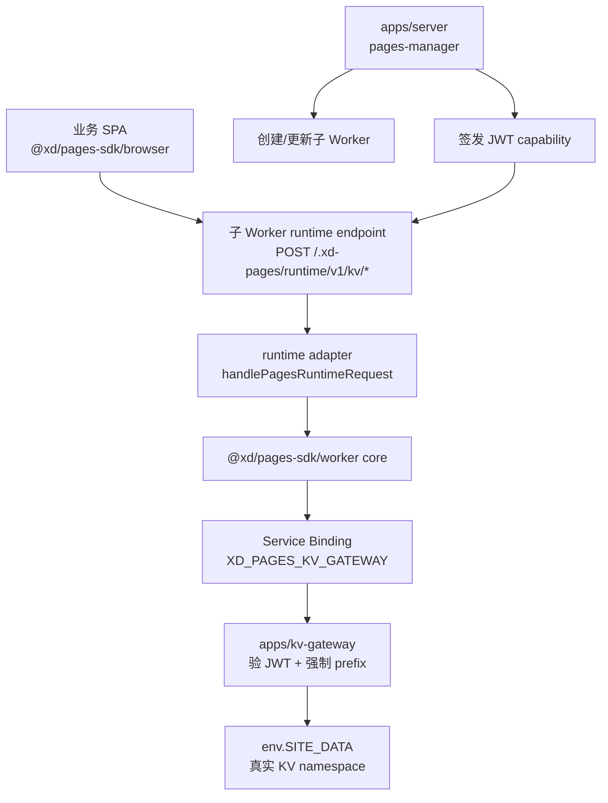
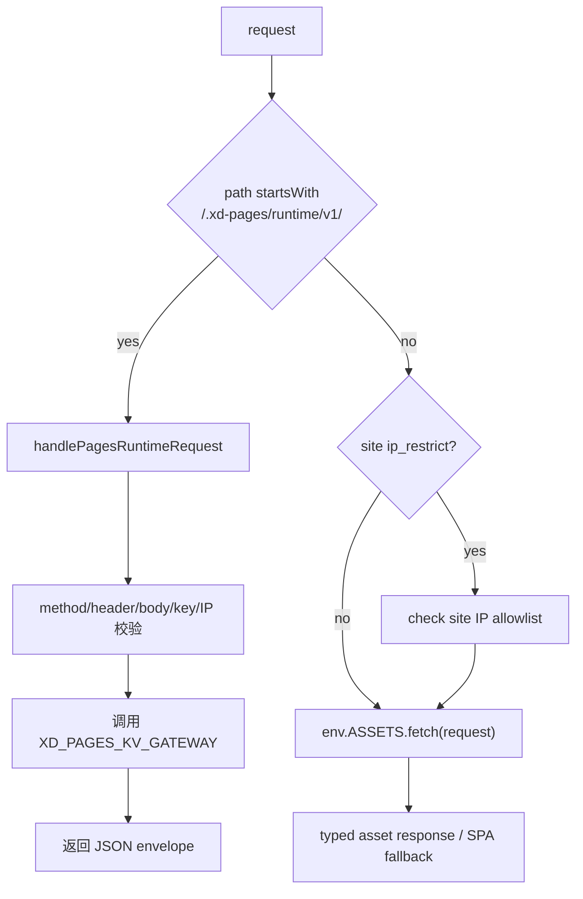
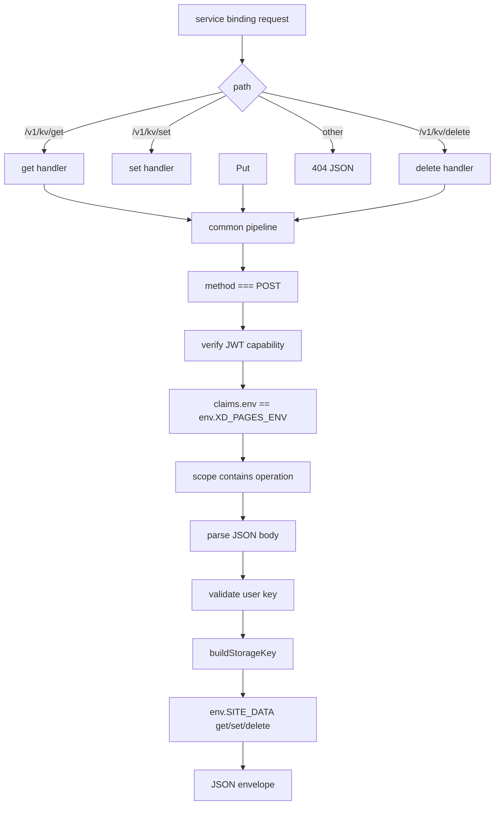

# pages-manager 子 Worker KV SDK 设计

## 背景

`pages-manager` 当前可以把静态站点、SPA 和自定义 Worker 发布为 `workers.xd.team` 下的子 Worker。业务侧希望由 pages-manager 创建的子 Worker 具备 KV 读写能力，尤其是 SPA 应用可以在浏览器代码中通过统一 SDK 读写轻量状态。

本设计引入 `@xd/pages-sdk`、站点 runtime endpoint 和平台 KV gateway。业务代码只依赖 SDK，不直接接触 Cloudflare KV binding、namespace id、Cloudflare API token 或平台运行时 capability。后续如果更换云服务厂商，优先在 gateway 和 SDK adapter 内部处理，不要求业务侧改调用方式。

## 目标

- 发布一个可供业务 SPA 安装的 npm 包 `@xd/pages-sdk`。
- 支持业务浏览器代码通过 `@xd/pages-sdk/browser` 执行 KV `get`、`set`、`delete`。
- 支持自定义 `_worker.js` 通过 `@xd/pages-sdk/worker` 使用同一套 KV 能力。
- pages-manager 生成的 SPA Worker 内置平台 runtime endpoint，并复用 SDK worker adapter 逻辑。
- KV 能力第一版必须显式 opt-in，例如部署参数 `kv=true`；未开启的站点不注入 gateway binding、capability 或 browser runtime endpoint。
- 通过独立 `pages-kv-gateway` Worker 持有真实 KV namespace binding。
- 使用共享 namespace + gateway 强制 prefix，实现同环境内多站点数据隔离。
- production 和 staging 使用独立 gateway、独立 KV namespace、独立 JWT secret。
- 第一版使用 JWT + HS256 对称签名的 signed capability，并为后续升级 RS256/非对称签名预留结构。
- 第一版不在线检查 `siteGeneration`，将主动吊销能力留作后续迭代。

## 非目标

- 不让浏览器直接访问 Cloudflare KV、gateway 或 signed capability。
- 不把真实 KV namespace binding 暴露给业务 Worker。
- 不提供强一致事务、锁、自增计数器或复杂查询能力。
- 不提供 `list`、批量读写、binary value 或业务 metadata。
- 不做 `kv=off | worker | browser-read | browser-readwrite` 细粒度能力分级；第一版只做 `kv=true` 显式开启，细粒度读写模式作为后续优化记录。
- 不引入短期 `exp` 或自动续签机制。
- 不在第一版实现 `siteGeneration` 在线校验、capability denylist 或 active token list。
- 不把 `packages/pages-runtime-protocol` 发布给业务侧；业务只安装 `@xd/pages-sdk`。

## 目录约定

本仓库约定：

```text
apps/
  对外交付物，包括可部署服务、可发布 npm 包、可构建应用。

packages/
  内部复用依赖，不直接作为业务侧交付物。
```

目标结构：

```text
apps/
  server/                 # pages-manager 管理 API Worker
  kv-gateway/             # pages KV gateway Worker
  pages-sdk/              # @xd/pages-sdk npm 发布物

packages/
  ip-guard/               # 内部 IP allowlist helper
  worker-kit/             # 内部 Worker helper
  pages-runtime-protocol/ # 内部协议常量、校验和 envelope helper
```

`pnpm-workspace.yaml` 继续保留：

```yaml
packages:
  - apps/*
  - packages/*
```

`apps/pages-sdk` 是 workspace package，也是 npm 发布物。它构建时会把 `packages/pages-runtime-protocol` 中需要的 browser-safe 协议常量和校验逻辑打进 `dist`，发布后的 `@xd/pages-sdk` 不应包含 `workspace:*` 依赖。

## 总体架构



浏览器 SDK 只请求同源 runtime endpoint。子 Worker runtime endpoint 使用部署时注入的 service binding 和 signed capability 调用 gateway。gateway 验证 capability 后，根据 claims 推导站点前缀并访问真实 KV。

## 环境隔离

production 和 staging 部署为两个独立 gateway Worker：

```text
pages-kv-gateway
pages-kv-gateway-staging
```

两者运行同一份代码，但绑定不同配置：

```text
production gateway:
  XD_PAGES_ENV = production
  SITE_DATA = PAGES_SITE_DATA_PROD
  PAGES_CAP_JWT_ACTIVE_KID / PAGES_CAP_JWT_KEYS = production key registry
  service name = pages-kv-gateway

staging gateway:
  XD_PAGES_ENV = staging
  SITE_DATA = PAGES_SITE_DATA_STAGING
  PAGES_CAP_JWT_ACTIVE_KID / PAGES_CAP_JWT_KEYS = staging key registry
  service name = pages-kv-gateway-staging
```

gateway 代码只访问 `env.SITE_DATA`，不在运行时选择 production/staging namespace。环境隔离依赖：

```text
1. 独立 gateway Worker
2. 独立 SITE_DATA KV namespace binding
3. 独立 JWT signing secret
4. gateway 校验 claims.env === env.XD_PAGES_ENV
```

真实 KV key 使用不可变站点 UUID，而不是只使用站点名。站点名可以被删除后重新注册，不能作为数据隔离的唯一前缀。`siteUuid` 在站点首次创建时生成并写入站点 metadata；同 token 覆盖部署保留原 `siteUuid`；删除后同名重建必须生成新的 `siteUuid`。旧数据清理可以 best-effort，但新站点隔离不能依赖清理成功。

由于 production 和 staging 使用物理不同的 KV namespace，真实 KV key 不再带 `production/` 或 `staging/` 环境前缀。为兼顾排障可读性和 key 长度，真实 key 使用短路径段，并同时包含可读站点 slug 和不可变 UUID：

```text
s/{siteSlug}--{siteUuid}/k/{encodedUserKey}
```

`siteSlug` 仅用于可读性，不参与安全边界；它使用现有站点名规则，最大 50 字符。`siteUuid` 才是隔离锚点。`siteUuid` 在 storage key 中使用无连字符 UUID，例如 `4b4c8e8361ef4b47b64f5c20a7db7c47`，减少 key 长度。

## Runtime Endpoint

站点 runtime endpoint 使用更特殊的平台保留路径：

```text
/.xd-pages/runtime/v1
```

KV endpoint 全部使用 POST：

```text
POST /.xd-pages/runtime/v1/kv/get
POST /.xd-pages/runtime/v1/kv/set
POST /.xd-pages/runtime/v1/kv/delete
```

选择 POST 的原因：

- key 不出现在 URL、浏览器历史、代理日志或常规 access log 中。
- 避免 path/query 对 `/`、中文、空格等 key 字符的编码差异。
- 后续扩展 batch、metadata、条件参数更自然。
- SDK 封装 HTTP 细节，不需要对业务暴露 REST 语义。

读请求：

```json
{
  "key": "app/config",
  "type": "json"
}
```

写请求：

```json
{
  "key": "drafts/123",
  "type": "json",
  "value": { "title": "hello" },
  "expirationTtl": 3600
}
```

删除请求：

```json
{
  "key": "drafts/123"
}
```

读命中响应：

```json
{
  "ok": true,
  "key": "app/config",
  "found": true,
  "value": { "theme": "dark" }
}
```

读未命中响应：

```json
{
  "ok": true,
  "key": "app/config",
  "found": false,
  "value": null
}
```

写和删除成功响应：

```json
{
  "ok": true,
  "key": "drafts/123"
}
```

错误响应：

```json
{
  "ok": false,
  "error": {
    "code": "INVALID_KEY",
    "message": "Invalid KV key"
  }
}
```

## SPA Worker 适配

pages-manager 生成 SPA Worker 时，runtime endpoint 必须早于 Assets 和 SPA fallback：



如果 runtime path 放在 `env.ASSETS.fetch()` 之后，Cloudflare Assets 的 SPA fallback 可能把 `/.xd-pages/runtime/v1/kv/*` 错误返回成 `index.html`，导致 SDK 收到 HTML 而不是 JSON。

v1 安全默认：

```text
kv 未开启:
  不注入 gateway binding、capability 或 browser runtime endpoint。

kv=true 且 ip_restrict=true:
  browser SDK 的 get/put/delete 可用，访问者仍必须在站点 IP allowlist 内。

kv=true 且 ip_restrict=false:
  页面公开可访问，但 runtime KV endpoint 仍走平台 IP allowlist，不随 public 站点自动公开。
```

`kv=true` 解析语义必须 fail-closed：

```text
缺失: disabled
"false": disabled
false: disabled
"true": enabled
true: enabled
其它值: 请求 400，拒绝部署
历史站点 metadata 无 kv 字段: disabled
```

因此，只要开启 `kv=true`，generated SPA Worker 必须始终内联或绑定平台 IP allowlist 给 runtime endpoint 使用。站点 assets 是否公开只影响普通页面访问，不能影响 `/.xd-pages/runtime/v1/kv/*` 的访问控制。

runtime allowlist 来源必须具体且 fail-closed。第一版沿用现有 static/spa 子 Worker 的 baked allowlist 模型：pages-manager 在生成 SPA Worker 时，将当前 `env.IP_ALLOWLIST` 编译进 runtime access guard。该 guard 专用于 `/.xd-pages/runtime/v1/*`，即使站点 `ip_restrict=false` 也必须存在。若 allowlist 缺失、为空、格式非法或 access guard 未被注入，runtime endpoint 返回 `FORBIDDEN`，不能默认放行。

第一版 browser KV 是站点级能力，不是用户级权限模型；任何通过 runtime endpoint 访问控制的调用者都可以读写该站点 KV。后续 `kv=off | worker | browser-read | browser-readwrite` 能力分级上线后，再允许站点显式声明更细粒度的浏览器读写能力。

## 子 Worker Bindings

开启 `kv=true` 后，SPA 子 Worker metadata 注入：

```js
[
  { type: "assets", name: "ASSETS" },
  { type: "service", name: "XD_PAGES_KV_GATEWAY", service: env.KV_GATEWAY_SERVICE },
  { type: "plain_text", name: "XD_PAGES_SITE_ID", text: name },
  { type: "plain_text", name: "XD_PAGES_SITE_UUID", text: siteUuid },
  { type: "plain_text", name: "XD_PAGES_ENV", text: env.PUBLIC_ENVIRONMENT },
  { type: "plain_text", name: "XD_PAGES_KV_CAPABILITY", text: signedCapability }
]
```

`XD_PAGES_SITE_ID`、`XD_PAGES_SITE_UUID` 和 `XD_PAGES_ENV` 只供日志、调试和 SDK 使用。gateway 不信任这些普通 env，真正授权只看 signed capability。

worker preset 在 `kv=true` 时也注入 gateway binding 和 capability，但不改写用户上传的 `_worker.js`。业务需要显式使用：

```js
import { createPagesRuntime } from "@xd/pages-sdk/worker";

export default {
  async fetch(request, env) {
    const pages = createPagesRuntime({ env });
    const config = await pages.kv.get("app/config", { type: "json" });
    return Response.json(config);
  },
};
```

pages-manager 当前直接上传用户提供的 `_worker.js`，不会解析或打包 npm 依赖。因此 worker preset 使用 `@xd/pages-sdk/worker` 时，业务需要先在自己的构建流程中把 `_worker.js` 打包成无裸 npm import 的 Worker module，再交给 pages-manager 部署。OpenAPI、README 和 skill 需要明确说明这一点。

worker preset 代码被视为站点 owner 自己的受信代码。开启 `kv=true` 后，它可以读取 env 中的站点 KV capability，也可以把本站 KV 能力暴露给公网路由；平台只保证它不能跨站读写。部署响应和 OpenAPI 需要类似现有 IP allowlist warning 一样提示该边界。

## Signed Capability

v1 使用 JWT + HS256 对称签名：

```text
pages-manager:
  持有当前 active kid 对应的 HS256 secret，用它签发 JWT。

pages-kv-gateway:
  持有允许 kid 对应的 HS256 secret，用它们验签。

子 Worker:
  只持有已签好的 JWT。

browser:
  不持有 JWT。
```

production 和 staging 使用不同 secret。

secret 使用高熵随机值生成，不人工编写，不提交到 Git，不放入 `vars`。示例生成方式：

```bash
openssl rand -base64 32
```

secret 需要分别作为 Worker secret 注入 `apps/server` 和 `apps/kv-gateway` 对应环境。production 与 staging 注入不同值。

为支持无中断轮换，v1 需要显式 key registry，而不是单 secret 写死在验签逻辑中。推荐使用非敏感 `vars` 配置 kid 到 secret 变量名的映射，真实 secret 只存在于 Worker secrets：

```text
PAGES_CAP_JWT_ACTIVE_KID = prod-hs-2026-06
PAGES_CAP_JWT_KEYS = prod-hs-2026-06:HS256:PAGES_CAP_JWT_SECRET_202606,prod-hs-2026-09:HS256:PAGES_CAP_JWT_SECRET_202609

Worker secrets:
PAGES_CAP_JWT_SECRET_202606 = <secret>
PAGES_CAP_JWT_SECRET_202609 = <secret>
```

上面的 registry 是结构示例，不能把真实 secret 写进 Git、`vars` 或公开文档。无论采用哪种具体载体，语义必须一致：

```text
manager:
  只用 PAGES_CAP_JWT_ACTIVE_KID 对应 key 签发新 capability。

gateway:
  可验 registry 中所有允许 kid。
  header.kid 必须存在于 registry。
  header.alg 必须等于 registry[kid].alg。
  registry entry 的 key type 必须与 alg 匹配。
```

JWT header 必须包含 `alg` 和 `kid`，为后续非对称签名升级预留空间：

```json
{
  "typ": "JWT",
  "alg": "HS256",
  "kid": "prod-hs-2026-06"
}
```

payload 第一版不加 `exp`，避免引入续签机制：

```json
{
  "iss": "pages-manager",
  "aud": "pages-kv-gateway",
  "env": "production",
  "siteId": "q2-report",
  "siteUuid": "4b4c8e8361ef4b47b64f5c20a7db7c47",
  "siteGeneration": 1,
  "scope": ["kv:get", "kv:set", "kv:delete"],
  "iat": 1781111111,
  "nbf": 1781111111,
  "jti": "cap_01hx..."
}
```

v1 gateway 校验：

```text
header.alg === "HS256"
header.kid 在允许列表中
signature valid
claims.iss === "pages-manager"
claims.aud === "pages-kv-gateway"
claims.env === env.XD_PAGES_ENV
claims.siteId 合法
claims.siteUuid 合法
claims.scope 包含当前操作
claims.nbf <= now
claims.iat 不在未来太多
```

`siteId` 使用现有站点名规则。`siteUuid` 使用 32 位小写十六进制无连字符 UUID 字符串，正则：

```text
^[0-9a-f]{32}$
```

v1 不在线检查 `siteGeneration`。该字段仅用于日志、审计和后续主动吊销能力预留。

因为 v1 不加 `exp` 且不在线检查 `siteGeneration`，key rotation 必须有明确运维流程：

```text
常规轮换:
  1. gateway key registry 同时接受旧 kid 和新 kid
  2. pages-manager 使用新 kid 签发新 capability
  3. 已有站点随重新部署自然刷新 capability
  4. 只有确认旧 capability 已不再需要，才能移除旧 kid

紧急泄漏:
  1. 生成新 secret/kid
  2. 更新 pages-manager 和 gateway secret
  3. 重新部署所有 kv=true 子 Worker，刷新 capability
  4. 从 gateway key registry 移除泄漏 kid
```

在旧 kid 被 gateway 接受期间，旧 capability 对其原 `siteUuid` 前缀仍有效；删除同名站点后新建站点会使用新的 `siteUuid`，不会继承旧数据前缀。由于 v1 gateway 不在线查询 active capability，泄漏的旧 capability 如果被其它仍拥有 `XD_PAGES_KV_GATEWAY` service binding 的子 Worker 使用，在旧 kid 未移除前仍可能访问旧 `siteUuid` 前缀。该风险通过 gateway 不公网暴露、KV capability 显式 opt-in、key rotation runbook 和“不存高敏数据”的文档边界控制；强 per-site 主动吊销留作后续 `siteGeneration` 在线检查。

后续升级非对称签名时，gateway 的 key registry 可同时接受旧 HS256 和新 RS256/EdDSA：

```text
旧 token: alg=HS256, kid=prod-hs-2026-06
新 token: alg=RS256, kid=prod-rs-2026-09
```

key registry 必须将 `kid` 绑定到预期 `alg` 和 key type。gateway 需要拒绝 header `alg` 与 registry entry 不一致的 token，避免算法混淆。

## KV Gateway

`apps/kv-gateway` 是唯一持有真实 KV namespace binding 的服务。它不配置公网 route，`workers_dev=false`，只通过 service binding 被子 Worker 调用。

第一版提供：

```text
POST /v1/kv/get
POST /v1/kv/set
POST /v1/kv/delete
```

gateway 处理流程：



gateway 根据 claims 和 user key 拼真实 key：

```js
buildStorageKey({
  siteSlug: claims.siteId,
  siteUuid: claims.siteUuid,
  userKey: body.key,
});
```

gateway 永远不信任请求 body、query 或 header 里的 `siteId`、`env`、`prefix`。

写入时，gateway 可写内部 metadata：

```json
{
  "siteId": "q2-report",
  "type": "json",
  "updatedAt": "2026-06-11T00:00:00.000Z"
}
```

metadata 不得包含部署 token、用户邮箱、JWT、capability、Cloudflare namespace id 或任何 secret。

## SDK 和 Adapter

`apps/pages-sdk` 使用 TypeScript 实现并发布 npm 包 `@xd/pages-sdk`。仓库其它模块可以继续使用 JS。

发布入口：

```text
@xd/pages-sdk/browser
@xd/pages-sdk/worker
```

不提供默认入口，避免业务误 import 错运行环境。

建议结构：

```text
apps/pages-sdk/
  package.json
  README.md
  tsconfig.json
  src/
    browser.ts
    worker.ts
    adapter.ts
    inline.ts
    errors.ts
    types.ts
  dist/
    browser.js
    browser.d.ts
    worker.js
    worker.d.ts
    internal/
      runtime-source.js
```

`package.json` exports：

```json
{
  "exports": {
    "./browser": {
      "types": "./dist/browser.d.ts",
      "import": "./dist/browser.js"
    },
    "./worker": {
      "types": "./dist/worker.d.ts",
      "import": "./dist/worker.js"
    },
    "./internal/runtime-source": {
      "import": "./dist/internal/runtime-source.js"
    }
  }
}
```

`./internal/runtime-source` 只给 `apps/server` 内部生成 SPA Worker 使用，业务文档不公开。

`./internal/runtime-source` 必须是自包含的 generated source string，不允许包含裸 npm import 或 workspace import。实现时需要测试生成的 SPA Worker source 不包含未解析的 `@xd/*` import，避免子 Worker 部署后运行时模块解析失败。

### Browser SDK

业务使用：

```ts
import { createPagesClient } from "@xd/pages-sdk/browser";

const pages = createPagesClient();

const config = await pages.kv.get("app/config", { type: "json" });
await pages.kv.set("drafts/123", { title: "hello" });
await pages.kv.delete("drafts/123");
```

API：

```ts
type KVType = "json" | "text";

createPagesClient(options?: {
  basePath?: string;
  fetch?: typeof fetch;
}): {
  kv: {
    get<T = unknown>(key: string, options?: { type?: KVType }): Promise<T | string | null>;
    set(key: string, value: unknown, options?: { type?: KVType; expirationTtl?: number }): Promise<void>;
    delete(key: string): Promise<void>;
  };
}
```

默认：

```text
get type = json
put type = json
```

纯文本需要显式声明 `{ type: "text" }`。

### Worker SDK

`@xd/pages-sdk/worker` 是 Worker-side gateway client，供自定义 `_worker.js` 和平台 runtime adapter 复用。

```ts
import { createPagesRuntime } from "@xd/pages-sdk/worker";

const pages = createPagesRuntime({ env });
await pages.kv.get("app/config", { type: "json" });
```

它要求 env 提供：

```ts
type PagesRuntimeEnv = {
  XD_PAGES_KV_GATEWAY: Fetcher;
  XD_PAGES_KV_CAPABILITY: string;
  XD_PAGES_SITE_ID?: string;
  XD_PAGES_SITE_UUID?: string;
  XD_PAGES_ENV?: string;
};
```

Worker SDK 调 gateway 时携带：

```http
Authorization: Bearer <XD_PAGES_KV_CAPABILITY>
Content-Type: application/json
```

### Runtime Adapter

`adapter.ts` 将站点 runtime endpoint 的 HTTP request 转成 worker SDK 调用：

```ts
export async function handlePagesRuntimeRequest(
  request: Request,
  env: PagesRuntimeEnv,
  options?: {
    checkAccess?: (request: Request, env: PagesRuntimeEnv) => Response | null | Promise<Response | null>;
  }
): Promise<Response | null>;
```

行为：

- 非 `/.xd-pages/runtime/v1/*` 返回 `null`，外层继续走 assets。
- runtime path 必须 `POST`。
- 必须 `Content-Type: application/json`。
- 必须带 `X-XD-Pages-Runtime: 1`。
- 默认不返回 CORS header，仅支持 same-origin 调用。
- 检查 `Origin`、`Sec-Fetch-Site` 等浏览器来源信号；跨站请求返回 `FORBIDDEN`。
- 对 public 站点的 runtime path，仍使用平台 IP allowlist 做访问控制；该 allowlist 必须由 generated Worker 内联提供，不能依赖站点 assets 是否公开。
- generated SPA Worker 调用 adapter 时必须提供 `checkAccess`。adapter 如果命中 runtime path 且缺少 `checkAccess`，必须 fail closed 返回 `FORBIDDEN`，不能默认放行。
- parse JSON body。
- 校验 key、type、ttl。
- 调 `createPagesRuntime({ env }).kv.get/put/delete`。
- 返回 JSON envelope。

pages-manager 生成的 SPA Worker 通过 inline runtime source 复用 adapter 和 worker client，避免复制逻辑。

## Protocol 内部包

`packages/pages-runtime-protocol` 保存协议常量和纯函数，不依赖 Node 或 Cloudflare runtime。

建议导出：

```js
export const RUNTIME = {
  VERSION: "v1",
  BASE_PATH: "/.xd-pages/runtime/v1",
  KV_GET_PATH: "/.xd-pages/runtime/v1/kv/get",
  KV_SET_PATH: "/.xd-pages/runtime/v1/kv/set",
  KV_DELETE_PATH: "/.xd-pages/runtime/v1/kv/delete",
};

export const GATEWAY = {
  BASE_PATH: "/v1",
  KV_GET_PATH: "/v1/kv/get",
  KV_SET_PATH: "/v1/kv/set",
  KV_DELETE_PATH: "/v1/kv/delete",
};

export const HEADERS = {
  RUNTIME_REQUEST: "X-XD-Pages-Runtime",
  REQUEST_ID: "X-XD-Pages-Request-Id",
};

export const BINDINGS = {
  ASSETS: "ASSETS",
  KV_GATEWAY: "XD_PAGES_KV_GATEWAY",
  SITE_ID: "XD_PAGES_SITE_ID",
  SITE_UUID: "XD_PAGES_SITE_UUID",
  ENV: "XD_PAGES_ENV",
  KV_CAPABILITY: "XD_PAGES_KV_CAPABILITY",
};
```

错误码：

```js
export const ERROR_CODES = {
  METHOD_NOT_ALLOWED: "METHOD_NOT_ALLOWED",
  INVALID_CONTENT_TYPE: "INVALID_CONTENT_TYPE",
  INVALID_JSON: "INVALID_JSON",
  INVALID_KEY: "INVALID_KEY",
  INVALID_TYPE: "INVALID_TYPE",
  KV_DECODE_FAILED: "KV_DECODE_FAILED",
  KV_VALUE_TOO_LARGE: "KV_VALUE_TOO_LARGE",
  FORBIDDEN: "FORBIDDEN",
  CAPABILITY_INVALID: "CAPABILITY_INVALID",
  CAPABILITY_SCOPE_DENIED: "CAPABILITY_SCOPE_DENIED",
  KV_FAILED: "KV_FAILED",
  INVALID_RUNTIME_RESPONSE: "INVALID_RUNTIME_RESPONSE",
};
```

key 规则：

```text
类型: string
userKey UTF-8 后不超过 256 bytes
最终 storageKey UTF-8 后不超过 512 bytes
禁止空字符串
禁止 "." 和 ".."
禁止平台保留前缀 ".xd-pages/"、"__xd_pages/"
允许 slash、中文、空格，由 storage key builder 编码
```

`encodedUserKey` 使用 UTF-8 bytes 的无 padding base64url 编码，保证可逆、无路径分隔符冲突，并避免 `%`、`/`、Unicode、空格等字符造成二义性。base64url 会膨胀 key 长度，因此 v1 将业务 `userKey` 限制为 256 bytes，并在 gateway 构造 storage key 后再次校验最终 key 不超过 Cloudflare KV 的 512 bytes 限制。需要覆盖 slash、percent、Unicode、空格和接近长度上限的编码测试。

`expirationTtl` 规则：

```text
可选
必须是整数
>= 60
<= 31536000
```

value 不做额外平台大小限制，遵循 Cloudflare KV 最大 value 25 MiB。超出底层限制时，gateway 将 Cloudflare 错误标准化为 `KV_VALUE_TOO_LARGE` 或 `KV_FAILED`。

第一版不人为设置低于 Cloudflare KV 上限的 value size，但仍需要标准化底层超限错误。共享 namespace 容量、写入限流和 per-site quota 属于后续治理能力；在细粒度能力分级完成前，`kv=true` 必须显式开启，降低无意暴露写入面的风险。

## 安全边界

平台承诺：

- 没有另一个站点的有效 signed capability 时，一个站点不能读写另一个站点的 KV 数据。
- 浏览器拿不到 gateway、KV namespace、Cloudflare token 或 signed capability。
- 子 Worker 拿不到真实 KV namespace binding。
- gateway 强制 prefix，不信任业务传入的 `siteId`、`env`、`prefix`。
- production/staging gateway、KV namespace 和 JWT secret 物理隔离。
- public 站点页面可公开，但 v1 runtime KV endpoint 仍默认受平台 IP allowlist 保护。
- 删除后同名重建站点会获得新的 `siteUuid` 和新的 KV prefix，不继承旧站点数据。

平台不承诺：

- 防止站点 owner 在自定义 `_worker.js` 中泄漏自己站点的数据。
- 防止站点 owner 写公开未鉴权接口滥用自己站点的 KV 能力。
- 防止业务把 KV 当强一致数据库使用。
- 防止业务存储不该存的敏感信息。

典型 owner 滥用案例：

```js
// 公开写接口，任何访问者都能改本站数据。
if (url.pathname === "/set") {
  await pages.kv.set(url.searchParams.get("key"), url.searchParams.get("value"));
  return new Response("ok");
}
```

gateway 能保证这个接口只能写该站点自己的 prefix，不能写其它站点；但无法判断 owner 是否有意公开了自己的写能力。

Signed capability 是 bearer token。任何拥有 `XD_PAGES_KV_GATEWAY` service binding 的 `kv=true` 子 Worker 如果拿到另一个站点仍有效的 capability，就可以访问该 capability 对应的 `siteUuid` prefix，直到对应 `kid` 被移除或后续主动吊销机制上线。因此 capability 不得记录到日志、响应、公开配置或业务可读存储中。

Browser KV threat model:

```text
same-origin:
  SDK 默认只请求当前站点 origin 下的 runtime endpoint。

CORS:
  runtime endpoint 默认不返回 CORS header。

CSRF:
  runtime endpoint 要求 POST、JSON Content-Type、X-XD-Pages-Runtime header，并检查 Origin / Sec-Fetch-Site。

XSS:
  如果业务 SPA 出现 XSS，攻击脚本可调用 browser SDK 读写本站 KV。平台不承诺防止业务前端 XSS 后的本站数据滥用。

用户权限:
  v1 browser KV 是站点级能力，不是用户级能力；SDK 不提供登录态或 per-user 隔离。
```

## 日志与敏感信息

gateway 可记录结构化日志：

```json
{
  "event": "pages.kv.set",
  "environment": "production",
  "siteId": "q2-report",
  "jti": "cap_...",
  "keyHash": "sha256(userKey).slice(0,16)",
  "type": "json",
  "status": "ok"
}
```

日志不得输出：

```text
完整 user key
value
JWT
signing secret
Cloudflare namespace id
deployment token
用户邮箱
```

## 文档更新

实现时需要同步更新：

- `README.md`：增加 KV SDK 架构和使用方式。
- `API.md`：说明部署后 SPA runtime endpoint 行为和安全默认。
- `pages-deploy.skill.md`：说明业务 SPA 如需 KV，需要安装 `@xd/pages-sdk`。
- `apps/server/src/handlers/openapi.js`：更新 OpenAPI / x-libs / x-scripts 中与 KV 能力相关的说明。
- worker preset 文档必须说明 `_worker.js` 需要自行 bundle，不能直接上传带裸 npm import 的源码。
- 部署响应和 OpenAPI 需要提示：开启 `kv=true` 会让站点 Worker 持有本站 KV capability，worker preset 代码可滥用或泄漏本站能力。

文档中不得出现真实 secret、真实 namespace id、Cloudflare account id 或内部 token。

## 测试策略

重点测试：

- protocol constants 在 server、gateway、SDK 中一致。
- browser SDK 对 get/put/delete 发出正确 POST 请求。
- browser SDK 能把非 JSON runtime 响应转成 `INVALID_RUNTIME_RESPONSE`。
- worker SDK 调 gateway 时带 `Authorization: Bearer <capability>`。
- runtime adapter 对非 runtime path 返回 `null`。
- runtime adapter 对 runtime path 不 fallback 到 `index.html`。
- runtime adapter 校验 method、content-type、runtime header、body、key、ttl。
- runtime adapter 命中 runtime path 但缺少 `checkAccess` 时 fail closed。
- browser cross-origin 调用被拒绝：缺失/外部 `Origin`、`Sec-Fetch-Site: cross-site`、preflight/no CORS 都不能访问；same-origin 成功。
- `kv` 未开启时不注入 gateway binding、capability 或 browser runtime endpoint。
- `kv=true` 时才注入 gateway binding、capability 和 browser runtime endpoint。
- `kv` 参数解析 fail-closed：缺失、`false`、`"false"`、历史 metadata 无字段均 disabled；非法值拒绝部署。
- public SPA 的普通 assets 可访问，但 KV endpoint 仍受平台 IP allowlist 保护。
- gateway 验 JWT 的 `alg`、`kid`、`iss`、`aud`、`env`、`scope`。
- gateway 验 JWT 的 `siteUuid` 必填且符合 `^[0-9a-f]{32}$`。
- gateway 拒绝 header `alg` 与 key registry entry 不一致的 token。
- gateway 不信任请求 body 中的 `siteId`。
- gateway 不信任请求 body/header/env 中的 `siteUuid`，只使用 JWT claims。
- gateway 拼出的 storage key 使用 `s/{siteSlug}--{siteUuid}/k/{encodedUserKey}` 结构。
- 同 slug + 不同 UUID 生成不同 prefix；同 token 覆盖部署保留 UUID。
- 删除后同名重建站点生成新的 `siteUuid`，不能读取旧站点 KV prefix。
- user key 编码对 slash、percent、Unicode 和空格无冲突。
- key 长度测试覆盖最大允许站点名、无连字符 UUID、base64url 编码后接近 512 bytes 的最终 storage key。
- staging 子 Worker 绑定 `pages-kv-gateway-staging`，production 子 Worker 绑定 `pages-kv-gateway`。
- 生成的 SPA Worker source 不包含未解析的 `@xd/*` 裸 import。
- metadata、响应和日志不泄露 token、JWT、namespace id 或真实 secret。

## 后续迭代

- `kv=off | worker | browser-read | browser-readwrite` 细粒度能力分级。
- gateway 在线检查 `siteGeneration`，支持主动吊销。
- capability denylist / active list。
- JWT 非对称签名升级。
- `exp` + 自动续签或自动重部署机制。
- 本地开发 mock adapter。
- `list`、batch、binary value、业务 metadata。
- per-site quota、rate limit、kill switch 和更细粒度审计。
