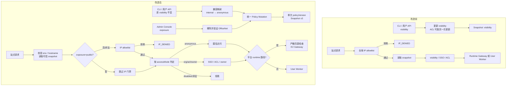

# XD Cell 站点公网 Exposure 设计

## 状态

- 日期：2026-08-07
- 状态：规格评审通过，等待用户审阅
- 适用范围：XD Cell v2
- 不适用范围：`apps/server` v1 legacy 链路

本文记录 XD Cell v2 站点公网访问能力的已确认设计。当前行为真相源仍是 `docs/security/routing-and-access.md`、`docs/architecture/publishing-and-runtime.md`、`docs/architecture/data-model.md` 和相关实现；功能落地时必须同步更新这些真相源，本文不替代运行态文档。

## 背景

当前 `pages-router` 在读取 hostname 和 route snapshot 之前统一执行公司网络 IP allowlist。所有 visibility 都受该网络门禁约束：

- `internal` 实际表示“通过网络门禁后不要求身份”，不是“网络范围仅限内网”。
- `org`、`acl` 和 `owner` 在网络门禁后继续执行 SSO、员工状态和 ACL/owner 判断。
- 旧的 `public` visibility 必须 fail closed。

需要新增由平台管理员控制的公网能力，同时满足：

- 不改变现有 CLI 命令、参数、配置和用户 API 调用方式。
- 不把 `public` 重新加入 visibility 枚举。
- 网络可达范围与身份访问策略正交。
- 普通用户不能自行把站点从公司网络提升为公网。
- Admin 授予 public 后，站点管理者仍可通过现有 visibility/ACL 控制访问对象，包括将站点设为匿名公网。

## 目标

1. Platform Admin 可以独立开启或关闭站点公网 exposure。
2. 现有 `visibility=internal` 在内部规范模型中映射为匿名访问。
3. 现有用户 visibility/ACL 写入保留 Admin 已设置的 public exposure。
4. 新站点和历史站点默认保持公司网络范围。
5. Router 只在可信 snapshot 明确声明 public 时绕过 IP allowlist。
6. Public runtime 请求具备严格的浏览器同源防护，不破坏同源站点功能或 Worker 内部 SDK。
7. Public Worker 不持有 `XD_OFFICE_NET`；Admin 开启公网时移除当前活跃 Worker 的该 binding，后续部署和回滚也不得重新注入。
8. Policy mutation、审计、snapshot、并发和失败补偿具有明确语义。

## 非目标

- 当前阶段不实现 recent-login enforcement。设计保留未来增加该门禁的空间，但文档和 UI 不得宣称当前已经具备。
- 当前阶段不实现 public runtime API 的按站点/IP 限流、配额或完整滥用防护。
- 不给 CLI 增加 `--public`、`--exposure` 或等价参数。
- 不允许普通用户 API、Access Token 或 Worker 配置控制 exposure。
- 不把用户 Worker 的业务 API CORS 责任收归平台；平台只保护保留的 runtime 路径。
- 不修改 v1 legacy 的 `public`、IP guard 或站点模型。

## 术语与规范模型

内部规范访问策略为：

```ts
interface SiteAccessPolicy {
  exposure: "internal" | "public";
  accessMode: "anonymous" | "org" | "acl" | "owner" | "disabled";
  aclEntries: SiteAclEntry[];
}
```

两个维度分别回答：

- `exposure`：请求能否从互联网到达站点 Router。
- `accessMode`：请求到达允许的网络范围后，是否需要身份以及如何授权。

合法组合：

| exposure | accessMode | 行为 |
| --- | --- | --- |
| `internal` | `anonymous` | 公司网络内免登录访问 |
| `public` | `anonymous` | 互联网匿名访问 |
| `internal` | `org` | 公司网络内要求 active 员工身份 |
| `public` | `org` | 公网可达，要求 active 员工身份 |
| 任意 | `acl` | 在允许的网络范围内要求身份并匹配 ACL；owner 隐式允许 |
| 任意 | `owner` | 在允许的网络范围内仅 active owner 可访问 |
| 任意 | `disabled` | 始终拒绝，不 dispatch |

`null`、空字符串和 `none` 都不是合法业务状态：

- exposure 缺失或非法时按 `internal` 处理，绝不能按 public 放行。
- 新 snapshot 的 accessMode 缺失或非法时 fail closed。
- 仅在迁移窗口内，合法旧 visibility 可以映射为 accessMode。

## 现有 Visibility 兼容层

外部 CLI 和用户 API 继续使用 visibility：

| 外部 visibility | 内部 accessMode |
| --- | --- |
| `internal` | `anonymous` |
| `org` | `org` |
| `acl` | `acl` |
| `owner` | `owner` |
| `disabled` | `disabled` |

兼容要求：

- 现有路径、请求体、visibility 枚举、状态码和 CLI flag 不变。
- 现有站点响应中的 `defaultVisibility`、`route.visibility` 和 access visibility 继续按反向映射返回。
- 所有普通用户 handler 在请求体显式出现 exposure 时统一返回 `SITE_EXPOSURE_ADMIN_REQUIRED`；合法旧请求不受影响，且任何用户输入都不能提升 exposure。
- 新建站点始终创建为 `exposure=internal`。
- 用户修改 visibility 或 ACL 时只更新 accessMode/ACL，不更新 exposure；因此当前 exposure 为 public 时继续保持 public。
- Admin Console 和 Console BFF 可以返回 exposure 供 UI 展示和治理，但不把 exposure 加入公开 CLI-managed API 合约。
- CLI help、Console 标签和文档必须把 `internal` 解释为“匿名/免登录访问模式”，不再解释成网络范围。

## 权限边界

### Platform Admin

Platform Admin 独占以下能力：

- 将 exposure 从 internal 改为 public。
- 将 exposure 从 public 改为 internal。
- 在 Admin 列表中筛选公网站点。
- 查看 public 操作的理由、actor 和审计记录。

当前阶段 Admin exposure mutation 需要：

- 有效 Console BFF 请求。
- 当前 active platform admin 身份。
- 开启 public 时填写理由并完成二次确认。
- 关闭 public 时完成明确确认；理由可选，不得阻碍紧急止损。
- 成功、失败和补偿结果均可审计。

当前阶段不要求 recent login。

### 站点管理者

站点 owner 或现有授权角色继续通过 visibility 和 ACL 管理 accessMode。Admin 将 exposure 设为 public 后，站点管理者可以：

- 将 `visibility=internal`，使站点成为 `public + anonymous`。
- 将站点改为 `org`、`acl`、`owner` 或 `disabled`。
- 修改 ACL，而不覆盖 public exposure。

普通用户不能通过 visibility、ACL、deploy 参数或 config 开启 public exposure。

## 数据模型与迁移

当前 schema version 为 18。实现使用 additive `0019` migration，避免 migration 先执行而旧 Worker 尚未更新时破坏运行态和回滚。

新增规范字段：

```text
sites.default_exposure TEXT NOT NULL DEFAULT 'internal'
sites.default_access_mode TEXT

site_routes.exposure TEXT NOT NULL DEFAULT 'internal'
site_routes.access_mode TEXT
```

`0019` 先进入兼容期，避免旧 pages-api binary 在 migration 后继续创建或更新 visibility-only 数据时产生双真相源：

1. 所有现有 exposure 回填为 `internal`。
2. 合法旧 visibility 回填 accessMode：`internal -> anonymous`，其余合法值一一映射。
3. 未知历史 visibility 不映射为 anonymous，继续作为非法策略 fail closed。
4. 兼容期内 legacy visibility 暂时仍是 accessMode 的读取权威；`access_mode` 是目标规范字段和一致性投影。新代码所有写路径必须在同一 batch 双写两者。
5. 旧 binary 新建记录留下的 null accessMode，或只更新 visibility 造成的不一致，由新 reader 按合法 visibility 派生并修复；非法 visibility 不生成 public snapshot，并触发告警。
6. exposure 从 `0019` 起即是独立权威字段；旧 binary 不认识该字段，INSERT 使用数据库默认 internal，UPDATE 必须保留已有 exposure。
7. 旧 binary 写出的 v2 snapshot 会使新 Router 安全降级为 internal，可能暂时关闭公网，但不能扩大访问。
8. 旧 binary 全部退出且回滚窗口结束后，执行独立收口 migration：全量校验/修复一致性，将 accessMode 切为读取权威并收紧为 NOT NULL/CHECK。完成该切换后，不得单独回滚到 visibility-only binary。
9. `deployments.visibility` 保留为历史请求/审计词汇，不作为 route 策略真相源；兼容 visibility 列的最终删除另行实施。

站点和 route 的兼容投影：

```text
accessMode=anonymous -> visibility=internal
其它 accessMode      -> visibility=同名值
```

## 统一策略 Mutation

新增 store-level `updateSiteAccessPolicy` 或等价能力，作为 accessMode、ACL 和 exposure 的统一写边界。

要求：

- 用户 mutation 只写 accessMode/ACL，字段级保留 exposure。
- Admin exposure mutation 只写 exposure，字段级保留 accessMode/ACL。
- accessMode、ACL、规范字段、兼容投影、updatedAt、cache tier、`policy_committed/pending_activation` 审计和一次 policyVersion bump 进入同一 D1 batch。
- 同一次请求最多 bump 一次 policyVersion。
- mutation 完成后重新读取完整 route 和 ACL，再构建 snapshot；不得使用 ACL 更新前的旧 route 对象。
- 使用 expected policyVersion/CAS guard 或有界内部重试，避免并发 Admin exposure 与用户 access mutation 相互覆盖。
- Admin public 与用户 anonymous 并发时，最终合法合并结果是 `public + anonymous`，提交顺序不应造成字段丢失。
- Same-value mutation 仅在 D1 与已确认 pointer 完全收敛时才是 no-op；若策略值相同但 pointer 缺失、落后或不一致，必须执行可重入 snapshot/pointer repair，且无需额外 bump policyVersion。

这同时修复当前 Console access 更新中 visibility 和 ACL 分两个 batch、可能产生两次 policyVersion 且 snapshot 使用旧 route 的问题。

## 用户写入流程

现有用户访问策略 API 流程：

1. 按现有方式完成用户/session/站点管理权限校验。
2. 读取当前规范 policy。
3. 验证原 visibility 输入并映射为 accessMode。
4. 验证 team-owned + owner 等既有约束。
5. 归一化 ACL。
6. 调用统一策略 mutation，只更新 accessMode/ACL。
7. exposure 为 public 时保持 public，否则保持 internal。
8. 写 route snapshot。
9. Snapshot 失败时执行条件补偿，不能覆盖更晚的 policy writer。
10. 响应通过兼容 serializer 返回旧 visibility 形状。

CLI `access set` 当前跨两个 HTTP 请求更新 ACL 和 visibility 的行为保持不变；跨请求原子性不在本次兼容范围内，但每一个请求都必须保留 exposure。

## Admin Exposure API

新增独立 Admin-only BFF endpoint，例如：

```http
PATCH /.xd-pages/api/console/admin/sites/{siteId}/exposure
Content-Type: application/json

{
  "exposure": "public",
  "reason": "用于对外活动页面"
}
```

该 endpoint 不复用普通用户可调用的 access handler 权限边界。

### 开启 Public

1. 校验 Console BFF 和 platform admin。
2. 要求非空 reason，生成 operationId，并在任何外部副作用前持久化 attempted 审计。
3. 获取站点级 policy/route commit lease，确认 D1 与当前 pointer 已收敛，再读取 active route、version 和 policy。
4. 如果当前是 WFP `worker-only` 或 `worker-with-assets`，在 lease 内移除并验证当前 active Worker 的 OfficeNet。
5. 使用完整 route tuple 和 lease fencing token 做 CAS，将 exposure 提交为 public；同一 D1 batch 写 `policy_committed/pending_activation` 审计。
6. 从提交后的完整策略写 snapshot、切换 pointer，并读回确认精确 tuple。
7. 只有确认 Router-effective exposure 为 public 后，写 `effective_success` 审计并返回成功。

同值 public 请求只有在 pointer 已收敛且 active Worker 已确认无 OfficeNet 时才直接幂等返回；否则进入 repair/verification，不重复 bump policyVersion。

### 关闭 Public

1. 校验 platform admin。
2. 生成 operationId、写 attempted 审计并获取同一站点级 lease。
3. 将 authority exposure 提交为 internal，保留 accessMode/ACL，并写 pending activation 审计。
4. 写 internal snapshot、切换 pointer，并读回确认后才记录关闭成功。
5. 不自动恢复 `XD_OFFICE_NET`；后续完整 internal 部署只有在 D1/pointer 已确认同为 internal 时才按默认规则重新注入。

关闭 public 不要求 recent login，且不能因理由缺失而阻塞紧急止损。

## XD_OFFICE_NET 处理

当前 WFP Worker 形态在配置了平台 Tunnel 时默认注入 `XD_OFFICE_NET`。本设计不新增版本级 binding 状态记录，责任由 Admin public 操作与平台部署流程共同承担。

核心不变量：

```text
effective exposure=public 时，当前接收站点流量的 Worker 不得持有 XD_OFFICE_NET。
```

### Admin 开启 Public 时移除当前 Binding

对当前 active WFP `worker-only` 或 `worker-with-assets`：

1. 通过受控 WFP client 读取 Worker settings。
2. 从完整 binding 列表中移除名称为 `XD_OFFICE_NET`、类型为 `vpc_network` 的平台 binding。
3. PATCH Worker settings。
4. 再次读取 settings，确认 binding 已不存在。
5. 只有验证成功后才能提交 public exposure。

`assets-only` 和不持有该 WFP binding 的执行形态无需处理。

Admin 承担“移除 OfficeNet 可能使站点业务功能返回 `OFFICE_NET_UNAVAILABLE`”的决策责任。确认文案必须明确该影响，但平台不允许 Admin 选择保留 OfficeNet 后继续开启 public。

### 部署与回滚

- Worker 上传可以在 lease 外执行，但 route activation 必须与 Admin exposure、rollback 和 pointer repair 共用 `(environment, siteId)` commit lease。
- Activation 在 lease 内重新读取 exposure、activeVersionId、routeGeneration、policyVersion、runtimeConfigGeneration 和 pointer，不得使用上传前的 exposure。
- exposure 为 public 时，激活候选 Worker 前移除并现场验证其 `XD_OFFICE_NET`；本设计不新增版本级 capability 记录。
- exposure 为 internal 且 D1/pointer 已确认收敛时保持默认注入逻辑；状态分叉时阻断 activation，不得引入 OfficeNet。
- route activation CAS 必须匹配上述完整 tuple 和 lease fencing token；丢锁或冲突后重新读取，不能继续写 snapshot。
- Public 回滚同样在 lease 内移除并验证目标 Worker binding，失败则拒绝切换 route。
- 所有会先 GET 完整 settings、再 PATCH bindings 的 runtime var/secret 同步路径，必须先获取 site commit lease，再获取现有 runtime-config lock；不得只持有 runtime-config lock。Provider 调用前后重新校验 active Worker、exposure 和 route tuple，目标漂移或 lease 丢失时返回冲突并进入 reconcile。
- 仅调用 WFP secret PUT/DELETE 且不重写完整 bindings 的路径也使用同样的 site lease，避免与 active Worker 切换交错；不得把旧 Worker 更新成功当作当前 Worker 已同步。
- 关闭 public 后不会立即恢复 binding，只有后续完整 internal 部署才重新注入。

Lease 必须续租并使用 fencing token。锁顺序固定为 site commit lease -> runtime-config lock -> route pointer 串行器；任何平台路径都不得反向获取。外部系统仍可绕过平台改 Worker settings，因此运维权限和漂移检测继续作为防线，但不在 D1 记录版本级 binding 状态。

### 跨系统失败

OfficeNet 与 D1/KV 无法形成单一原子事务，使用安全优先顺序：

1. 先移除并验证 OfficeNet。
2. 再提交 D1 exposure。
3. 再写 route snapshot/pointer。

失败语义：

- OfficeNet 移除失败：public 不生效，返回可操作错误。
- OfficeNet 移除成功但 D1 mutation 失败：站点仍 internal，但暂时失去 OfficeNet；返回部分失败并写审计。
- D1 public 成功但 snapshot/pointer 失败：以更高 policyVersion 条件提交 internal 补偿，再确认 internal pointer；无法确认时 effective exposure 记为 unknown，告警并走紧急 kill switch/WAF 路径。
- D1 已 internal 但 pointer 仍 public 时，authority 与 effective 状态分叉。此时关闭尚未成功，所有 deploy/rollback 和会引入 OfficeNet 的操作必须阻断，先以当前或更高版本重建并确认 internal pointer。
- Pointer repair 是独立的可重入发布步骤；即使 D1 策略值未变化也必须执行。若 pointer tuple 高于 D1，不得写低版本覆盖，须先提交更高版本的 internal repair policy。
- 绝不能先让 Router 生效 public，再尝试移除 OfficeNet。

## Route Snapshot v3

Snapshot 升级为 schema version 3，新增：

```ts
{
  schemaVersion: 3,
  exposure: "internal" | "public",
  accessMode: "anonymous" | "org" | "acl" | "owner" | "disabled",
  visibility: "internal" | "org" | "acl" | "owner" | "disabled", // 迁移期兼容投影
  policyVersion: number
}
```

兼容策略：

- 新 Router 同时读取 v2 和 v3。
- v2 只接受合法 visibility，固定映射为 exposure=internal 和对应 accessMode；v2 永远不能绕过 IP。
- v3 exposure 缺失/非法按 internal；只有 `schemaVersion === 3 && exposure === public` 才能绕过 IP。
- v3 accessMode 必须合法，不从 visibility fallback；visibility 兼容投影也必须合法并与 accessMode 反向映射一致，否则 snapshot 无效。
- 未知 schemaVersion fail closed。
- Snapshot key 继续使用 routeGeneration + policyVersion。
- Pointer 的单调规则不变，旧 policyVersion 不能覆盖新策略。
- 迁移期 v3 保留 visibility 投影，使旧 Router 即使读取新 snapshot 也继续执行全局 IP 门禁，形成安全降级。

## Router 请求流程

改造后顺序：

1. Runtime 路径固定 JSON 协商。
2. 校验 Router environment。
3. 分类并校验 hostname。
4. 读取并验证 route pointer 与 immutable snapshot。
5. 规范化 exposure/accessMode。
6. 只有可信 `exposure=public` 跳过 IP allowlist。
7. internal、缺失或非法 exposure 执行 IP allowlist。
8. 检查 route 状态、版本和 dispatch target。
9. 处理 auth callback 或读取可选 site session。
10. 按 accessMode 执行访问策略。
11. Runtime path 进入 gateway；普通请求构建内部 header/JWT 后 dispatch User Worker。

为避免公网枚举内部站点：

- 对不在 allowlist 的外部请求，route 不存在、snapshot 损坏、exposure 缺失或非法时优先返回通用 `IP_DENIED`。
- 内网请求可以继续得到具体 route/配置错误。
- 只有可信 public route 才返回其真实 policy 错误。

### AccessMode 判定

```text
if accessMode == disabled:
  deny

if accessMode == anonymous:
  allow without identity

require valid and fresh site_session
require matching siteId / policyVersion / sessionVersion
require employeeStatus == active

if userId == ownerUserId:
  allow

if accessMode == org:
  allow

if accessMode == owner:
  deny non-owner

if accessMode == acl:
  allow if ACL matches

otherwise:
  deny
```

Anonymous 模式下，如果请求带有过期、不匹配或不可验证的旧 session，应将其降级为 anonymous，而不是把陈旧身份注入 User Worker 或签发 user-scoped capability。

## Public Runtime 同源防护

平台保留的 `/.xd-pages/runtime/*` 在 Router 被截获，用户 Worker 无法自行保护。因此平台只对该保留路径执行同源规则；用户 Worker 自己的 `/api/*` 业务路由仍由业务代码管理 CORS、鉴权和公开范围。

对 exposure=public 的 runtime 请求强制：

1. 只允许 POST。
2. `Content-Type` 必须是 `application/json`，允许 charset 参数。
3. 必须包含精确 `X-XD-Pages-Runtime: 1`。
4. Origin 必须存在、可解析，且 normalized origin 精确等于请求站点 origin。
5. 拒绝 `Origin: null`、缺失 Origin、兄弟子域和其它 origin。
6. `Sec-Fetch-Site` 存在时必须为 `same-origin`。
7. `Sec-Fetch-Mode` 存在时只允许 `cors` 或 `same-origin`。
8. `Sec-Fetch-Dest` 存在时要求 `empty`。
9. 拒绝 OPTIONS/preflight，不返回 CORS allow header。
10. Router 清理 gateway 响应中的全部 `Access-Control-*` header。

兼容边界：

- 同源页面的相对路径 POST JSON fetch 正常工作。
- Worker SDK 通过内部 service binding 访问 gateway，不经过公网 runtime URL，不受影响。
- 纯 API Worker 的业务 endpoint 不受影响。
- 外部 API 客户端不得把平台 runtime URL 当作业务公开 API；需要由 User Worker 暴露业务 endpoint 并在 Worker 内调用 SDK。
- 当前 internal route 可暂时保留缺失 Origin 的旧行为；先为缺失 Origin 增加 telemetry，再考虑全局收紧。

安全边界：Origin、Fetch Metadata 和 CORS 只防浏览器跨站/CSRF，非浏览器客户端可以伪造这些 header。当前阶段接受 public+anonymous site-scope runtime 数据可被直接 HTTP 客户端调用的剩余风险；后续通过限流、配额、写权限和滥用检测治理。

User-scope runtime 数据在没有有效身份时必须 fail closed，不得以 anonymous subject 访问用户数据。

## Cache 与 Session

- Cache tier 由规范 accessMode 派生：`disabled -> strict`、`acl|owner -> sensitive`、`anonymous|org -> fast`，保持现有语义。
- Exposure 当前不单独改变 cache tier，但相关 helper 应接受完整 policy，方便未来增加 public-specific 策略。
- Exposure、accessMode 或 ACL 变化都 bump policyVersion。
- Protected accessMode 下旧 session 因 policyVersion 不匹配重新走 auth。
- Anonymous accessMode 不要求 session；无效旧身份只能降级匿名。

## Admin Console

### 列表

Admin 站点列表新增：

- 网络范围列：`仅公司网络` / `公网`。
- `全部 / 仅公网 / 仅公司网络` 筛选。
- Public badge。

公网治理不能只依赖当前最多 200 条的前端内存过滤。Admin list API 应支持服务端 exposure filter 和可靠分页/cursor，确保可以完整盘点公网站点。

### 详情

Admin SiteDetail 的访问页增加独立的“网络范围”卡片，不把 public 加进 visibility select：

- 展示 exposure。
- 展示当前 accessMode 的最终效果。
- `public + anonymous` 显示“互联网匿名访问”高风险提示。
- 开启 public 时要求 reason 和确认。
- 如果当前 Worker 持有 OfficeNet，确认文案说明将移除能力以及潜在业务影响。
- 关闭 public 使用明确但可快速执行的确认。

Workspace 站点详情建议只读展示 exposure，避免用户看到 `visibility=internal` 时误以为仍然只能从公司网络访问。

## API 与错误码

建议新增或复用清晰错误码：

| code | 场景 | action |
| --- | --- | --- |
| `SITE_EXPOSURE_INVALID` | Admin exposure 值非法 | 使用 internal 或 public |
| `SITE_EXPOSURE_REASON_REQUIRED` | 开启 public 缺少理由 | 填写原因后重试 |
| `SITE_EXPOSURE_ADMIN_REQUIRED` | 非平台管理员调用 | 使用平台管理员账号 |
| `SITE_PUBLIC_OFFICE_NET_REMOVE_FAILED` | 当前 Worker 无法移除 OfficeNet | 检查 Cloudflare Worker settings 后重试 |
| `SITE_PUBLIC_OFFICE_NET_VERIFY_FAILED` | 移除后无法确认 binding 已消失 | 不开启公网，排查 Cloudflare 状态 |
| `SITE_PUBLIC_ROUTE_INACTIVE` | 当前无可服务的 active route/version | 先完成部署 |
| `SITE_POLICY_CONFLICT` | policyVersion CAS 冲突且重试失败 | 刷新状态后重试 |
| `ROUTE_SNAPSHOT_WRITE_FAILED` | Snapshot/pointer 写入失败 | 保持或补偿为安全状态后重试 |
| `RUNTIME_ORIGIN_REQUIRED` | Public runtime 缺少 Origin | 从同源页面调用 |
| `RUNTIME_ORIGIN_DENIED` | Runtime Origin/Fetch Metadata 不匹配 | 使用站点同源请求 |
| `RUNTIME_CONTENT_TYPE_INVALID` | Runtime 请求不是 JSON | 使用 application/json |

错误响应不得包含 Cloudflare account/resource ID、binding 内容、token、内部 worker settings 或 route metadata。

## 审计与可观测性

每个 Admin exposure 请求生成不可变 operationId；同一 operationId 下的 stage 事件必须幂等。事件区分 D1 authority 与 Router-effective 状态，只有读回确认 pointer 的精确 hostname、routeGeneration、policyVersion 和 snapshot key 后才能记录 `effective_success`。

事件阶段至少包含：`attempted`、`office_net_removed_verified`、`policy_committed/pending_activation`、`effective_success`、`partial_failed`、`compensated_failure`、`compensation_failed` 和 `reconciled`。其中 policy committed 事件与 D1 policy mutation 同 batch；其它事件用于包围外部 OfficeNet/KV 副作用。关闭 public 未确认 pointer 时只能记录 partial failure，不能宣称已关闭。

Admin exposure 事件 metadata 至少包含：

```text
operationId
siteId
siteSlug
previousExposure
requestedExposure
authorityExposure
effectiveExposure=internal|public|unknown
activationState
accessMode
reason
source=console-admin
officeNetBindingRemoved
officeNetBindingVerified
policyVersionBefore
policyVersionCommitted
compensationPolicyVersion
pointerConfirmed
failureStage
errorCode
```

OfficeNet 已移除但 D1 失败属于 partial failure；public commit 后成功确认更高版本 internal pointer 属于 compensated failure；补偿未确认时 effectiveExposure 必须是 unknown 或实测值。后置审计写失败必须进入 durable retry/reconciliation 并告警，不能覆盖或改写既有事件历史。

建议指标：

- public site count。
- exposure change success/failure。
- public Router requests、deny 和 dispatch。
- public runtime same-origin reject。
- public runtime site/user read/write operation。
- OfficeNet removal/verification failure。
- Snapshot compensation 与 pointer conflict。

当前阶段不实现完整限流，但必须有足够日志和指标支持快速判断滥用和执行紧急关闭。

## 并发与补偿

D1 是 authority/desired 策略真相源，KV pointer 指向的可信 snapshot 是 Router-effective 策略。两者无法形成单一事务，API 和 UI 不得只根据 D1 宣称公网已开启或关闭。

规则：

- Admin exposure、deploy/rollback activation 和 pointer repair 共用站点级 lease；外部上传在锁外，最终 revalidation、D1 CAS、snapshot/pointer 与必要补偿在锁内。
- 每次 policy mutation 获得唯一递增 policyVersion。
- Snapshot 内容必须与该 policyVersion 的完整策略一致。
- Pointer 单调规则拒绝旧 policyVersion 覆盖新策略。
- 条件回滚只在当前 route 仍等于本次预期提交时执行。
- 如果更晚 writer 已提交，旧 writer 不得恢复旧策略。
- 如果 public pointer 可能已经生效，不能尝试写更低 policyVersion 的旧 internal pointer；必须以更高 policyVersion 写 internal 补偿提交。
- D1/pointer 分叉期间站点处于 publication pending/degraded；同值请求必须 repair，且完整部署、回滚和 OfficeNet 恢复均被阻断。
- 关闭 public 写 snapshot 失败时，旧 public pointer 可能继续有效。API 不得宣称关闭成功，必须持续 repair、告警，并保留紧急平台 kill switch/WAF 操作路径。

## 发布顺序

必须按以下顺序发布，production 继续由 GitHub Actions 手动触发：

1. 单独先发布 Router 双读能力：支持 v2/v3；旧 snapshot 固定 internal exposure，Admin public 开关保持关闭。
2. 上线 D1 additive migration、兼容期 reader 和全写路径双写。
3. Pages API 开始写严格 snapshot v3，但保留 legacy visibility 投影。
4. 刷新存量 active route snapshot，仍全部为 internal exposure。
5. 上线 public runtime 同源防护和 OfficeNet 受控移除能力。
6. 上线 Admin exposure API 与 UI，但先在 staging 验证。
7. 在 staging 覆盖 anonymous/org/acl/owner/disabled、runtime、OfficeNet、rollback 和补偿路径。
8. 手动发布 production。

绝不能先开放 Admin public mutation，再部署识别 exposure 的 Router。若现有 workflow 固定先部署 pages-api 后部署 Router，实施必须调整顺序或拆成两个受控发布阶段，不能依赖单次旧顺序滚动完成。

Staging 和 production 的 D1、KV、route、Worker 前缀、domain 和 OfficeNet 环境配置继续严格隔离。

## 测试策略

### Schema 与 Store

- 0019 migration backfill。
- 规范字段与 visibility 投影一致。
- 兼容期旧 binary 新建/更新 visibility-only 数据可被新 reader 安全归一化。
- 收口 migration 前后及 binary rollback 边界。
- 旧非法 visibility 不映射为 anonymous。
- User mutation 保留 public exposure。
- Admin mutation 保留 accessMode/ACL。
- accessMode + ACL 单 batch、单 policyVersion。
- 并发 exposure/accessMode mutation 不丢字段。
- 条件回滚不覆盖后续 writer。
- Same-value policy 的 pointer repair 不额外 bump policyVersion。

### API

- 现有 CLI/API visibility 请求与响应契约不变。
- 用户传 exposure 不能提升权限。
- Admin-only exposure 权限、reason、幂等和审计。
- 关闭 public 保留 accessMode。
- Snapshot 失败和补偿错误。
- Admin list exposure filter 与分页。

### Router

- v2 snapshot 固定 internal。
- Public 无 IP 允许；internal 无 IP 拒绝。
- exposure 缺失/非法不得绕过 IP。
- anonymous/org/acl/owner/disabled 全组合。
- Public auth callback。
- Anonymous 旧 session 降级。
- Runtime exact Origin、缺失 Origin、null Origin、兄弟子域、Fetch Metadata、JSON MIME、OPTIONS 和响应 CORS 清理。
- Public user-scope runtime 无身份拒绝。
- Route 不存在/损坏时避免公网枚举。

### OfficeNet

- Admin public 前移除并验证 active Worker binding。
- 移除失败不提交 exposure。
- exposure/snapshot 失败后的安全状态和审计。
- Public 完整部署不注入 binding。
- Internal 完整部署维持默认注入。
- Public rollback 先移除目标 Worker binding。
- Public var/secret 更新不重新引入 binding。
- Admin enable 与 deploy/rollback 交错时由 lease、完整 tuple CAS 和现场重验阻止带 OfficeNet Worker 生效。
- Runtime settings 的 stale GET/PATCH 与 Admin OfficeNet 移除交错时不会恢复 binding。
- D1 internal / pointer public 时阻断 activation，并可重入修复到 confirmed internal。

### UI

- Admin 列表 exposure 筛选和 badge。
- Admin exposure reason/确认/错误提示。
- Public + anonymous 风险文案。
- OfficeNet 移除影响说明。
- Workspace exposure 只读展示。

### 文档与 CLI

- CLI 参数、请求和输出测试保持不变。
- Help/README 把 internal 解释为 anonymous access mode。
- 安全、运行时、数据模型、运维、可观测性和 API boundary 真相源同步。
- 更新对“第一版不支持公网”和“旧 public visibility fail closed”的断言，使其描述新 exposure 模型，同时保留未知 visibility fail closed。

## 流程前后对比



## 验收标准

- Platform Admin 能在 Admin Console 开启/关闭 public exposure。
- 普通用户和现有 CLI/API 不能开启 public，但可以在 public 站点上继续修改 visibility/ACL。
- `visibility=internal` 在内部映射为 anonymous，现有调用契约不变。
- Public 站点从互联网可访问；internal 站点继续要求 IP allowlist。
- Public + anonymous、org、acl、owner、disabled 行为符合表格定义。
- Public runtime 同源浏览器调用可用，跨源浏览器调用被拒绝，Worker 业务 API 不受影响。
- Admin 开启 public 前当前 active WFP Worker 的 `XD_OFFICE_NET` 被移除并验证；失败时 public 不生效。
- Public 后续部署和回滚不会重新引入 `XD_OFFICE_NET`。
- exposure/accessMode/ACL mutation 单次 bump policyVersion，snapshot 与最终策略一致。
- 旧 snapshot 和旧数据安全降级为 internal，未知 accessMode fail closed。
- Staging/production 隔离和 production 手动部署规则不变。
- 文档、CLI help、Console 文案、OpenAPI 兼容说明和测试与实现一致。
